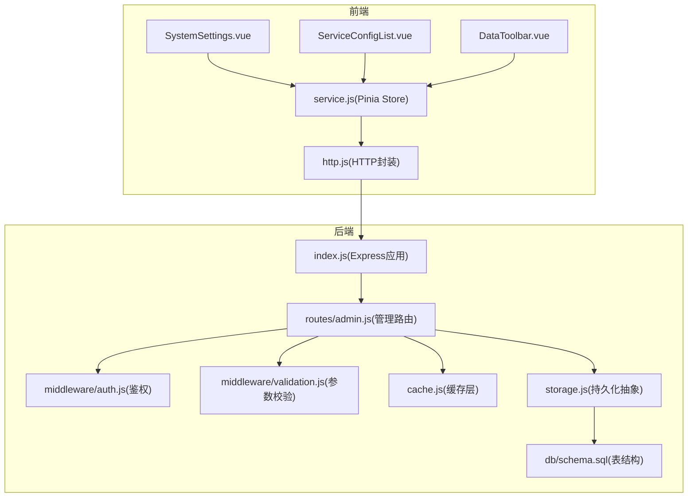
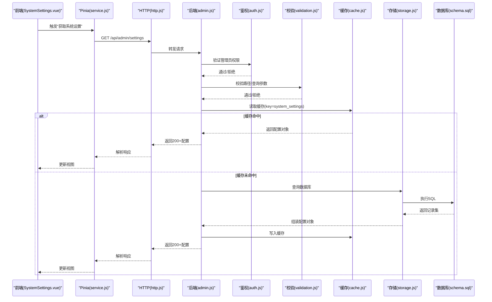
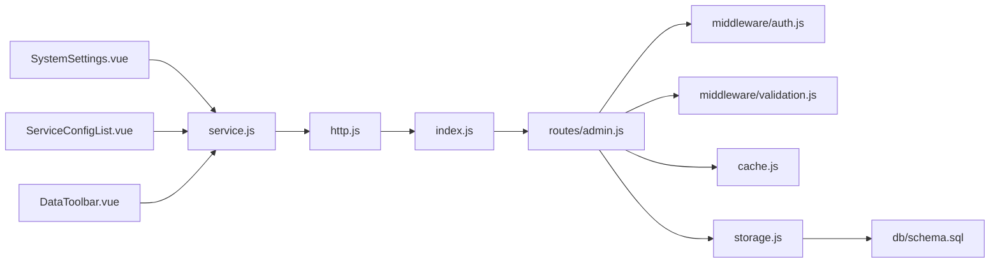

# 系统设置管理

<cite>
**本文引用的文件**   
- [backend/index.js](file://backend/index.js)
- [backend/config.js](file://backend/config.js)
- [backend/cache.js](file://backend/cache.js)
- [backend/storage.js](file://backend/storage.js)
- [backend/middleware/auth.js](file://backend/middleware/auth.js)
- [backend/middleware/validation.js](file://backend/middleware/validation.js)
- [backend/routes/admin.js](file://backend/routes/admin.js)
- [frontend/h5/src/views/admin/config/SystemSettings.vue](file://frontend/h5/src/views/admin/config/SystemSettings.vue)
- [frontend/h5/src/views/admin/config/ServiceConfigList.vue](file://frontend/h5/src/views/admin/config/ServiceConfigList.vue)
- [frontend/h5/src/views/admin/components/DataToolbar.vue](file://frontend/h5/src/views/admin/components/DataToolbar.vue)
- [frontend/h5/src/stores/service.js](file://frontend/h5/src/stores/service.js)
- [frontend/h5/src/utils/http.js](file://frontend/h5/src/utils/http.js)
- [backend/db/schema.sql](file://backend/db/schema.sql)
</cite>

## 目录
1. [简介](#简介)
2. [项目结构](#项目结构)
3. [核心组件](#核心组件)
4. [架构总览](#架构总览)
5. [详细组件分析](#详细组件分析)
6. [依赖关系分析](#依赖关系分析)
7. [性能考量](#性能考量)
8. [故障排查指南](#故障排查指南)
9. [结论](#结论)
10. [附录](#附录)

## 简介
本文件面向“低空经济服务平台”的系统设置管理能力，覆盖前后端实现、数据模型与缓存策略、接口流程与权限控制、以及常见问题定位方法。目标是帮助开发者与运维人员快速理解并扩展系统设置模块，确保配置项的可用性、一致性与安全性。

## 项目结构
围绕系统设置管理的代码主要分布在后端路由、中间件、数据库与前端页面/状态管理：
- 后端入口与配置：index.js、config.js
- 缓存与存储抽象：cache.js、storage.js
- 鉴权与校验：middleware/auth.js、middleware/validation.js
- 管理端路由：routes/admin.js
- 前端页面：SystemSettings.vue、ServiceConfigList.vue、DataToolbar.vue
- 前端状态与请求：stores/service.js、utils/http.js
- 数据模型：db/schema.sql

图表来源
- [backend/index.js](file://backend/index.js)
- [backend/routes/admin.js](file://backend/routes/admin.js)
- [backend/middleware/auth.js](file://backend/middleware/auth.js)
- [backend/middleware/validation.js](file://backend/middleware/validation.js)
- [backend/cache.js](file://backend/cache.js)
- [backend/storage.js](file://backend/storage.js)
- [backend/db/schema.sql](file://backend/db/schema.sql)
- [frontend/h5/src/views/admin/config/SystemSettings.vue](file://frontend/h5/src/views/admin/config/SystemSettings.vue)
- [frontend/h5/src/views/admin/config/ServiceConfigList.vue](file://frontend/h5/src/views/admin/config/ServiceConfigList.vue)
- [frontend/h5/src/views/admin/components/DataToolbar.vue](file://frontend/h5/src/views/admin/components/DataToolbar.vue)
- [frontend/h5/src/stores/service.js](file://frontend/h5/src/stores/service.js)
- [frontend/h5/src/utils/http.js](file://frontend/h5/src/utils/http.js)

章节来源
- [backend/index.js](file://backend/index.js)
- [backend/config.js](file://backend/config.js)
- [backend/cache.js](file://backend/cache.js)
- [backend/storage.js](file://backend/storage.js)
- [backend/middleware/auth.js](file://backend/middleware/auth.js)
- [backend/middleware/validation.js](file://backend/middleware/validation.js)
- [backend/routes/admin.js](file://backend/routes/admin.js)
- [frontend/h5/src/views/admin/config/SystemSettings.vue](file://frontend/h5/src/views/admin/config/SystemSettings.vue)
- [frontend/h5/src/views/admin/config/ServiceConfigList.vue](file://frontend/h5/src/views/admin/config/ServiceConfigList.vue)
- [frontend/h5/src/views/admin/components/DataToolbar.vue](file://frontend/h5/src/views/admin/components/DataToolbar.vue)
- [frontend/h5/src/stores/service.js](file://frontend/h5/src/stores/service.js)
- [frontend/h5/src/utils/http.js](file://frontend/h5/src/utils/http.js)
- [backend/db/schema.sql](file://backend/db/schema.sql)

## 核心组件
- 后端入口与配置
  - index.js：初始化 Express、挂载静态资源、注册路由与中间件、启动服务。
  - config.js：集中管理环境变量与默认配置（如端口、数据库连接、缓存策略等）。
- 缓存与存储
  - cache.js：提供键值缓存能力，用于热点配置项的快速读取与更新。
  - storage.js：对底层存储进行抽象，统一读写接口，便于切换或扩展存储后端。
- 鉴权与校验
  - middleware/auth.js：校验管理员身份与会话/令牌，保护管理端接口。
  - middleware/validation.js：对请求体进行结构化校验，防止非法输入进入业务逻辑。
- 管理端路由
  - routes/admin.js：暴露系统设置的查询、更新、批量操作等接口，串联鉴权、校验、缓存与存储。
- 前端页面与状态
  - SystemSettings.vue：系统设置主界面，展示分组配置、表单编辑与保存。
  - ServiceConfigList.vue：服务相关配置列表，支持增删改查与状态切换。
  - DataToolbar.vue：通用数据工具栏，提供刷新、筛选、导出等操作。
  - stores/service.js：基于 Pinia 的状态管理，封装配置的加载、缓存与提交。
  - utils/http.js：HTTP 请求封装，统一错误处理、拦截器与重试策略。
- 数据模型
  - db/schema.sql：定义系统设置相关的表结构与约束，保证数据一致性。

章节来源
- [backend/index.js](file://backend/index.js)
- [backend/config.js](file://backend/config.js)
- [backend/cache.js](file://backend/cache.js)
- [backend/storage.js](file://backend/storage.js)
- [backend/middleware/auth.js](file://backend/middleware/auth.js)
- [backend/middleware/validation.js](file://backend/middleware/validation.js)
- [backend/routes/admin.js](file://backend/routes/admin.js)
- [frontend/h5/src/views/admin/config/SystemSettings.vue](file://frontend/h5/src/views/admin/config/SystemSettings.vue)
- [frontend/h5/src/views/admin/config/ServiceConfigList.vue](file://frontend/h5/src/views/admin/config/ServiceConfigList.vue)
- [frontend/h5/src/views/admin/components/DataToolbar.vue](file://frontend/h5/src/views/admin/components/DataToolbar.vue)
- [frontend/h5/src/stores/service.js](file://frontend/h5/src/stores/service.js)
- [frontend/h5/src/utils/http.js](file://frontend/h5/src/utils/http.js)
- [backend/db/schema.sql](file://backend/db/schema.sql)

## 架构总览
系统设置管理采用前后端分离架构，前端通过 HTTP 调用后端管理接口，后端在鉴权与参数校验后，优先命中缓存，未命中则落库持久化，并同步更新缓存。

图表来源
- [backend/routes/admin.js](file://backend/routes/admin.js)
- [backend/middleware/auth.js](file://backend/middleware/auth.js)
- [backend/middleware/validation.js](file://backend/middleware/validation.js)
- [backend/cache.js](file://backend/cache.js)
- [backend/storage.js](file://backend/storage.js)
- [backend/db/schema.sql](file://backend/db/schema.sql)
- [frontend/h5/src/views/admin/config/SystemSettings.vue](file://frontend/h5/src/views/admin/config/SystemSettings.vue)
- [frontend/h5/src/stores/service.js](file://frontend/h5/src/stores/service.js)
- [frontend/h5/src/utils/http.js](file://frontend/h5/src/utils/http.js)

## 详细组件分析

### 后端管理路由（admin.js）
- 职责
  - 暴露系统设置相关接口：查询、更新、批量更新、重置默认值等。
  - 串联鉴权与参数校验中间件，确保访问安全与输入合法。
  - 协调缓存与存储层，保证读多写少场景下的性能与一致性。
- 关键流程
  - 读取：先查缓存，未命中再查存储层与数据库，回填缓存。
  - 更新：校验请求体，写入存储层，失效或更新对应缓存键。
  - 批量：事务性更新，失败回滚，保持配置一致性。
- 错误处理
  - 鉴权失败返回未授权错误。
  - 参数校验失败返回明确的字段级错误信息。
  - 存储异常捕获并返回友好错误码。

章节来源
- [backend/routes/admin.js](file://backend/routes/admin.js)
- [backend/middleware/auth.js](file://backend/middleware/auth.js)
- [backend/middleware/validation.js](file://backend/middleware/validation.js)
- [backend/cache.js](file://backend/cache.js)
- [backend/storage.js](file://backend/storage.js)

### 前端系统设置页面（SystemSettings.vue）
- 职责
  - 渲染系统设置分组与字段，支持在线编辑与即时保存。
  - 与 Pinia store 交互，管理本地状态与缓存。
  - 集成 DataToolbar 提供刷新、筛选、导出等功能。
- 交互流程
  - 页面加载时从 store 拉取配置；若本地无缓存则发起网络请求。
  - 用户修改字段后，store 将变更暂存，点击保存后批量提交。
  - 保存成功后更新本地缓存与视图，失败时提示错误并保留草稿。
- 用户体验
  - 使用乐观更新提升响应速度，失败时自动回滚。
  - 提供字段级校验反馈与全局错误提示。

章节来源
- [frontend/h5/src/views/admin/config/SystemSettings.vue](file://frontend/h5/src/views/admin/config/SystemSettings.vue)
- [frontend/h5/src/stores/service.js](file://frontend/h5/src/stores/service.js)
- [frontend/h5/src/views/admin/components/DataToolbar.vue](file://frontend/h5/src/views/admin/components/DataToolbar.vue)
- [frontend/h5/src/utils/http.js](file://frontend/h5/src/utils/http.js)

### 服务配置列表（ServiceConfigList.vue）
- 职责
  - 展示服务类配置项列表，支持启用/禁用、排序与批量操作。
  - 与后端接口对接，完成配置的增删改查。
- 关键点
  - 列表分页与搜索过滤。
  - 状态切换的幂等性与并发保护。
  - 操作日志与审计（可选）。

章节来源
- [frontend/h5/src/views/admin/config/ServiceConfigList.vue](file://frontend/h5/src/views/admin/config/ServiceConfigList.vue)
- [frontend/h5/src/stores/service.js](file://frontend/h5/src/stores/service.js)
- [frontend/h5/src/utils/http.js](file://frontend/h5/src/utils/http.js)

### 数据工具栏（DataToolbar.vue）
- 职责
  - 提供通用的数据操作按钮组：刷新、筛选、导出、重置。
  - 与上层页面联动，触发对应事件回调。
- 设计要点
  - 可配置化按钮集合与权限控制。
  - 统一的加载态与错误态展示。

章节来源
- [frontend/h5/src/views/admin/components/DataToolbar.vue](file://frontend/h5/src/views/admin/components/DataToolbar.vue)

### 状态管理与请求封装（service.js、http.js）
- service.js（Pinia Store）
  - 维护系统设置的全局状态，包含本地缓存与待提交变更。
  - 提供异步方法：fetchSettings、updateSetting、batchUpdate、resetDefaults。
  - 错误边界处理与重试机制。
- http.js（HTTP 封装）
  - 统一请求头、基础 URL、超时与重试策略。
  - 拦截器处理鉴权失败、网络异常与业务错误码。
  - 提供取消重复请求的能力，避免竞态条件。

章节来源
- [frontend/h5/src/stores/service.js](file://frontend/h5/src/stores/service.js)
- [frontend/h5/src/utils/http.js](file://frontend/h5/src/utils/http.js)

### 缓存与存储层（cache.js、storage.js）
- cache.js
  - 内存缓存为主，支持过期时间与容量限制。
  - 提供 get/set/del/flush 等基础操作。
  - 针对系统设置键名做命名规范与冲突检测。
- storage.js
  - 抽象数据库访问，统一 CRUD 接口。
  - 支持事务与批量操作，保证配置一致性。
  - 错误上报与降级策略（如只读模式）。

章节来源
- [backend/cache.js](file://backend/cache.js)
- [backend/storage.js](file://backend/storage.js)

### 数据模型（schema.sql）
- 建议表结构
  - 系统设置表：包含键名、分组、类型、默认值、当前值、描述、更新时间等字段。
  - 服务配置表：包含服务标识、开关状态、参数 JSON、优先级、生效范围等。
- 约束与索引
  - 键名唯一约束，避免重复配置。
  - 常用查询字段建立索引（如分组、服务标识）。
  - 时间戳字段用于审计与清理。

章节来源
- [backend/db/schema.sql](file://backend/db/schema.sql)

## 依赖关系分析
- 前端依赖
  - SystemSettings.vue 依赖 service.js 与 http.js。
  - ServiceConfigList.vue 依赖 service.js 与 http.js。
  - DataToolbar.vue 为通用组件，被上述页面复用。
- 后端依赖
  - admin.js 依赖 auth.js、validation.js、cache.js、storage.js。
  - storage.js 依赖 schema.sql 定义的表结构。
  - index.js 负责挂载所有路由与中间件。

图表来源
- [frontend/h5/src/views/admin/config/SystemSettings.vue](file://frontend/h5/src/views/admin/config/SystemSettings.vue)
- [frontend/h5/src/views/admin/config/ServiceConfigList.vue](file://frontend/h5/src/views/admin/config/ServiceConfigList.vue)
- [frontend/h5/src/views/admin/components/DataToolbar.vue](file://frontend/h5/src/views/admin/components/DataToolbar.vue)
- [frontend/h5/src/stores/service.js](file://frontend/h5/src/stores/service.js)
- [frontend/h5/src/utils/http.js](file://frontend/h5/src/utils/http.js)
- [backend/index.js](file://backend/index.js)
- [backend/routes/admin.js](file://backend/routes/admin.js)
- [backend/middleware/auth.js](file://backend/middleware/auth.js)
- [backend/middleware/validation.js](file://backend/middleware/validation.js)
- [backend/cache.js](file://backend/cache.js)
- [backend/storage.js](file://backend/storage.js)
- [backend/db/schema.sql](file://backend/db/schema.sql)

章节来源
- [backend/index.js](file://backend/index.js)
- [backend/routes/admin.js](file://backend/routes/admin.js)
- [backend/middleware/auth.js](file://backend/middleware/auth.js)
- [backend/middleware/validation.js](file://backend/middleware/validation.js)
- [backend/cache.js](file://backend/cache.js)
- [backend/storage.js](file://backend/storage.js)
- [backend/db/schema.sql](file://backend/db/schema.sql)
- [frontend/h5/src/views/admin/config/SystemSettings.vue](file://frontend/h5/src/views/admin/config/SystemSettings.vue)
- [frontend/h5/src/views/admin/config/ServiceConfigList.vue](file://frontend/h5/src/views/admin/config/ServiceConfigList.vue)
- [frontend/h5/src/views/admin/components/DataToolbar.vue](file://frontend/h5/src/views/admin/components/DataToolbar.vue)
- [frontend/h5/src/stores/service.js](file://frontend/h5/src/stores/service.js)
- [frontend/h5/src/utils/http.js](file://frontend/h5/src/utils/http.js)

## 性能考量
- 缓存命中率优化
  - 合理设置缓存键与过期时间，减少数据库压力。
  - 对热点配置项使用独立键，避免整表失效。
- 批量操作与事务
  - 批量更新使用事务，降低锁竞争与不一致风险。
- 前端缓存与去重
  - 使用 Pinia 本地缓存与请求去重，避免重复网络请求。
- 懒加载与分页
  - 大列表分页加载，按需渲染，提升首屏性能。
- 监控与告警
  - 记录缓存命中率、接口耗时与错误率，及时发现问题。

[本节为通用指导，不直接分析具体文件]

## 故障排查指南
- 鉴权失败
  - 检查管理员会话/令牌是否有效，确认中间件是否正确挂载。
- 参数校验失败
  - 查看 validation 中间件的规则与错误消息，修正前端提交数据。
- 缓存不一致
  - 对比缓存与数据库值，必要时清空缓存并重新拉取。
- 存储层异常
  - 检查 storage 层的 SQL 与连接池配置，关注事务回滚日志。
- 前端状态不同步
  - 检查 Pinia 的更新逻辑与 http 拦截器的错误处理，确保视图与状态一致。

章节来源
- [backend/middleware/auth.js](file://backend/middleware/auth.js)
- [backend/middleware/validation.js](file://backend/middleware/validation.js)
- [backend/cache.js](file://backend/cache.js)
- [backend/storage.js](file://backend/storage.js)
- [frontend/h5/src/stores/service.js](file://frontend/h5/src/stores/service.js)
- [frontend/h5/src/utils/http.js](file://frontend/h5/src/utils/http.js)

## 结论
系统设置管理模块通过清晰的分层设计与严格的鉴权校验，实现了高可用、高性能的配置管理能力。前端以 Pinia 为核心进行状态与缓存管理，后端以缓存优先、存储兜底的策略保障数据一致性与响应速度。建议在后续迭代中完善审计日志、灰度发布与配置版本管理，进一步提升系统的可观测性与可维护性。

[本节为总结性内容，不直接分析具体文件]

## 附录
- 最佳实践
  - 配置项命名规范化，按分组与用途划分键空间。
  - 敏感配置加密存储与传输，最小权限原则访问。
  - 变更审批与回滚机制，确保生产环境稳定。
- 扩展方向
  - 增加配置模板与导入导出功能。
  - 引入配置中心与动态下发能力。
  - 增强可视化与差异对比，辅助运维决策。

[本节为补充说明，不直接分析具体文件]