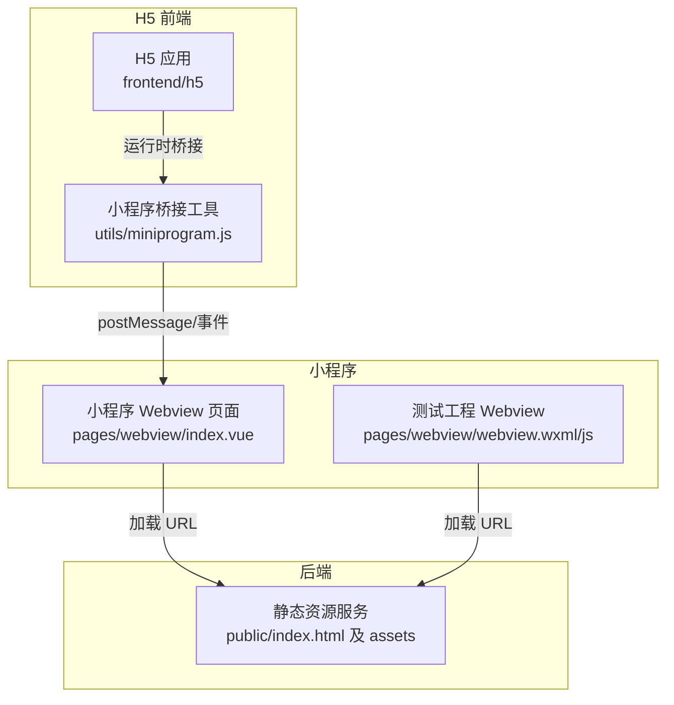
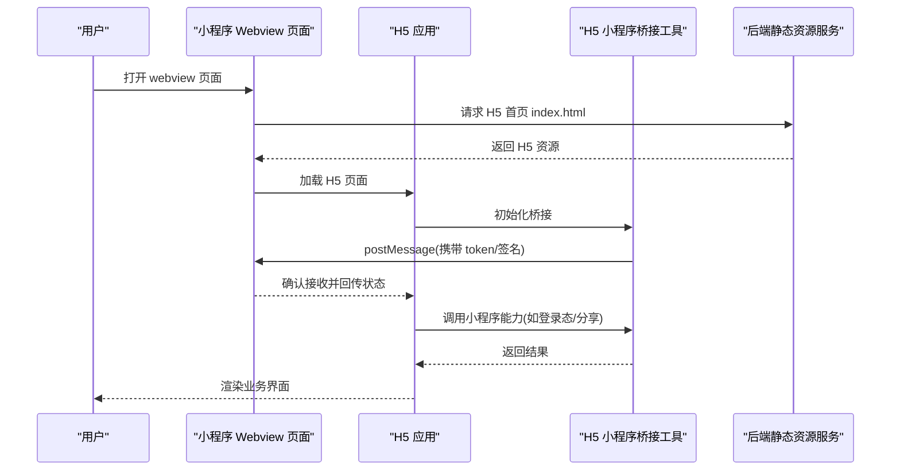
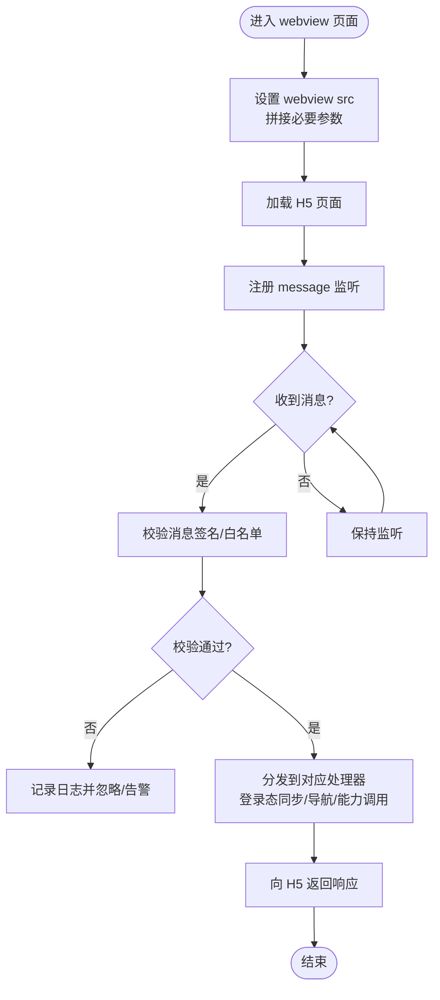
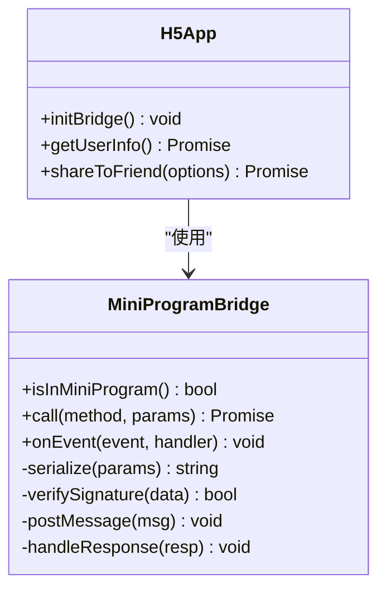
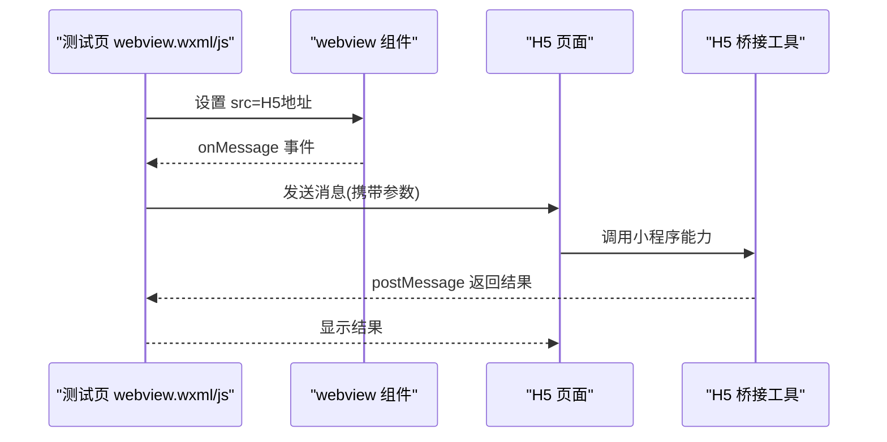

# 小程序Webview集成

<cite>
**本文档引用的文件**   
- [frontend/miniprogram/pages/webview/index.vue](file://frontend/miniprogram/pages/webview/index.vue)
- [frontend/miniprogram-webview-test/pages/webview/webview.js](file://frontend/miniprogram-webview-test/pages/webview/webview.js)
- [frontend/miniprogram-webview-test/pages/webview/webview.wxml](file://frontend/miniprogram-webview-test/pages/webview/webview.wxml)
- [frontend/miniprogram-webview-test/app.json](file://frontend/miniprogram-webview-test/app.json)
- [backend/public/index.html](file://backend/public/index.html)
- [frontend/h5/src/utils/miniprogram.js](file://frontend/h5/src/utils/miniprogram.js)
</cite>

## 目录
1. [简介](#简介)
2. [项目结构](#项目结构)
3. [核心组件](#核心组件)
4. [架构总览](#架构总览)
5. [详细组件分析](#详细组件分析)
6. [依赖关系分析](#依赖关系分析)
7. [性能与兼容性考虑](#性能与兼容性考虑)
8. [故障排查指南](#故障排查指南)
9. [结论](#结论)
10. [附录](#附录)

## 简介
本仓库包含一个完整的小程序与H5（Web）集成的方案，重点围绕“小程序内嵌Webview加载H5页面”的能力。后端提供静态资源服务，前端H5通过工具方法桥接小程序能力；小程序端通过webview页面承载H5内容，并实现双向通信、鉴权与导航等关键流程。该文档从系统架构、数据流、处理逻辑、集成点与错误处理等方面进行全面解析，帮助读者快速理解并落地实施。

## 项目结构
本项目采用前后端分离与多端适配的组织方式：
- 后端：Node.js服务，提供静态资源与API，供H5页面直接访问。
- H5前端：Vue工程，内置小程序桥接工具，用于在小程序环境中调用原生能力。
- 小程序端：两个示例/工程
  - miniprogram：主小程序工程，包含webview页面入口与业务页面。
  - miniprogram-webview-test：最小化测试工程，便于验证webview加载与通信。



图表来源
- [frontend/miniprogram/pages/webview/index.vue](file://frontend/miniprogram/pages/webview/index.vue)
- [frontend/miniprogram-webview-test/pages/webview/webview.wxml](file://frontend/miniprogram-webview-test/pages/webview/webview.wxml)
- [frontend/miniprogram-webview-test/pages/webview/webview.js](file://frontend/miniprogram-webview-test/pages/webview/webview.js)
- [backend/public/index.html](file://backend/public/index.html)
- [frontend/h5/src/utils/miniprogram.js](file://frontend/h5/src/utils/miniprogram.js)

章节来源
- [frontend/miniprogram/pages/webview/index.vue](file://frontend/miniprogram/pages/webview/index.vue)
- [frontend/miniprogram-webview-test/pages/webview/webview.wxml](file://frontend/miniprogram-webview-test/pages/webview/webview.wxml)
- [frontend/miniprogram-webview-test/pages/webview/webview.js](file://frontend/miniprogram-webview-test/pages/webview/webview.js)
- [backend/public/index.html](file://backend/public/index.html)
- [frontend/h5/src/utils/miniprogram.js](file://frontend/h5/src/utils/miniprogram.js)

## 核心组件
- 小程序 Webview 页面：负责加载指定URL、监听消息事件、转发到H5或执行小程序侧操作（如登录态同步、返回导航）。
- H5 小程序桥接工具：封装在小程序环境下的能力调用（如获取用户信息、分享、支付等），并通过postMessage与小程序通信。
- 后端静态资源服务：提供H5页面与静态资源的HTTP服务，确保跨域与安全策略正确配置。
- 测试工程：最小化验证webview加载与通信链路，便于快速定位问题。

章节来源
- [frontend/miniprogram/pages/webview/index.vue](file://frontend/miniprogram/pages/webview/index.vue)
- [frontend/h5/src/utils/miniprogram.js](file://frontend/h5/src/utils/miniprogram.js)
- [backend/public/index.html](file://backend/public/index.html)
- [frontend/miniprogram-webview-test/pages/webview/webview.wxml](file://frontend/miniprogram-webview-test/pages/webview/webview.wxml)
- [frontend/miniprogram-webview-test/pages/webview/webview.js](file://frontend/miniprogram-webview-test/pages/webview/webview.js)

## 架构总览
下图展示了小程序Webview加载H5页面的整体交互流程，包括鉴权、消息通信与导航控制。



图表来源
- [frontend/miniprogram/pages/webview/index.vue](file://frontend/miniprogram/pages/webview/index.vue)
- [frontend/h5/src/utils/miniprogram.js](file://frontend/h5/src/utils/miniprogram.js)
- [backend/public/index.html](file://backend/public/index.html)

## 详细组件分析

### 小程序 Webview 页面（miniprogram）
职责
- 动态设置webview的src为H5地址，支持参数注入（如token、签名）。
- 监听message事件，处理来自H5的消息，执行小程序侧逻辑（如跳转、提示、鉴权校验）。
- 管理生命周期，确保页面卸载时清理监听器，避免内存泄漏。

关键点
- 安全校验：对传入参数进行白名单校验与签名验证，防止恶意注入。
- 消息协议：定义统一的消息格式（类型、时间戳、签名、载荷），保证双向通信一致性。
- 导航控制：根据H5请求触发小程序路由切换或返回行为。



图表来源
- [frontend/miniprogram/pages/webview/index.vue](file://frontend/miniprogram/pages/webview/index.vue)

章节来源
- [frontend/miniprogram/pages/webview/index.vue](file://frontend/miniprogram/pages/webview/index.vue)

### H5 小程序桥接工具（h5/utils/miniprogram.js）
职责
- 检测运行环境是否为小程序，若是则启用桥接模式。
- 封装常用小程序能力（如获取用户信息、分享、支付、扫码等），内部通过postMessage与小程序通信。
- 提供统一的回调与错误处理机制，确保H5侧调用稳定可靠。

关键点
- 环境判断：基于特定标识或API可用性判断是否在小程序中运行。
- 消息封装：将调用参数序列化，附加时间戳与签名，避免重放攻击。
- 超时与重试：对网络或小程序侧无响应场景增加超时与重试策略。



图表来源
- [frontend/h5/src/utils/miniprogram.js](file://frontend/h5/src/utils/miniprogram.js)

章节来源
- [frontend/h5/src/utils/miniprogram.js](file://frontend/h5/src/utils/miniprogram.js)

### 测试工程（miniprogram-webview-test）
职责
- 最小化验证webview加载H5页面与消息通信链路。
- 提供wxml模板与js逻辑，展示如何设置src、监听message与发送消息。

关键点
- 页面配置：在app.json中声明webview页面路径。
- 模板绑定：wxml中放置webview组件，绑定src与事件。
- JS逻辑：初始化页面、设置src、监听message并处理返回。



图表来源
- [frontend/miniprogram-webview-test/pages/webview/webview.wxml](file://frontend/miniprogram-webview-test/pages/webview/webview.wxml)
- [frontend/miniprogram-webview-test/pages/webview/webview.js](file://frontend/miniprogram-webview-test/pages/webview/webview.js)
- [frontend/miniprogram-webview-test/app.json](file://frontend/miniprogram-webview-test/app.json)

章节来源
- [frontend/miniprogram-webview-test/pages/webview/webview.wxml](file://frontend/miniprogram-webview-test/pages/webview/webview.wxml)
- [frontend/miniprogram-webview-test/pages/webview/webview.js](file://frontend/miniprogram-webview-test/pages/webview/webview.js)
- [frontend/miniprogram-webview-test/app.json](file://frontend/miniprogram-webview-test/app.json)

### 后端静态资源服务（backend/public/index.html）
职责
- 提供H5应用的index.html与静态资源（JS/CSS/图片等）。
- 配置CORS与安全头，确保小程序webview可正常加载。

关键点
- 资源路径：确保H5资源路径与小程序webview的src一致。
- 安全策略：设置合适的Content-Security-Policy与Access-Control-Allow-Origin。
- 缓存策略：合理设置缓存头，提升加载性能。

章节来源
- [backend/public/index.html](file://backend/public/index.html)

## 依赖关系分析
- 小程序webview页面依赖后端静态资源服务以加载H5页面。
- H5应用依赖小程序桥接工具以调用小程序能力。
- 测试工程依赖小程序框架提供的webview组件与消息事件。

```mermaid
graph LR
MP_webview["小程序 webview 页面"] --> BE_static["后端静态资源"]
H5_app["H5 应用"] --> H5_bridge["H5 小程序桥接工具"]
MP_webview <- --> H5_app : "postMessage 通信"
MP_test_webview["测试工程 webview"] --> BE_static
```

图表来源
- [frontend/miniprogram/pages/webview/index.vue](file://frontend/miniprogram/pages/webview/index.vue)
- [frontend/h5/src/utils/miniprogram.js](file://frontend/h5/src/utils/miniprogram.js)
- [backend/public/index.html](file://backend/public/index.html)
- [frontend/miniprogram-webview-test/pages/webview/webview.wxml](file://frontend/miniprogram-webview-test/pages/webview/webview.wxml)

章节来源
- [frontend/miniprogram/pages/webview/index.vue](file://frontend/miniprogram/pages/webview/index.vue)
- [frontend/h5/src/utils/miniprogram.js](file://frontend/h5/src/utils/miniprogram.js)
- [backend/public/index.html](file://backend/public/index.html)
- [frontend/miniprogram-webview-test/pages/webview/webview.wxml](file://frontend/miniprogram-webview-test/pages/webview/webview.wxml)

## 性能与兼容性考虑
- 首屏加载优化：压缩静态资源、启用Gzip/Brotli、CDN加速。
- 消息体积控制：限制单次postMessage的数据大小，避免阻塞。
- 兼容性问题：不同版本小程序对webview的支持差异，需做降级处理。
- 内存管理：及时移除监听器，避免页面卸载后仍持有引用。

[本节为通用指导，不直接分析具体文件]

## 故障排查指南
常见问题与解决思路
- webview无法加载H5页面：检查后端服务是否启动、域名是否配置、CORS是否正确。
- 消息通信失败：确认小程序与H5的消息协议一致，检查签名与时间戳。
- 权限不足：检查小程序权限配置与用户授权状态。
- 性能卡顿：监控消息频率与数据量，优化H5渲染与接口响应。

章节来源
- [frontend/miniprogram/pages/webview/index.vue](file://frontend/miniprogram/pages/webview/index.vue)
- [frontend/h5/src/utils/miniprogram.js](file://frontend/h5/src/utils/miniprogram.js)
- [backend/public/index.html](file://backend/public/index.html)

## 结论
通过小程序webview与H5前端的桥接方案，实现了能力互补与体验融合。关键在于统一的消息协议、严格的鉴权校验与稳定的错误处理。建议在生产环境加强监控与日志记录，持续优化性能与兼容性。

[本节为总结性内容，不直接分析具体文件]

## 附录
- 相关文档与参考案例位于docs/接入文档与docs/implementation目录，可结合业务需求进一步扩展。
- 建议在开发阶段优先使用测试工程验证基础能力，再逐步迁移至主小程序工程。

[本节为补充说明，不直接分析具体文件]