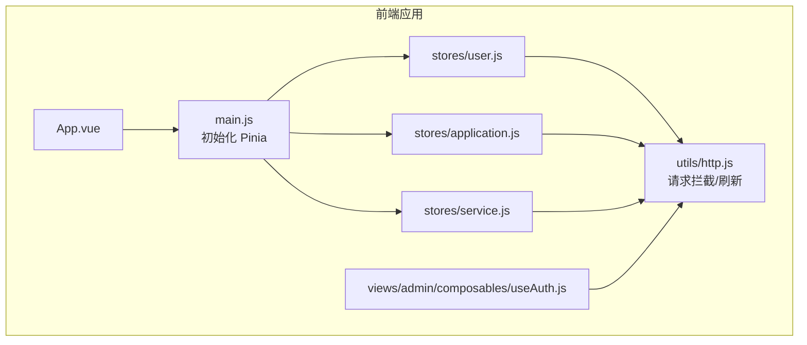
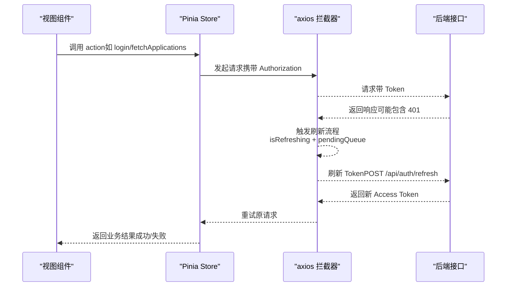
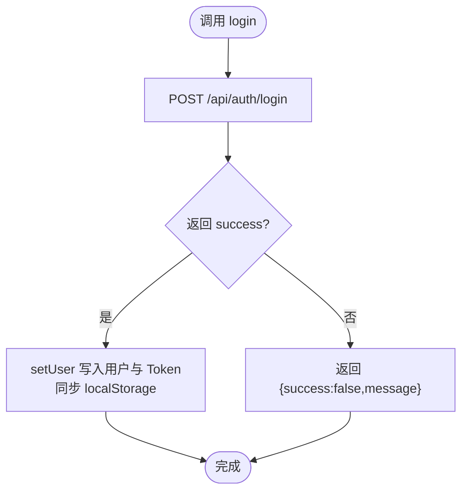
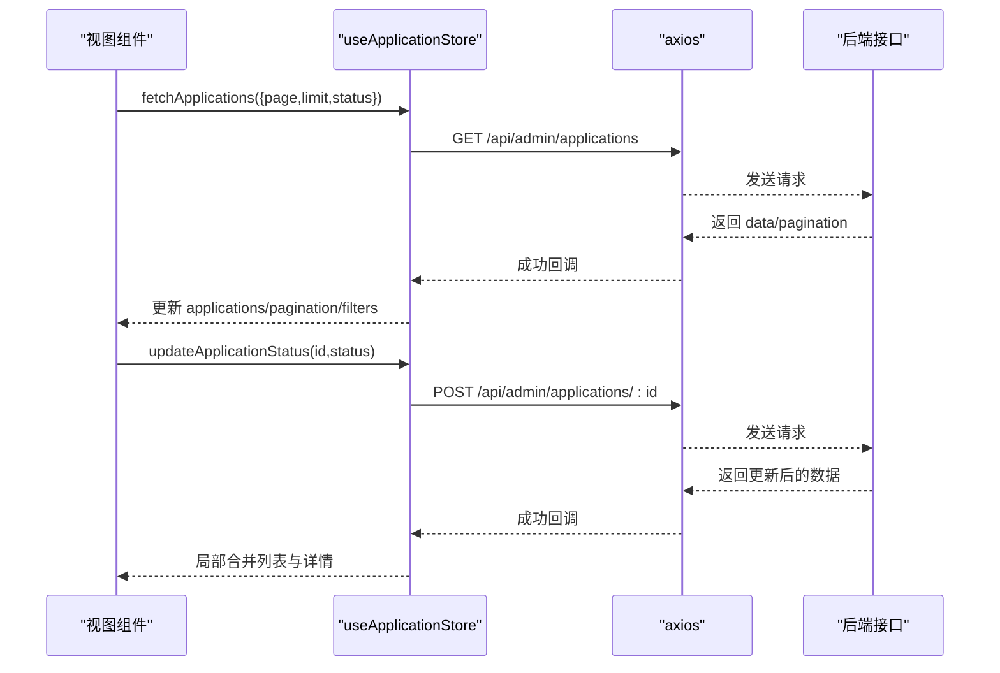
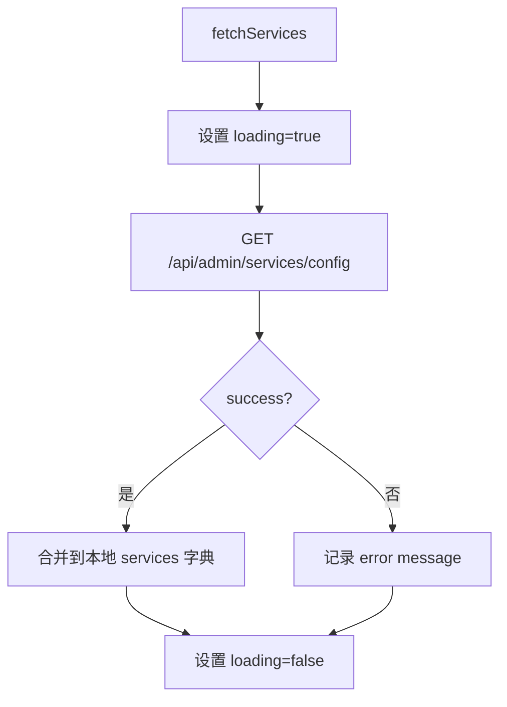
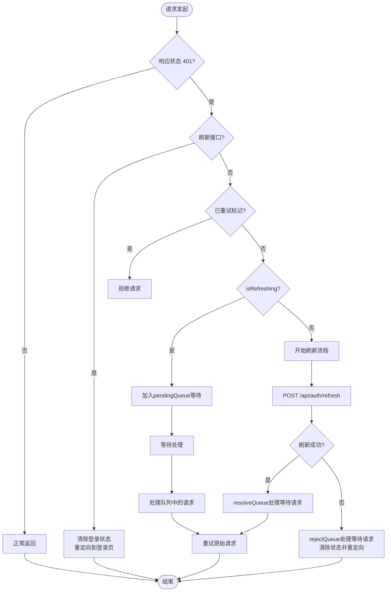
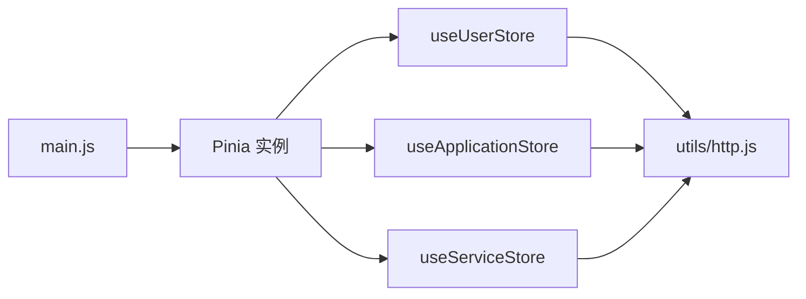

# 状态管理系统

<cite>
**本文引用的文件**
- [frontend/h5/src/stores/user.js](file://frontend/h5/src/stores/user.js)
- [frontend/h5/src/stores/application.js](file://frontend/h5/src/stores/application.js)
- [frontend/h5/src/stores/service.js](file://frontend/h5/src/stores/service.js)
- [frontend/h5/PINIA_GUIDE.md](file://frontend/h5/PINIA_GUIDE.md)
- [frontend/h5/src/utils/http.js](file://frontend/h5/src/utils/http.js)
- [frontend/h5/src/main.js](file://frontend/h5/src/main.js)
- [frontend/h5/src/views/admin/composables/useAuth.js](file://frontend/h5/src/views/admin/composables/useAuth.js)
- [frontend/h5/src/App.vue](file://frontend/h5/src/App.vue)
</cite>

## 目录
1. [简介](#简介)
2. [项目结构](#项目结构)
3. [核心组件](#核心组件)
4. [架构总览](#架构总览)
5. [详细组件分析](#详细组件分析)
6. [依赖关系分析](#依赖关系分析)
7. [性能考量](#性能考量)
8. [故障排查指南](#故障排查指南)
9. [结论](#结论)
10. [附录](#附录)

## 简介
本文件系统性阐述低空飞行服务平台前端基于 Pinia 的状态管理体系，覆盖用户状态、应用/订单状态、服务配置状态的设计与实现；解释状态持久化策略、订阅机制、异步更新流程、状态重置与恢复，并提供 Store 组合使用示例与性能优化建议。目标是帮助开发者快速理解并正确使用状态管理模块。

## 项目结构
状态管理位于 H5 前端工程的 stores 目录，采用按功能域划分的模块化组织方式：
- stores/user.js：用户认证与资料管理
- stores/application.js：申请/订单列表与分页、筛选、导出等
- stores/service.js：服务配置与展示数据管理
- utils/http.js：HTTP 拦截器与 Token 刷新逻辑
- main.js：Pinia 初始化与挂载
- views/admin/composables/useAuth.js：权限组合函数（非 Pinia Store）
- PINIA_GUIDE.md：官方使用指南与最佳实践

**图表来源**
- [frontend/h5/src/App.vue:1-32](file://frontend/h5/src/App.vue#L1-L32)
- [frontend/h5/src/main.js:1-22](file://frontend/h5/src/main.js#L1-L22)
- [frontend/h5/src/stores/user.js:1-177](file://frontend/h5/src/stores/user.js#L1-L177)
- [frontend/h5/src/stores/application.js:1-177](file://frontend/h5/src/stores/application.js#L1-L177)
- [frontend/h5/src/stores/service.js:1-164](file://frontend/h5/src/stores/service.js#L1-L164)
- [frontend/h5/src/utils/http.js:1-119](file://frontend/h5/src/utils/http.js#L1-L119)
- [frontend/h5/src/views/admin/composables/useAuth.js:1-49](file://frontend/h5/src/views/admin/composables/useAuth.js#L1-L49)

**章节来源**
- [frontend/h5/src/main.js:1-22](file://frontend/h5/src/main.js#L1-L22)
- [frontend/h5/src/App.vue:1-32](file://frontend/h5/src/App.vue#L1-L32)

## 核心组件
- 用户状态管理（useUserStore）
  - 状态：用户对象、访问令牌、刷新令牌
  - Getters：登录态、角色判断、显示名
  - Actions：登录/注册/登出、刷新用户信息、设置/清除用户、更新资料
  - 持久化：自动同步至 localStorage
- 应用/订单状态管理（useApplicationStore）
  - 状态：申请列表、当前详情、加载态、分页、筛选
  - Getters：待处理/处理中/已完成过滤、是否有数据
  - Actions：获取列表/详情、更新状态、导出 Excel、清空状态
- 服务配置状态管理（useServiceStore）
  - 状态：服务配置字典、加载态、错误信息
  - Getters：按 ID 获取配置、服务列表、研学展示数据
  - Actions：获取/更新配置、获取/更新研学展示、清空状态

**章节来源**
- [frontend/h5/src/stores/user.js:7-177](file://frontend/h5/src/stores/user.js#L7-L177)
- [frontend/h5/src/stores/application.js:7-177](file://frontend/h5/src/stores/application.js#L7-L177)
- [frontend/h5/src/stores/service.js:7-164](file://frontend/h5/src/stores/service.js#L7-L164)

## 架构总览
Pinia Store 通过 defineStore 定义，配合 axios 拦截器实现统一鉴权与 Token 自动刷新。用户状态与服务状态均持久化到 localStorage，确保页面刷新后状态可恢复。权限判断在组合函数 useAuth 中基于本地存储与接口拉取结果共同维护。

**更新** 增强了认证状态管理的并发控制机制，通过队列管理防止多个并发请求同时触发 token 刷新，确保系统的稳定性和可靠性。

**图表来源**
- [frontend/h5/src/utils/http.js:28-98](file://frontend/h5/src/utils/http.js#L28-L98)
- [frontend/h5/src/stores/user.js:41-60](file://frontend/h5/src/stores/user.js#L41-L60)
- [frontend/h5/src/stores/application.js:45-66](file://frontend/h5/src/stores/application.js#L45-L66)
- [frontend/h5/src/stores/service.js:38-56](file://frontend/h5/src/stores/service.js#L38-L56)

## 详细组件分析

### 用户状态管理（useUserStore）
- 设计要点
  - 状态字段与 localStorage 同步，实现页面刷新后自动恢复
  - Getter 提供多维度权限判断，便于模板层直接使用
  - Action 封装登录、注册、登出、资料更新等原子操作
- 异步更新与错误处理
  - 登录/注册：捕获后端返回的 message 或网络异常
  - 登出：即使后端失败也清除本地状态，保证一致性
  - 刷新用户信息：401 时主动清空本地用户态
- 订阅与持久化
  - 所有状态变更均写入 localStorage，实现跨组件共享与持久化

**图表来源**
- [frontend/h5/src/stores/user.js:41-60](file://frontend/h5/src/stores/user.js#L41-L60)
- [frontend/h5/src/stores/user.js:125-133](file://frontend/h5/src/stores/user.js#L125-L133)

**章节来源**
- [frontend/h5/src/stores/user.js:7-177](file://frontend/h5/src/stores/user.js#L7-L177)

### 应用/订单状态管理（useApplicationStore）
- 设计要点
  - 列表 + 分页 + 筛选 + 导出一体化设计
  - 支持单条状态更新并同步到列表与详情
- 异步更新与错误处理
  - 列表加载：统一设置 loading，finally 关闭
  - 状态更新：局部合并，避免重复请求
  - 导出：Blob 下载，统一封装错误提示
- 订阅与持久化
  - 状态变更写入 store，模板层通过 getter 过滤与计算

**图表来源**
- [frontend/h5/src/stores/application.js:45-66](file://frontend/h5/src/stores/application.js#L45-L66)
- [frontend/h5/src/stores/application.js:92-127](file://frontend/h5/src/stores/application.js#L92-L127)

**章节来源**
- [frontend/h5/src/stores/application.js:7-177](file://frontend/h5/src/stores/application.js#L7-L177)

### 服务配置状态管理（useServiceStore）
- 设计要点
  - 以服务 ID 为键的配置字典，便于按需读取与更新
  - 提供"服务列表"与"研学展示"两类派生数据
- 异步更新与错误处理
  - 获取/更新配置：统一 loading/error 状态
  - 研学展示：按服务 ID 写入对应字段，避免污染其他服务
- 订阅与持久化
  - 本地状态与后端配置保持一致，便于组件层直接消费

**图表来源**
- [frontend/h5/src/stores/service.js:38-56](file://frontend/h5/src/stores/service.js#L38-L56)

**章节来源**
- [frontend/h5/src/stores/service.js:7-164](file://frontend/h5/src/stores/service.js#L7-L164)

### 权限与鉴权组合（useAuth）
- 设计要点
  - 基于本地存储的用户角色与超级管理员标识
  - 提供刷新当前用户信息的能力，必要时清理 Token 与用户缓存
- 与 Pinia 的关系
  - 该组合函数不依赖 Pinia，但与 useUserStore 的持久化策略互补

**章节来源**
- [frontend/h5/src/views/admin/composables/useAuth.js:1-49](file://frontend/h5/src/views/admin/composables/useAuth.js#L1-L49)

### HTTP 拦截器与并发控制（增强）
**更新** 本节详细说明了认证状态管理的改进，包括并发请求处理和错误处理机制。

- 设计要点
  - 使用 `isRefreshing` 标志位防止并发 token 刷新
  - 通过 `pendingQueue` 队列管理等待中的请求
  - 实现 `resolveQueue` 和 `rejectQueue` 函数处理队列中的请求
  - 完善的错误处理和状态清理机制
- 并发控制机制
  - 当检测到 401 错误时，检查 `isRefreshing` 标志
  - 如果正在刷新，将请求加入 `pendingQueue` 等待
  - 刷新完成后，批量处理队列中的请求
  - 防止多个并发请求同时触发 token 刷新
- 错误处理与状态清理
  - 刷新接口返回 401 时，直接清除登录状态并重定向
  - 刷新失败时，清理所有 token 并重定向到登录页
  - 确保系统状态的一致性和安全性

**图表来源**
- [frontend/h5/src/utils/http.js:28-98](file://frontend/h5/src/utils/http.js#L28-L98)

**章节来源**
- [frontend/h5/src/utils/http.js:1-119](file://frontend/h5/src/utils/http.js#L1-L119)

## 依赖关系分析
- Store 间耦合
  - 三者彼此独立，无直接依赖；通过 HTTP 与后端交互
- 外部依赖
  - axios：统一请求与响应拦截
  - localStorage：用户态与 Token 的持久化载体
- 初始化与挂载
  - main.js 中创建并挂载 Pinia，全局可用

**图表来源**
- [frontend/h5/src/main.js:16-16](file://frontend/h5/src/main.js#L16-L16)
- [frontend/h5/src/utils/http.js:1-119](file://frontend/h5/src/utils/http.js#L1-L119)

**章节来源**
- [frontend/h5/src/main.js:1-22](file://frontend/h5/src/main.js#L1-L22)
- [frontend/h5/src/utils/http.js:1-119](file://frontend/h5/src/utils/http.js#L1-L119)

## 性能考量
- 响应式与计算属性
  - 使用 computed 对 getter 结果进行稳定引用，减少不必要的重渲染
- 加载态与并发控制
  - 列表加载统一设置 loading，避免重复请求叠加
  - **新增** HTTP 拦截器通过队列管理防止并发刷新，提升系统稳定性
- 数据粒度与内存占用
  - 仅保留必要的状态字段，避免大对象频繁深拷贝
- 缓存与去抖
  - 对高频筛选/分页场景，可在组件层增加防抖或节流
- 本地存储与序列化
  - localStorage 存储用户态与 Token，注意避免存储过大的对象
- **新增** 并发请求优化
  - 通过 `isRefreshing` 标志位避免重复的 token 刷新请求
  - 使用 `pendingQueue` 队列批量处理等待中的请求

## 故障排查指南
- 登录后页面未更新
  - 检查是否调用了 setUser 并写入 localStorage
  - 确认模板中使用的是 store 的 getter（如 isLoggedIn、displayName）
- 401 未触发自动刷新
  - 检查 axios 请求拦截器是否正确设置 Authorization
  - 确认刷新队列逻辑未被阻塞（isRefreshing、pendingQueue）
  - **新增** 检查是否存在并发请求竞争条件
- 登出后仍显示登录态
  - 确认 logout 是否执行了 clearUser 并清理 localStorage
- 列表状态更新不生效
  - 检查 updateApplicationStatus 是否对列表与详情做了局部合并
- 导出失败
  - 检查 responseType 与 Blob 处理链路
- **新增** 并发请求问题
  - 检查 `isRefreshing` 标志位是否正确设置
  - 确认 `pendingQueue` 队列中的请求是否正确处理
  - 验证 `resolveQueue` 和 `rejectQueue` 函数的调用时机

**章节来源**
- [frontend/h5/src/stores/user.js:88-97](file://frontend/h5/src/stores/user.js#L88-L97)
- [frontend/h5/src/stores/application.js:92-127](file://frontend/h5/src/stores/application.js#L92-L127)
- [frontend/h5/src/utils/http.js:28-98](file://frontend/h5/src/utils/http.js#L28-L98)

## 结论
本状态管理体系以 Pinia 为核心，围绕用户、应用/订单、服务配置三大领域构建了清晰的 Store 设计与完善的异步更新流程。通过 axios 拦截器与 Token 刷新机制保障鉴权可靠性，结合 localStorage 实现状态持久化与自动恢复。

**更新** 最新的认证状态管理改进显著提升了系统的稳定性和可靠性。通过引入并发控制机制，有效防止了多个并发请求同时触发 token 刷新导致的竞争条件，确保了系统的安全性和一致性。建议在实际开发中遵循官方最佳实践，合理使用 computed、watch 与 clear 方法，持续优化性能与可维护性。

## 附录
- 快速上手与示例参考
  - Store 使用与示例：见 PINIA_GUIDE.md
  - 用户认证与权限示例：见 PINIA_GUIDE.md
  - 申请列表与导出示例：见 PINIA_GUIDE.md
  - 服务配置示例：见 PINIA_GUIDE.md
- 状态持久化说明
  - Store 会自动同步状态到 localStorage，页面刷新后状态可恢复
  - 可直接使用 localStorage.getItem('user') 获取用户信息
- **新增** 并发控制最佳实践
  - 在高并发场景下，系统会自动处理请求排队和批量处理
  - 开发者无需额外处理并发请求竞争条件
  - 如需自定义处理逻辑，可通过修改 HTTP 拦截器实现

**章节来源**
- [frontend/h5/PINIA_GUIDE.md:1-338](file://frontend/h5/PINIA_GUIDE.md#L1-L338)