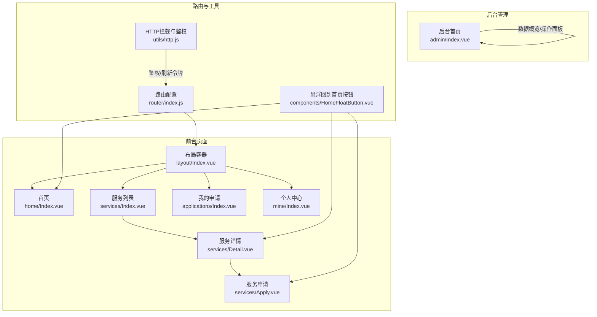
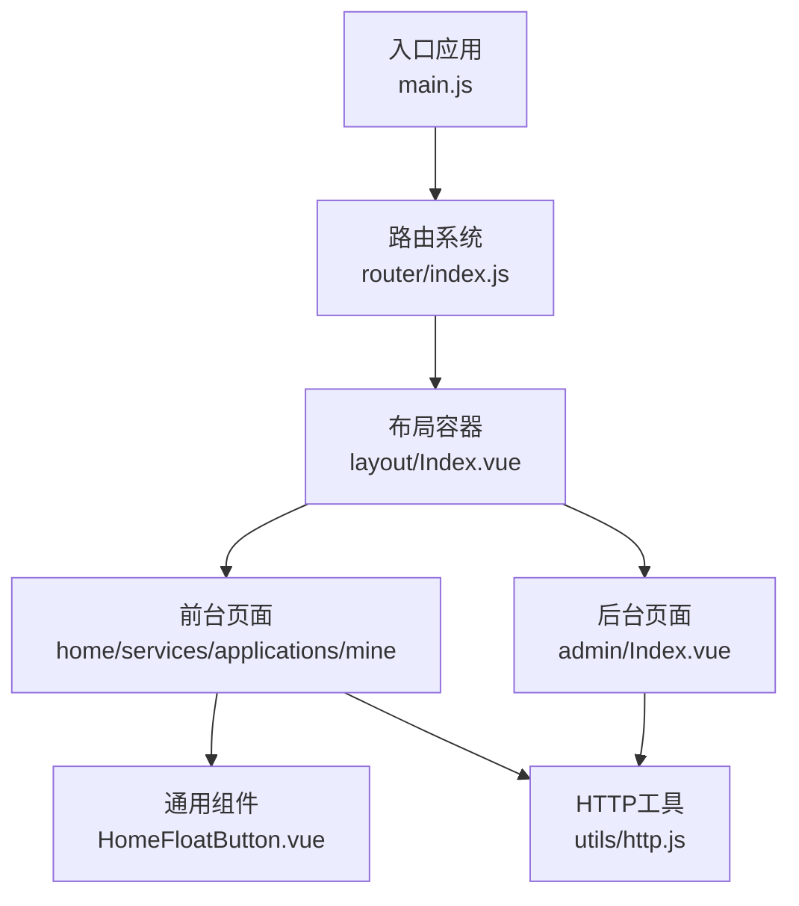
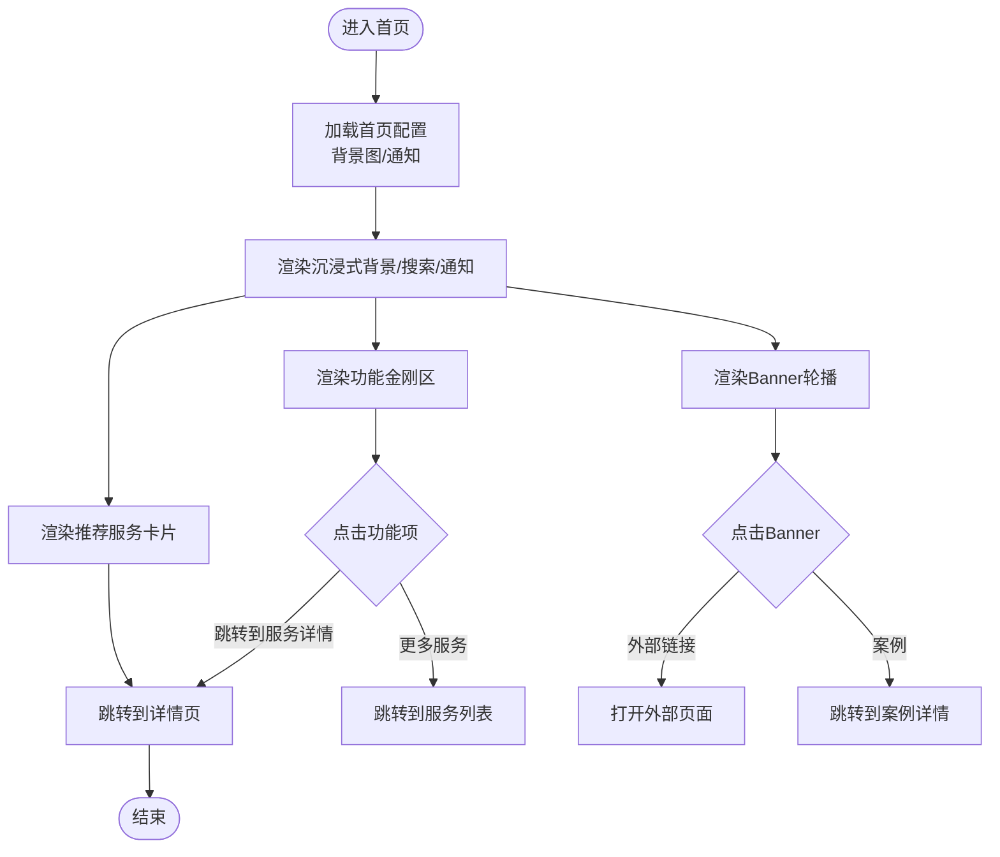
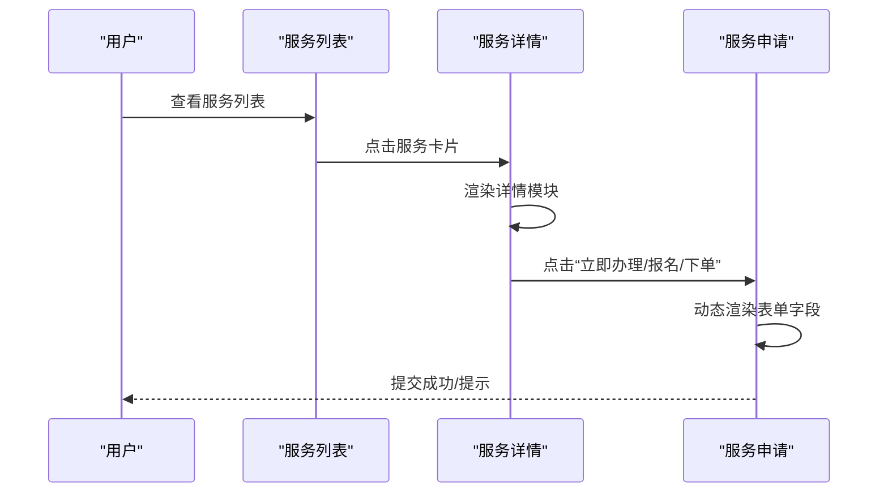
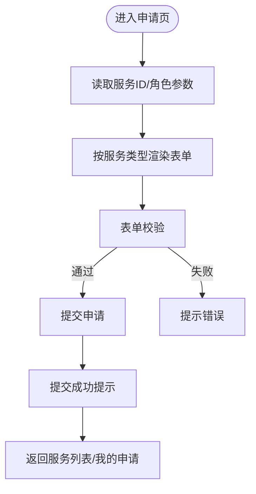
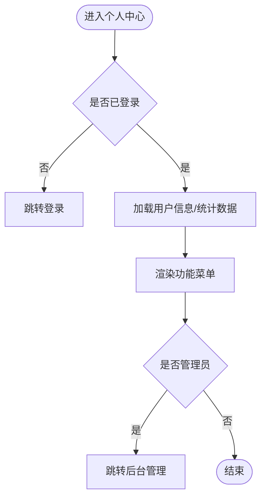
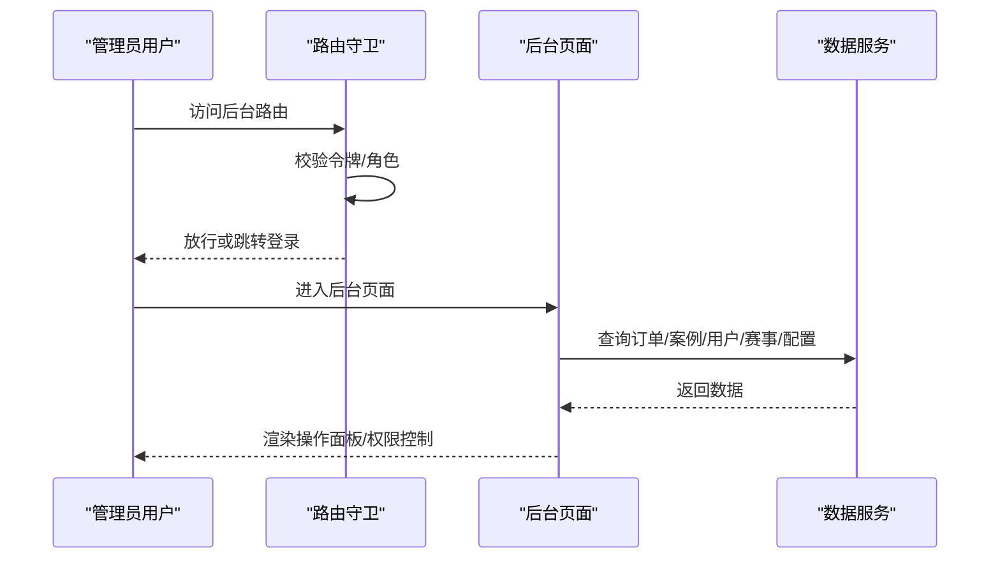
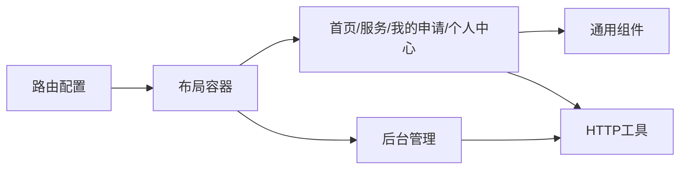

# 页面视图设计

<cite>
**本文档引用的文件**
- [frontend/h5/src/router/index.js](file://frontend/h5/src/router/index.js)
- [frontend/h5/src/main.js](file://frontend/h5/src/main.js)
- [frontend/h5/src/App.vue](file://frontend/h5/src/App.vue)
- [frontend/h5/src/views/layout/Index.vue](file://frontend/h5/src/views/layout/Index.vue)
- [frontend/h5/src/views/home/Index.vue](file://frontend/h5/src/views/home/Index.vue)
- [frontend/h5/src/views/services/Index.vue](file://frontend/h5/src/views/services/Index.vue)
- [frontend/h5/src/views/services/Detail.vue](file://frontend/h5/src/views/services/Detail.vue)
- [frontend/h5/src/views/services/Apply.vue](file://frontend/h5/src/views/services/Apply.vue)
- [frontend/h5/src/views/applications/Index.vue](file://frontend/h5/src/views/applications/Index.vue)
- [frontend/h5/src/views/mine/Index.vue](file://frontend/h5/src/views/mine/Index.vue)
- [frontend/h5/src/views/admin/Index.vue](file://frontend/h5/src/views/admin/Index.vue)
- [frontend/h5/src/components/HomeFloatButton.vue](file://frontend/h5/src/components/HomeFloatButton.vue)
- [frontend/h5/src/utils/http.js](file://frontend/h5/src/utils/http.js)
- [frontend/miniprogram/pages.json](file://frontend/miniprogram/pages.json)
</cite>

## 目录
1. [引言](#引言)
2. [项目结构](#项目结构)
3. [核心组件](#核心组件)
4. [架构总览](#架构总览)
5. [详细组件分析](#详细组件分析)
6. [依赖关系分析](#依赖关系分析)
7. [性能考虑](#性能考虑)
8. [故障排除指南](#故障排除指南)
9. [结论](#结论)
10. [附录](#附录)

## 引言
本文件面向低空飞行服务平台的页面视图设计，系统化梳理前端页面的布局、路由、组件与数据绑定模式，并给出后台管理页面的数据概览、操作面板与权限控制方案。文档同时总结页面开发规范与用户体验优化建议，帮助开发者快速理解并迭代平台界面。

## 项目结构
平台采用前后端分离架构，前端基于 Vue 3 + Vant 移动端组件库构建，路由采用 Vue Router；小程序端采用 uni-app 结构，页面清单通过 pages.json 管理。整体页面分为四类：
- 前台业务页面：首页、服务大厅、我的申请、个人中心
- 服务详情与申请：服务详情、服务申请
- 后台管理页面：数据概览、订单管理、案例管理、用户管理、赛事管理、服务配置
- 通用组件：悬浮回到首页按钮

**图表来源**
- [frontend/h5/src/router/index.js:5-148](file://frontend/h5/src/router/index.js#L5-L148)
- [frontend/h5/src/views/layout/Index.vue:1-83](file://frontend/h5/src/views/layout/Index.vue#L1-L83)
- [frontend/h5/src/views/home/Index.vue:1-638](file://frontend/h5/src/views/home/Index.vue#L1-L638)
- [frontend/h5/src/views/services/Index.vue:1-225](file://frontend/h5/src/views/services/Index.vue#L1-L225)
- [frontend/h5/src/views/services/Detail.vue:1-800](file://frontend/h5/src/views/services/Detail.vue#L1-L800)
- [frontend/h5/src/views/services/Apply.vue:1-800](file://frontend/h5/src/views/services/Apply.vue#L1-L800)
- [frontend/h5/src/views/applications/Index.vue:1-176](file://frontend/h5/src/views/applications/Index.vue#L1-L176)
- [frontend/h5/src/views/mine/Index.vue:1-336](file://frontend/h5/src/views/mine/Index.vue#L1-L336)
- [frontend/h5/src/views/admin/Index.vue:1-800](file://frontend/h5/src/views/admin/Index.vue#L1-L800)
- [frontend/h5/src/components/HomeFloatButton.vue:1-53](file://frontend/h5/src/components/HomeFloatButton.vue#L1-L53)
- [frontend/h5/src/utils/http.js:1-99](file://frontend/h5/src/utils/http.js#L1-L99)

**章节来源**
- [frontend/h5/src/router/index.js:1-227](file://frontend/h5/src/router/index.js#L1-L227)
- [frontend/h5/src/views/layout/Index.vue:1-83](file://frontend/h5/src/views/layout/Index.vue#L1-L83)
- [frontend/h5/src/views/home/Index.vue:1-638](file://frontend/h5/src/views/home/Index.vue#L1-L638)
- [frontend/h5/src/views/services/Index.vue:1-225](file://frontend/h5/src/views/services/Index.vue#L1-L225)
- [frontend/h5/src/views/services/Detail.vue:1-800](file://frontend/h5/src/views/services/Detail.vue#L1-L800)
- [frontend/h5/src/views/services/Apply.vue:1-800](file://frontend/h5/src/views/services/Apply.vue#L1-L800)
- [frontend/h5/src/views/applications/Index.vue:1-176](file://frontend/h5/src/views/applications/Index.vue#L1-L176)
- [frontend/h5/src/views/mine/Index.vue:1-336](file://frontend/h5/src/views/mine/Index.vue#L1-L336)
- [frontend/h5/src/views/admin/Index.vue:1-800](file://frontend/h5/src/views/admin/Index.vue#L1-L800)
- [frontend/h5/src/components/HomeFloatButton.vue:1-53](file://frontend/h5/src/components/HomeFloatButton.vue#L1-L53)
- [frontend/h5/src/utils/http.js:1-99](file://frontend/h5/src/utils/http.js#L1-L99)

## 核心组件
- 布局容器：负责前台页面的 TabBar 展示与切换，根据路由 meta 控制 TabBar 显示。
- 首页：沉浸式背景、功能金刚区、通知栏、轮播 Banner、推荐服务卡片等。
- 服务列表：分组展示服务，支持搜索过滤。
- 服务详情：按服务类型差异化展示内容，底部悬浮“立即办理/报名/下单”按钮。
- 服务申请：动态表单，按服务类型渲染不同字段，含多种弹窗选择器与上传控件。
- 我的申请：展示用户申请记录，支持查看详情。
- 个人中心：用户信息卡片、统计数据、功能菜单、权限入口、客服与关于。
- 后台管理：多标签页数据面板，含订单、案例、用户、赛事、服务配置管理。
- 通用组件：悬浮回到首页按钮，跨页面复用。

**章节来源**
- [frontend/h5/src/views/layout/Index.vue:1-83](file://frontend/h5/src/views/layout/Index.vue#L1-L83)
- [frontend/h5/src/views/home/Index.vue:1-638](file://frontend/h5/src/views/home/Index.vue#L1-L638)
- [frontend/h5/src/views/services/Index.vue:1-225](file://frontend/h5/src/views/services/Index.vue#L1-L225)
- [frontend/h5/src/views/services/Detail.vue:1-800](file://frontend/h5/src/views/services/Detail.vue#L1-L800)
- [frontend/h5/src/views/services/Apply.vue:1-800](file://frontend/h5/src/views/services/Apply.vue#L1-L800)
- [frontend/h5/src/views/applications/Index.vue:1-176](file://frontend/h5/src/views/applications/Index.vue#L1-L176)
- [frontend/h5/src/views/mine/Index.vue:1-336](file://frontend/h5/src/views/mine/Index.vue#L1-L336)
- [frontend/h5/src/views/admin/Index.vue:1-800](file://frontend/h5/src/views/admin/Index.vue#L1-L800)
- [frontend/h5/src/components/HomeFloatButton.vue:1-53](file://frontend/h5/src/components/HomeFloatButton.vue#L1-L53)

## 架构总览
平台采用“路由驱动 + 组件化 + 状态管理”的前端架构。路由负责页面导航与权限校验，组件负责页面结构与交互，状态管理由 Pinia 管理应用级状态（如用户信息、服务配置），HTTP 层负责鉴权与请求拦截。

**图表来源**
- [frontend/h5/src/main.js:1-22](file://frontend/h5/src/main.js#L1-L22)
- [frontend/h5/src/router/index.js:1-227](file://frontend/h5/src/router/index.js#L1-L227)
- [frontend/h5/src/views/layout/Index.vue:1-83](file://frontend/h5/src/views/layout/Index.vue#L1-L83)
- [frontend/h5/src/components/HomeFloatButton.vue:1-53](file://frontend/h5/src/components/HomeFloatButton.vue#L1-L53)
- [frontend/h5/src/utils/http.js:1-99](file://frontend/h5/src/utils/http.js#L1-L99)

## 详细组件分析

### 首页设计（信息展示、功能入口、用户体验）
- 信息展示
  - 沉浸式背景与遮罩层，支持配置背景图与对齐位置。
  - 顶部悬浮搜索栏， Placeholder 轮播提示关键词。
  - 通知栏轮播展示平台公告。
- 功能入口
  - 功能金刚区：按 7 个图标一页分页，支持“更多服务”跳转。
  - Banner 轮播：支持点击跳转外部链接或案例详情。
  - 推荐服务卡片：点击进入服务详情。
- 用户体验
  - 下拉刷新与加载提示。
  - 毛玻璃与圆角卡片风格，提升视觉层次。
  - 悬浮回到首页按钮，便于快速返回。

**图表来源**
- [frontend/h5/src/views/home/Index.vue:137-189](file://frontend/h5/src/views/home/Index.vue#L137-L189)
- [frontend/h5/src/views/home/Index.vue:197-258](file://frontend/h5/src/views/home/Index.vue#L197-L258)
- [frontend/h5/src/views/home/Index.vue:264-291](file://frontend/h5/src/views/home/Index.vue#L264-L291)

**章节来源**
- [frontend/h5/src/views/home/Index.vue:1-638](file://frontend/h5/src/views/home/Index.vue#L1-L638)

### 服务页面（服务列表、详情展示、申请流程）
- 服务列表
  - 分组展示核心服务、商业应用、教育培训、增值服务、互动反馈。
  - 支持关键词搜索，实时过滤结果。
- 服务详情
  - 研学/培训专属头部与亮点卡片。
  - 普通服务使用图标+标题+标语头部。
  - 展示服务介绍、服务项目、优势、联系方式等模块。
  - 底部悬浮“立即办理/报名/下单”按钮，根据服务类型动态文案。
- 申请流程
  - 点击“立即办理/报名/下单”进入对应服务申请页。
  - 申请页按服务类型渲染差异化表单字段，支持日期/时间选择器、上传控件、性别/角色选择等。

**图表来源**
- [frontend/h5/src/views/services/Index.vue:92-121](file://frontend/h5/src/views/services/Index.vue#L92-L121)
- [frontend/h5/src/views/services/Detail.vue:379-402](file://frontend/h5/src/views/services/Detail.vue#L379-L402)
- [frontend/h5/src/views/services/Apply.vue:738-800](file://frontend/h5/src/views/services/Apply.vue#L738-L800)

**章节来源**
- [frontend/h5/src/views/services/Index.vue:1-225](file://frontend/h5/src/views/services/Index.vue#L1-L225)
- [frontend/h5/src/views/services/Detail.vue:1-800](file://frontend/h5/src/views/services/Detail.vue#L1-L800)
- [frontend/h5/src/views/services/Apply.vue:1-800](file://frontend/h5/src/views/services/Apply.vue#L1-L800)

### 申请页面（表单设计、状态管理、进度跟踪）
- 表单设计
  - 按服务类型动态渲染字段：物流/政务/托管/吊运/培训/研学/维修/赛事等。
  - 支持日期选择器、性别/角色选择、上传控件、备注说明等。
- 状态管理
  - 使用响应式 ref/computed 管理表单数据与选项。
  - 通过路由参数传递服务 ID 与角色参数，保证状态一致性。
- 进度跟踪
  - 提交后通过 Toast/Dialog 提示用户下一步操作。
  - “我的申请”页面展示申请记录与状态标签。

**图表来源**
- [frontend/h5/src/views/services/Apply.vue:738-800](file://frontend/h5/src/views/services/Apply.vue#L738-L800)
- [frontend/h5/src/views/applications/Index.vue:63-93](file://frontend/h5/src/views/applications/Index.vue#L63-L93)

**章节来源**
- [frontend/h5/src/views/services/Apply.vue:1-800](file://frontend/h5/src/views/services/Apply.vue#L1-L800)
- [frontend/h5/src/views/applications/Index.vue:1-176](file://frontend/h5/src/views/applications/Index.vue#L1-L176)

### 个人中心（用户信息、历史记录、设置管理）
- 用户信息卡片：展示头像、昵称、手机号，未登录时引导登录。
- 统计数据：总申请、处理中、已完成。
- 功能菜单：我的申请、案例展示、个人信息、实名认证、服务指南、常见问题、联系客服、关于我们。
- 权限入口：管理员角色显示后台管理入口。
- 设置管理：退出登录，清除本地缓存与令牌。

**图表来源**
- [frontend/h5/src/views/mine/Index.vue:129-213](file://frontend/h5/src/views/mine/Index.vue#L129-L213)
- [frontend/h5/src/views/mine/Index.vue:42-118](file://frontend/h5/src/views/mine/Index.vue#L42-L118)

**章节来源**
- [frontend/h5/src/views/mine/Index.vue:1-336](file://frontend/h5/src/views/mine/Index.vue#L1-L336)

### 后台管理页面（数据概览、操作面板、权限控制）
- 数据概览与操作面板
  - 订单管理：列表、全选、导出、状态修改。
  - 案例管理：新增、编辑、封面上传、媒体资源管理。
  - 用户管理：角色标签、权限切换（超级管理员限制）。
  - 赛事管理：搜索、筛选、统计卡片、批量导出。
  - 服务配置：首页配置、服务详情配置、课程安排、亮点与展示。
- 权限控制
  - 路由守卫校验管理员角色（admin/dsl_admin/study_admin）。
  - 后台页面内部根据用户角色显示/隐藏功能。

**图表来源**
- [frontend/h5/src/router/index.js:184-220](file://frontend/h5/src/router/index.js#L184-L220)
- [frontend/h5/src/views/admin/Index.vue:770-792](file://frontend/h5/src/views/admin/Index.vue#L770-L792)

**章节来源**
- [frontend/h5/src/router/index.js:184-220](file://frontend/h5/src/router/index.js#L184-L220)
- [frontend/h5/src/views/admin/Index.vue:1-800](file://frontend/h5/src/views/admin/Index.vue#L1-L800)

## 依赖关系分析
- 路由与页面
  - 路由配置定义前台与后台页面路径、标题与权限策略。
  - 布局容器包裹前台页面，控制 TabBar 显示。
- 组件与页面
  - 服务详情与申请页共享悬浮回到首页按钮，提升跨页面一致性。
- 数据与状态
  - HTTP 工具统一注入 Authorization 头，处理 401 自动刷新令牌。
  - 页面通过 axios 发起业务请求，结合 Toast/Dialog 提供交互反馈。

**图表来源**
- [frontend/h5/src/router/index.js:5-148](file://frontend/h5/src/router/index.js#L5-L148)
- [frontend/h5/src/views/layout/Index.vue:1-83](file://frontend/h5/src/views/layout/Index.vue#L1-L83)
- [frontend/h5/src/components/HomeFloatButton.vue:1-53](file://frontend/h5/src/components/HomeFloatButton.vue#L1-L53)
- [frontend/h5/src/utils/http.js:19-78](file://frontend/h5/src/utils/http.js#L19-L78)

**章节来源**
- [frontend/h5/src/router/index.js:1-227](file://frontend/h5/src/router/index.js#L1-L227)
- [frontend/h5/src/utils/http.js:1-99](file://frontend/h5/src/utils/http.js#L1-L99)

## 性能考虑
- 路由懒加载：页面组件采用异步导入，减少首屏体积。
- 组件复用：悬浮回到首页按钮跨页面复用，降低重复逻辑。
- 图片与媒体：详情页支持远程/本地/Base64 图片地址归一化，避免混合内容与 404。
- 列表渲染：后台管理列表使用虚拟滚动与分页策略（建议），减少 DOM 节点数。
- 缓存策略：首页配置与用户信息本地缓存，减少重复请求。

## 故障排除指南
- 登录与鉴权
  - 401 未授权：自动刷新令牌队列处理，避免并发请求重复刷新。
  - 令牌失效：清理本地令牌并跳转登录页。
- 路由守卫
  - 后台访问：若非管理员角色，提示无权限并跳转登录。
  - SSO 参数：支持 jyauthcode/authcode 两种参数名，自动登录并写入本地存储。
- 申请表单
  - 字段必填与格式校验失败时，通过 Toast 提示用户修正。
  - 上传控件异常：检查 accept 类型与 after-read 回调。

**章节来源**
- [frontend/h5/src/utils/http.js:28-78](file://frontend/h5/src/utils/http.js#L28-L78)
- [frontend/h5/src/router/index.js:155-223](file://frontend/h5/src/router/index.js#L155-L223)
- [frontend/h5/src/views/services/Apply.vue:738-800](file://frontend/h5/src/views/services/Apply.vue#L738-L800)

## 结论
平台页面视图设计围绕“前台业务 + 后台管理 + 统一鉴权”的目标展开，通过路由与组件化实现清晰的页面边界与良好的用户体验。前台页面强调信息密度与入口易达性，后台页面强调数据可视化与权限控制。建议持续优化首屏性能、统一交互反馈与完善错误处理，以提升整体可用性与可维护性。

## 附录
- 页面开发规范
  - 统一使用 Vant 组件库，遵循品牌色与圆角风格。
  - 页面标题通过路由 meta 管理，保持一致的导航语义。
  - 表单字段校验与提示规范化，避免歧义。
  - 媒体资源地址统一归一化，避免跨域与路径问题。
- 小程序页面清单
  - 通过 pages.json 管理小程序页面路径、标题与 TabBar 配置，确保与 H5 页面一致的导航体验。

**章节来源**
- [frontend/miniprogram/pages.json:1-163](file://frontend/miniprogram/pages.json#L1-L163)