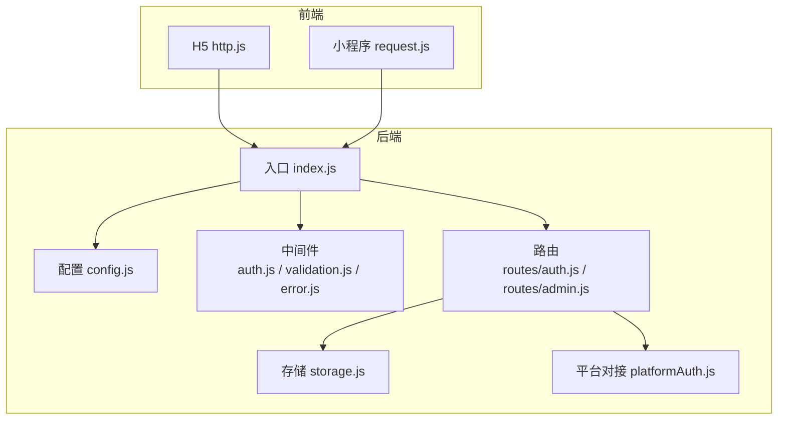
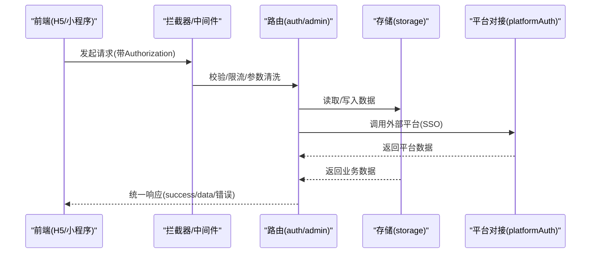
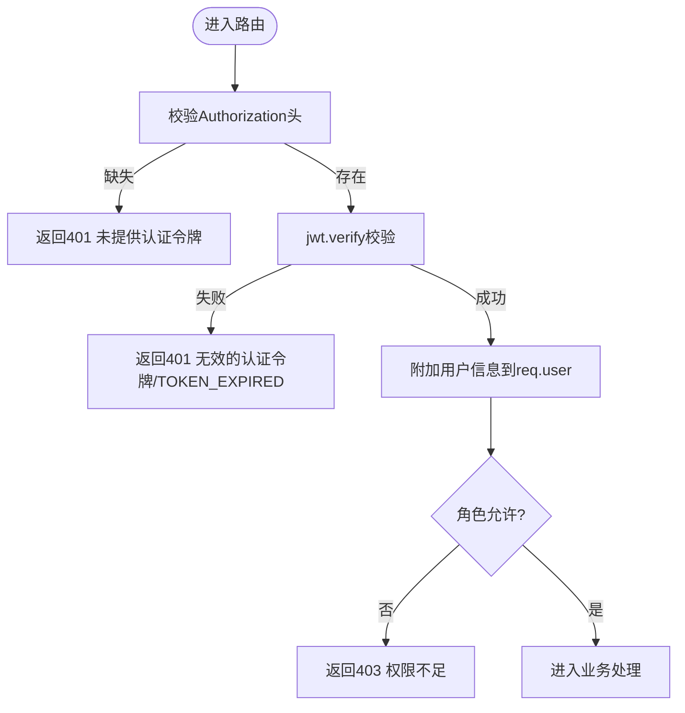
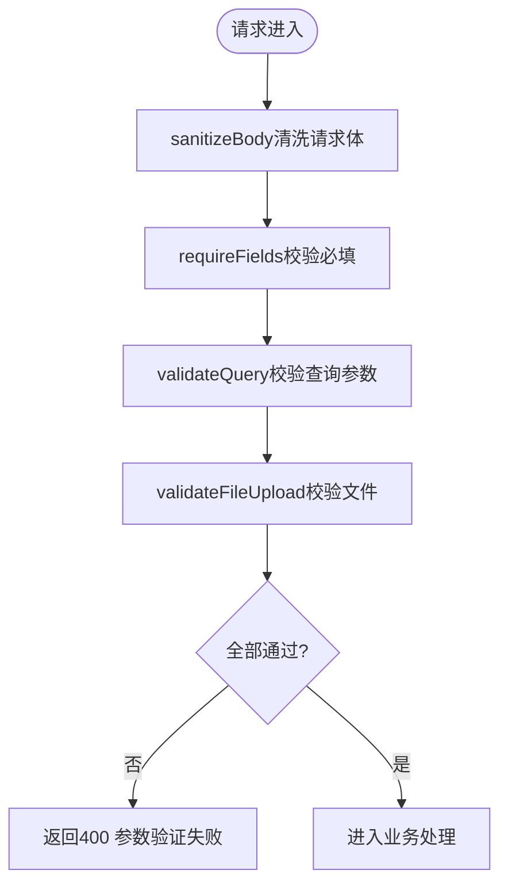
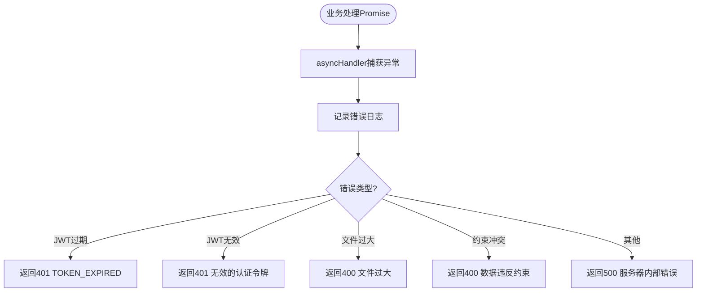
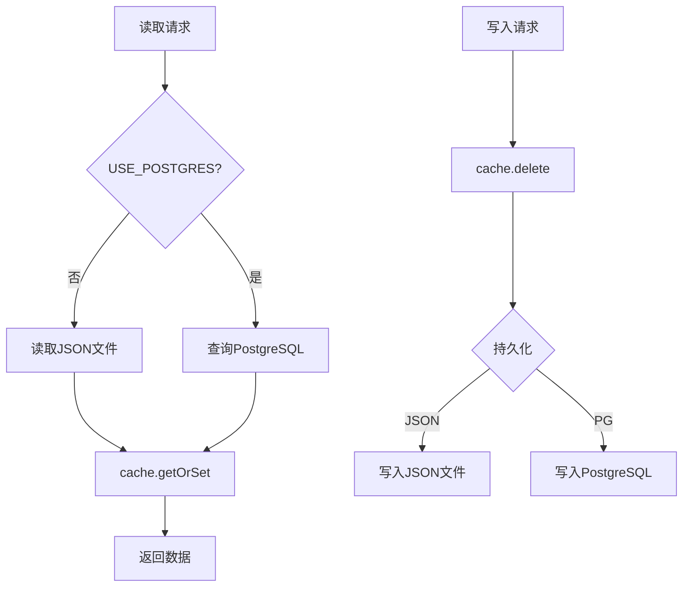
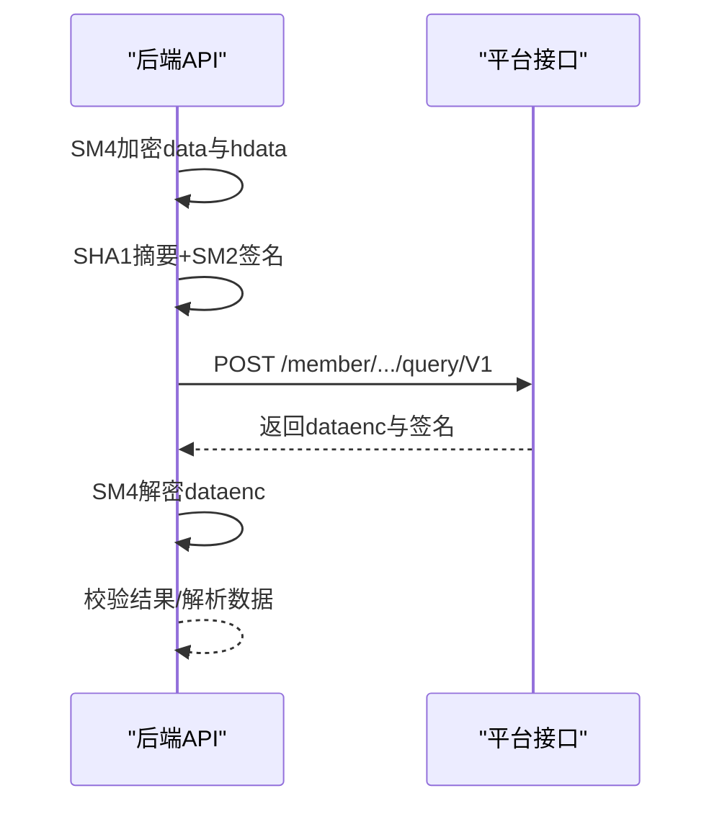
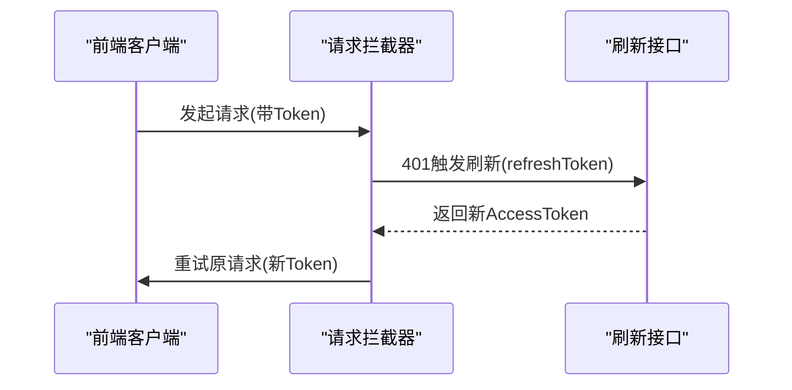
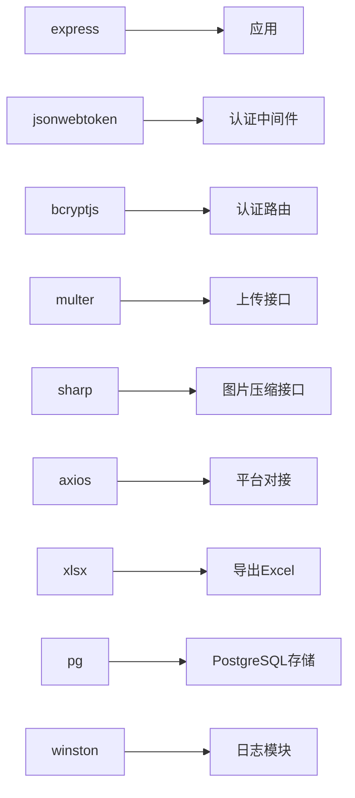

# API接口设计

<cite>
**本文引用的文件**
- [backend/index.js](file://backend/index.js)
- [backend/config.js](file://backend/config.js)
- [backend/middleware/auth.js](file://backend/middleware/auth.js)
- [backend/middleware/validation.js](file://backend/middleware/validation.js)
- [backend/middleware/error.js](file://backend/middleware/error.js)
- [backend/storage.js](file://backend/storage.js)
- [backend/platformAuth.js](file://backend/platformAuth.js)
- [backend/routes/auth.js](file://backend/routes/auth.js)
- [backend/routes/admin.js](file://backend/routes/admin.js)
- [frontend/h5/src/utils/http.js](file://frontend/h5/src/utils/http.js)
- [frontend/miniprogram/utils/request.js](file://frontend/miniprogram/utils/request.js)
- [backend/package.json](file://backend/package.json)
- [backend/OPTIMIZATION_SUMMARY.md](file://backend/OPTIMIZATION_SUMMARY.md)
- [backend/QUICK_REFERENCE.md](file://backend/QUICK_REFERENCE.md)
- [docs/接入文档/Apifox使用说明.md](file://docs/接入文档/Apifox使用说明.md)
</cite>

## 目录
1. [简介](#简介)
2. [项目结构](#项目结构)
3. [核心组件](#核心组件)
4. [架构总览](#架构总览)
5. [详细组件分析](#详细组件分析)
6. [依赖分析](#依赖分析)
7. [性能考虑](#性能考虑)
8. [故障排查指南](#故障排查指南)
9. [结论](#结论)
10. [附录](#附录)

## 简介
本文件面向低空飞行服务平台的API接口设计，基于现有后端代码库进行系统化梳理与规范化输出，涵盖RESTful设计原则、接口命名约定、HTTP状态码使用、请求/响应格式、参数校验、错误处理、版本管理、速率限制与安全防护，并提供接口文档模板、常见业务场景实现示例、错误码定义与处理流程，以及设计新接口与兼容演进的最佳实践。

## 项目结构
后端采用Express框架，按职责拆分为配置、中间件、路由与存储层；前端提供H5与小程序两套客户端，统一通过拦截器处理鉴权与刷新流程。

图表来源
- [backend/index.js:1-1401](file://backend/index.js#L1-L1401)
- [backend/config.js:1-123](file://backend/config.js#L1-L123)
- [backend/middleware/auth.js:1-168](file://backend/middleware/auth.js#L1-L168)
- [backend/middleware/validation.js:1-192](file://backend/middleware/validation.js#L1-L192)
- [backend/middleware/error.js:1-90](file://backend/middleware/error.js#L1-L90)
- [backend/storage.js:1-197](file://backend/storage.js#L1-L197)
- [backend/platformAuth.js:1-177](file://backend/platformAuth.js#L1-L177)
- [backend/routes/auth.js:1-591](file://backend/routes/auth.js#L1-L591)
- [backend/routes/admin.js:1-514](file://backend/routes/admin.js#L1-L514)
- [frontend/h5/src/utils/http.js:1-99](file://frontend/h5/src/utils/http.js#L1-L99)
- [frontend/miniprogram/utils/request.js:1-144](file://frontend/miniprogram/utils/request.js#L1-L144)

章节来源
- [backend/index.js:1-1401](file://backend/index.js#L1-L1401)
- [backend/package.json:1-34](file://backend/package.json#L1-L34)

## 核心组件
- 配置中心：集中管理JWT、微信、SSO、数据库、上传、服务器等配置项，并提供配置校验与打印。
- 中间件体系：认证与权限、输入消毒与校验、速率限制、全局错误处理。
- 路由模块：认证路由（登录/注册/刷新/登出/SSO/微信登录）、管理路由（统计/申请/用户/服务配置/评价等）。
- 存储层：统一读写封装，支持JSON文件与PostgreSQL双模式，内置缓存与一致性保障。
- 平台对接：与“畅行温州”平台的SM2/SM4加解密与签名交互。
- 前端拦截器：统一注入Authorization头，401自动刷新令牌并重试。

章节来源
- [backend/config.js:1-123](file://backend/config.js#L1-L123)
- [backend/middleware/auth.js:1-168](file://backend/middleware/auth.js#L1-L168)
- [backend/middleware/validation.js:1-192](file://backend/middleware/validation.js#L1-L192)
- [backend/middleware/error.js:1-90](file://backend/middleware/error.js#L1-L90)
- [backend/storage.js:1-197](file://backend/storage.js#L1-L197)
- [backend/platformAuth.js:1-177](file://backend/platformAuth.js#L1-L177)
- [frontend/h5/src/utils/http.js:1-99](file://frontend/h5/src/utils/http.js#L1-L99)
- [frontend/miniprogram/utils/request.js:1-144](file://frontend/miniprogram/utils/request.js#L1-L144)

## 架构总览
下图展示从客户端到后端路由、中间件、存储与外部平台的整体调用链路。

图表来源
- [backend/routes/auth.js:1-591](file://backend/routes/auth.js#L1-L591)
- [backend/routes/admin.js:1-514](file://backend/routes/admin.js#L1-L514)
- [backend/middleware/auth.js:1-168](file://backend/middleware/auth.js#L1-L168)
- [backend/middleware/validation.js:1-192](file://backend/middleware/validation.js#L1-L192)
- [backend/storage.js:1-197](file://backend/storage.js#L1-L197)
- [backend/platformAuth.js:1-177](file://backend/platformAuth.js#L1-L177)
- [frontend/h5/src/utils/http.js:1-99](file://frontend/h5/src/utils/http.js#L1-L99)
- [frontend/miniprogram/utils/request.js:1-144](file://frontend/miniprogram/utils/request.js#L1-L144)

## 详细组件分析

### 认证与权限中间件
- authRequired：校验Bearer Token，支持过期与无效错误细分。
- roleRequired：基于用户角色的权限控制。
- optionalAuth：可选认证，不影响请求流程。
- rateLimit：基于内存的滑动窗口限流，默认15分钟窗口与最大请求数可配。

图表来源
- [backend/middleware/auth.js:11-75](file://backend/middleware/auth.js#L11-L75)

章节来源
- [backend/middleware/auth.js:1-168](file://backend/middleware/auth.js#L1-L168)

### 输入验证与消毒中间件
- sanitizeBody/sanitizeString/sanitizeObject：移除脚本标签、事件属性、javascript协议，清洗字符串。
- requireFields：必填字段校验。
- validateQuery：查询参数类型、范围、枚举与长度校验。
- validateFileUpload：文件类型与大小校验。

图表来源
- [backend/middleware/validation.js:52-149](file://backend/middleware/validation.js#L52-L149)

章节来源
- [backend/middleware/validation.js:1-192](file://backend/middleware/validation.js#L1-L192)

### 全局错误处理
- errorHandler：统一捕获错误，区分Multer、JWT、数据库约束等错误类型，生产环境不暴露堆栈。
- notFoundHandler：404接口不存在。
- asyncHandler：异步函数错误包装，避免try-catch重复。

图表来源
- [backend/middleware/error.js:9-83](file://backend/middleware/error.js#L9-L83)

章节来源
- [backend/middleware/error.js:1-90](file://backend/middleware/error.js#L1-L90)

### 存储与缓存
- 支持JSON文件与PostgreSQL两种存储后端，自动切换。
- 读取使用缓存，写入主动清缓存，缓存键与过期策略明确。
- 提供初始化与双序列化兼容处理。

图表来源
- [backend/storage.js:42-132](file://backend/storage.js#L42-L132)

章节来源
- [backend/storage.js:1-197](file://backend/storage.js#L1-L197)

### 平台对接（SSO）
- 与“畅行温州”平台交互，使用SM2签名与SM4加密，构建请求体并校验响应。
- 提供queryMemberByAuthCode封装调用。

图表来源
- [backend/platformAuth.js:165-172](file://backend/platformAuth.js#L165-L172)

章节来源
- [backend/platformAuth.js:1-177](file://backend/platformAuth.js#L1-L177)

### 前端拦截与令牌刷新
- H5与小程序均在请求前注入Authorization头。
- 401时自动调用刷新接口，队列化并发刷新，成功后重试原请求。

图表来源
- [frontend/h5/src/utils/http.js:19-78](file://frontend/h5/src/utils/http.js#L19-L78)
- [frontend/miniprogram/utils/request.js:36-134](file://frontend/miniprogram/utils/request.js#L36-L134)

章节来源
- [frontend/h5/src/utils/http.js:1-99](file://frontend/h5/src/utils/http.js#L1-L99)
- [frontend/miniprogram/utils/request.js:1-144](file://frontend/miniprogram/utils/request.js#L1-L144)

## 依赖分析
- Express：Web框架与路由。
- JWT：令牌签发与校验。
- Bcrypt：密码哈希。
- Multer：文件上传。
- Sharp：图片压缩。
- Axios：HTTP客户端。
- XLSX：Excel导出。
- PG：PostgreSQL驱动。
- Winston：日志（可选）。

图表来源
- [backend/package.json:12-28](file://backend/package.json#L12-L28)

章节来源
- [backend/package.json:1-34](file://backend/package.json#L1-L34)

## 性能考虑
- 缓存策略：用户/申请/案例/服务配置分别设置60秒/5分钟缓存，显著降低I/O与响应时间。
- 存储层：读取走缓存、写入清缓存，避免脏读。
- 图片压缩：失败回退原图，设置合理缓存头。
- 速率限制：登录/注册接口限流，防暴力破解与滥用。

章节来源
- [backend/storage.js:134-181](file://backend/storage.js#L134-L181)
- [backend/index.js:86-114](file://backend/index.js#L86-L114)
- [backend/middleware/auth.js:108-160](file://backend/middleware/auth.js#L108-L160)
- [backend/routes/auth.js:18-21](file://backend/routes/auth.js#L18-L21)

## 故障排查指南
- 401未提供/无效令牌：检查Authorization头格式与有效期；确认刷新接口可用。
- 403权限不足：确认用户角色与路由所需角色匹配。
- 400参数错误：检查必填字段、类型、范围与长度；关注文件类型与大小限制。
- 429请求频繁：检查限流配置与客户端重试策略。
- 500服务器错误：查看日志文件定位具体异常；生产环境不暴露堆栈。
- SSO失败：检查平台对接参数、SM2/SM4密钥与签名流程。

章节来源
- [backend/middleware/error.js:9-83](file://backend/middleware/error.js#L9-L83)
- [backend/middleware/auth.js:11-75](file://backend/middleware/auth.js#L11-L75)
- [backend/middleware/validation.js:79-149](file://backend/middleware/validation.js#L79-L149)
- [backend/middleware/auth.js:108-160](file://backend/middleware/auth.js#L108-L160)
- [backend/platformAuth.js:135-163](file://backend/platformAuth.js#L135-L163)

## 结论
本项目在安全、性能与可维护性方面已形成较为完善的API设计与实现体系：统一的中间件链路确保输入安全与权限控制；模块化的路由与存储便于扩展；前端拦截器提供一致的鉴权体验；平台对接采用国密算法保证合规。建议后续在数据库、监控与API文档自动化方面持续演进。

## 附录

### RESTful设计规范与命名约定
- 资源命名：使用名词复数形式，如/users、/applications、/reviews。
- 动作映射：GET/POST/PUT/DELETE分别对应读取/创建/更新/删除。
- 版本管理：建议在路径中加入版本号，如/api/v1/，便于未来平滑演进。
- 命名风格：小写短横线或驼峰均可，保持前后端一致。

### HTTP状态码使用标准
- 200：成功，返回success与data。
- 201：资源创建成功。
- 400：参数错误/数据校验失败。
- 401：未认证/令牌无效/过期。
- 403：权限不足。
- 404：资源不存在。
- 409：资源冲突（如重复注册）。
- 429：请求过于频繁。
- 500：服务器内部错误。

### 请求/响应格式规范
- 成功响应：包含success与data字段；部分接口返回用户信息时包含令牌。
- 失败响应：包含success与message；生产环境不返回堆栈与detail。
- 分页响应：包含page、limit、total、totalPages。

章节来源
- [backend/routes/admin.js:101-110](file://backend/routes/admin.js#L101-L110)
- [backend/middleware/error.js:56-61](file://backend/middleware/error.js#L56-L61)

### 参数验证机制
- 必填字段：requireFields。
- 查询参数：validateQuery（类型、范围、枚举、长度）。
- 文件上传：validateFileUpload（类型与大小）。
- 输入消毒：sanitizeBody/sanitizeString。

章节来源
- [backend/middleware/validation.js:79-180](file://backend/middleware/validation.js#L79-L180)

### 错误处理策略
- 统一错误处理器：errorHandler。
- 404处理：notFoundHandler。
- 异步包装：asyncHandler。
- 日志记录：结构化日志，包含请求上下文与错误详情。

章节来源
- [backend/middleware/error.js:9-83](file://backend/middleware/error.js#L9-L83)
- [backend/OPTIMIZATION_SUMMARY.md:127-165](file://backend/OPTIMIZATION_SUMMARY.md#L127-L165)

### API版本管理
- 建议在路由前缀加入版本号，如/api/v1/。
- 保持向后兼容，新增字段时默认可选，避免破坏既有客户端。
- 通过配置开关或路由分组管理多版本并行。

章节来源
- [backend/routes/auth.js:96-147](file://backend/routes/auth.js#L96-L147)
- [backend/routes/admin.js:28-61](file://backend/routes/admin.js#L28-L61)

### 速率限制
- 登录/注册接口默认限流，防止暴力破解。
- 可根据业务场景调整窗口与阈值，结合Redis实现分布式限流。

章节来源
- [backend/middleware/auth.js:108-160](file://backend/middleware/auth.js#L108-L160)
- [backend/routes/auth.js:18-21](file://backend/routes/auth.js#L18-L21)

### 安全防护措施
- JWT：强密钥、合理TTL、刷新令牌轮换。
- 输入消毒：移除脚本与事件属性，防止XSS。
- 参数校验：严格的数据类型与范围校验。
- 权限隔离：按角色过滤数据与操作范围。
- 平台对接：SM2/SM4加解密与签名，确保数据安全。

章节来源
- [backend/config.js:8-76](file://backend/config.js#L8-L76)
- [backend/middleware/validation.js:9-47](file://backend/middleware/validation.js#L9-L47)
- [backend/middleware/auth.js:11-75](file://backend/middleware/auth.js#L11-L75)
- [backend/platformAuth.js:66-103](file://backend/platformAuth.js#L66-L103)

### 接口文档模板
- 路径：/api/...（建议加入版本号）
- 方法：GET/POST/PUT/DELETE
- 认证：Bearer Token（部分接口可选）
- 请求头：Content-Type: application/json
- 成功示例：返回success与data；失败示例：返回success与message
- 分页：page、limit、total、totalPages
- 错误码：参考错误处理章节

章节来源
- [backend/routes/admin.js:101-110](file://backend/routes/admin.js#L101-L110)
- [backend/middleware/error.js:56-61](file://backend/middleware/error.js#L56-L61)

### 常见业务场景实现示例
- 用户登录：/api/auth/login（用户名/手机号+密码），返回令牌与用户信息。
- 注册：/api/auth/register（手机号+密码+姓名），返回成功信息。
- 获取当前用户：/api/auth/me（需认证）。
- 刷新令牌：/api/auth/refresh（提交refreshToken）。
- 管理员统计：/api/admin/stats（需管理员角色）。
- 申请列表：/api/admin/applications（支持分页与筛选）。
- 服务配置：/api/admin/services/config（按角色可见/可改）。
- 评价管理：/api/admin/reviews（审核/删除）。

章节来源
- [backend/routes/auth.js:96-392](file://backend/routes/auth.js#L96-L392)
- [backend/routes/admin.js:28-511](file://backend/routes/admin.js#L28-L511)

### 设计新API接口步骤
- 明确资源与动作，选择合适HTTP方法与路径。
- 定义请求/响应模型，统一字段命名与类型。
- 在路由层编写处理逻辑，引入必要的中间件（认证、校验、限流）。
- 使用存储层读写数据，注意缓存一致性。
- 编写错误处理与日志记录。
- 前端拦截器自动注入Authorization，必要时增加重试与刷新逻辑。

章节来源
- [backend/routes/auth.js:96-392](file://backend/routes/auth.js#L96-L392)
- [backend/routes/admin.js:28-511](file://backend/routes/admin.js#L28-L511)
- [frontend/h5/src/utils/http.js:19-78](file://frontend/h5/src/utils/http.js#L19-L78)

### 实现接口版本兼容
- 在路径中加入版本号，如/api/v1/。
- 保留旧接口一段时间，返回迁移提示或重定向。
- 对新增字段默认可选，避免破坏既有客户端。
- 通过配置或路由分组管理多版本并行。

章节来源
- [backend/routes/auth.js:96-147](file://backend/routes/auth.js#L96-L147)
- [backend/routes/admin.js:28-61](file://backend/routes/admin.js#L28-L61)

### 优化API性能与安全性
- 使用缓存减少I/O，写入时清缓存。
- 图片压缩与CDN，失败回退原图并设置缓存头。
- 速率限制与白名单策略。
- 强JWT密钥与短TTL，及时刷新。
- 输入消毒与参数校验，最小权限原则。

章节来源
- [backend/storage.js:134-181](file://backend/storage.js#L134-L181)
- [backend/index.js:86-114](file://backend/index.js#L86-L114)
- [backend/middleware/auth.js:108-160](file://backend/middleware/auth.js#L108-L160)
- [backend/config.js:8-76](file://backend/config.js#L8-L76)

### 错误码定义与处理流程
- 400：参数/数据校验失败。
- 401：未认证/令牌无效/过期。
- 403：权限不足。
- 404：资源不存在。
- 409：资源冲突。
- 429：请求过于频繁。
- 500：服务器内部错误。

章节来源
- [backend/middleware/error.js:16-61](file://backend/middleware/error.js#L16-L61)

### SSO对接与调试
- 使用Apifox或脚本生成请求体，包含签名与加密字段。
- 注意每次运行生成新的会话号与签名，避免复用。
- 在后端通过queryMemberByAuthCode调用平台接口。

章节来源
- [docs/接入文档/Apifox使用说明.md:1-69](file://docs/接入文档/Apifox使用说明.md#L1-L69)
- [backend/platformAuth.js:135-172](file://backend/platformAuth.js#L135-L172)