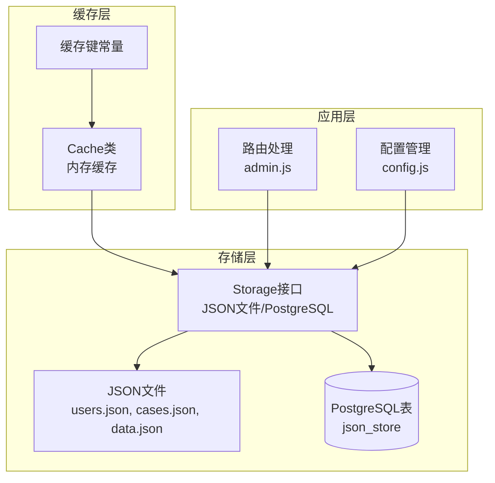
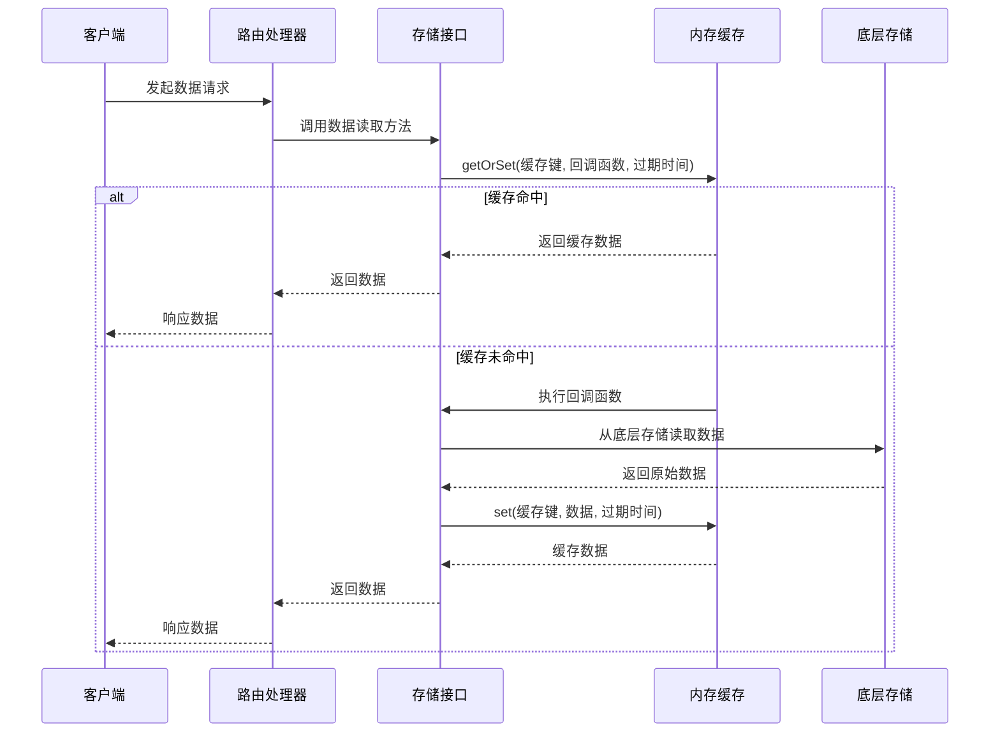
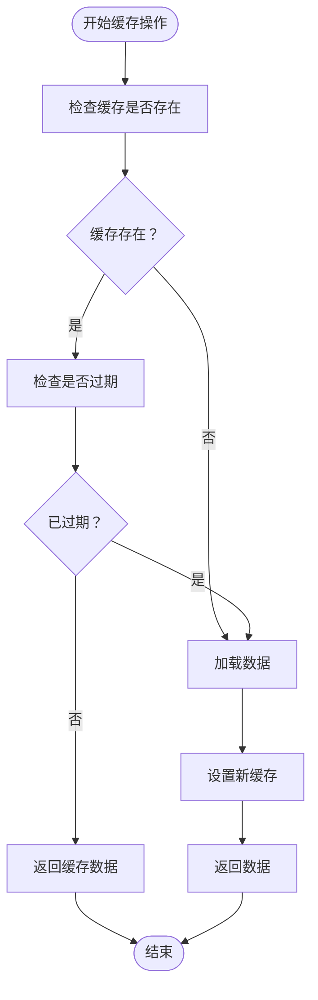
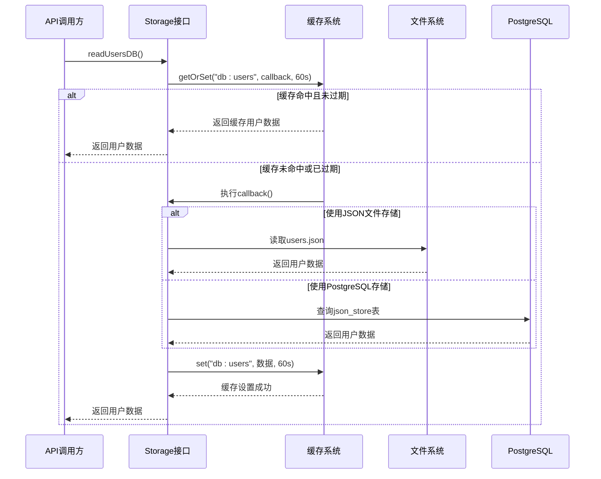
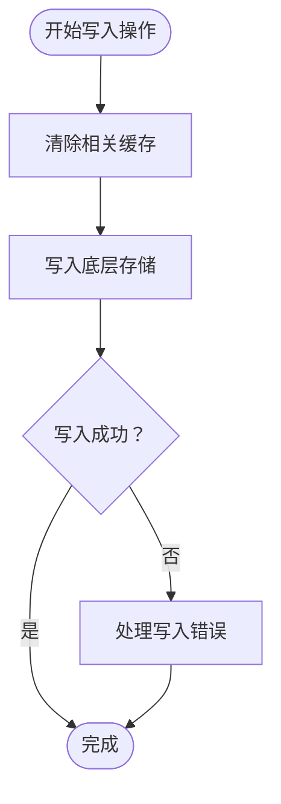
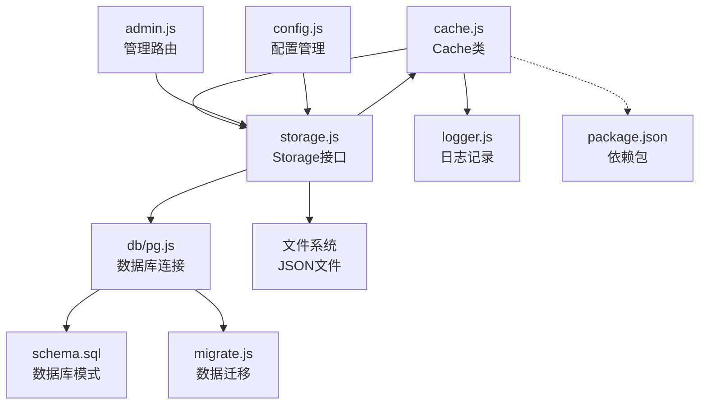
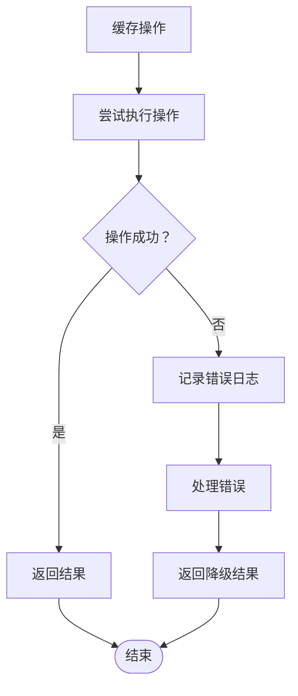

# 缓存机制设计

<cite>
**本文档引用的文件**
- [cache.js](file://backend/cache.js)
- [storage.js](file://backend/storage.js)
- [index.js](file://backend/index.js)
- [config.js](file://backend/config.js)
- [admin.js](file://backend/routes/admin.js)
- [migrate.js](file://backend/db/migrate.js)
- [schema.sql](file://backend/db/schema.sql)
- [package.json](file://backend/package.json)
</cite>

## 目录
1. [引言](#引言)
2. [项目结构](#项目结构)
3. [核心组件](#核心组件)
4. [架构概览](#架构概览)
5. [详细组件分析](#详细组件分析)
6. [依赖关系分析](#依赖关系分析)
7. [性能考虑](#性能考虑)
8. [故障排除指南](#故障排除指南)
9. [结论](#结论)
10. [附录](#附录)

## 引言

本项目实现了基于内存的缓存系统，旨在优化数据访问性能，减少对底层存储层的频繁读取。缓存机制采用简单高效的内存映射表实现，支持多种数据类型的差异化过期策略，并提供了完整的缓存生命周期管理功能。

缓存系统的核心设计理念是：
- **高性能**：内存访问速度远超磁盘IO
- **灵活性**：支持不同数据类型的差异化缓存策略
- **可靠性**：自动过期清理和错误处理
- **可维护性**：清晰的键值管理和统计监控

## 项目结构

缓存机制相关的文件组织如下：

**图表来源**
- [cache.js:1-119](file://backend/cache.js#L1-L119)
- [storage.js:1-197](file://backend/storage.js#L1-L197)
- [admin.js:1-514](file://backend/routes/admin.js#L1-L514)

**章节来源**
- [cache.js:1-119](file://backend/cache.js#L1-L119)
- [storage.js:1-197](file://backend/storage.js#L1-L197)

## 核心组件

### 缓存类设计

缓存系统的核心是一个简洁的内存缓存类，提供以下核心功能：

#### 基础操作
- **get(key)**: 获取缓存项，自动检查过期时间
- **set(key, value, ttl)**: 设置缓存项，支持自定义过期时间
- **delete(key)**: 删除特定缓存项
- **clear()**: 清空所有缓存

#### 高级功能
- **getOrSet(key, fn, ttl)**: 命中则返回，未命中则异步加载并设置缓存
- **cleanup()**: 清理过期缓存项
- **stats()**: 获取缓存统计信息

#### 缓存键管理

系统定义了统一的缓存键常量，确保键值的一致性和可维护性：

| 键类型 | 键值模式 | 描述 |
|--------|----------|------|
| 用户数据 | `db:users` | 用户基础数据缓存 |
| 申请数据 | `db:applications` | 业务申请数据缓存 |
| 案例数据 | `db:cases` | 展示案例数据缓存 |
| 服务配置 | `db:services_config` | 服务配置数据缓存 |
| 评价数据 | `db:reviews` | 用户评价数据缓存 |
| 管理统计 | `stats:admin` | 管理后台统计缓存 |
| 用户详情 | `user:{userId}` | 特定用户的详细信息缓存 |

**章节来源**
- [cache.js:54-99](file://backend/cache.js#L54-L99)
- [cache.js:107-116](file://backend/cache.js#L107-L116)

## 架构概览

缓存系统采用分层架构设计，实现了存储层与应用层的有效解耦：

**图表来源**
- [storage.js:134-181](file://backend/storage.js#L134-L181)
- [cache.js:57-67](file://backend/cache.js#L57-L67)

## 详细组件分析

### 缓存策略设计

#### 时间过期策略

系统针对不同类型的数据制定了差异化的过期时间策略：

| 数据类型 | 过期时间 | 设计原因 | 缓存键 |
|----------|----------|----------|--------|
| 用户数据 | 60秒 | 用户信息频繁变更，需要及时更新 | `db:users` |
| 案例数据 | 5分钟 | 展示内容相对稳定，减少频繁读取 | `db:cases` |
| 申请数据 | 1分钟 | 业务数据实时性要求高 | `db:applications` |
| 服务配置 | 5分钟 | 配置变更频率较低 | `db:services_config` |
| 评价数据 | 60秒 | 评价内容需要快速响应 | `db:reviews` |

#### 过期时间计算机制

**图表来源**
- [cache.js:14-28](file://backend/cache.js#L14-L28)
- [cache.js:33-38](file://backend/cache.js#L33-L38)

**章节来源**
- [storage.js:134-181](file://backend/storage.js#L134-L181)

### 缓存读取流程

缓存读取采用"先命中后加载"的策略，确保数据的时效性和一致性：

**图表来源**
- [storage.js:134-142](file://backend/storage.js#L134-L142)
- [cache.js:57-67](file://backend/cache.js#L57-L67)

**章节来源**
- [storage.js:134-142](file://backend/storage.js#L134-L142)

### 缓存写入策略

缓存写入采用"先写存储后清缓存"的策略，确保数据的一致性：

**图表来源**
- [storage.js:139-142](file://backend/storage.js#L139-L142)
- [storage.js:149-152](file://backend/storage.js#L149-L152)

**章节来源**
- [storage.js:139-142](file://backend/storage.js#L139-L142)

### 缓存失效机制

系统实现了多层次的缓存失效机制：

#### 自动清理
- **定时清理**：每5分钟自动清理过期缓存项
- **惰性清理**：访问时检查并清理过期项

#### 手动失效
- **写入触发**：数据写入后立即清除相关缓存
- **键空间管理**：支持按键前缀批量清理

**章节来源**
- [cache.js:72-79](file://backend/cache.js#L72-L79)
- [cache.js:105](file://backend/cache.js#L105)

### 缓存键值管理

#### 键值设计原则
- **命名规范**：采用`namespace:key`格式
- **命名空间隔离**：不同数据类型使用独立命名空间
- **动态键生成**：支持用户ID等动态参数

#### 键值映射表

| 键名 | 命名空间 | 动态参数 | 用途 |
|------|----------|----------|------|
| `db:users` | db | 无 | 用户基础数据 |
| `db:applications` | db | 无 | 业务申请数据 |
| `db:cases` | db | 无 | 展示案例数据 |
| `db:services_config` | db | 无 | 服务配置数据 |
| `db:reviews` | db | 无 | 用户评价数据 |
| `stats:admin` | stats | 无 | 管理统计数据 |
| `user:{userId}` | user | userId | 用户详情数据 |

**章节来源**
- [cache.js:108-116](file://backend/cache.js#L108-L116)

## 依赖关系分析

缓存系统与其他组件的依赖关系如下：

**图表来源**
- [cache.js:1-119](file://backend/cache.js#L1-L119)
- [storage.js:1-197](file://backend/storage.js#L1-L197)
- [admin.js:1-514](file://backend/routes/admin.js#L1-L514)

**章节来源**
- [package.json:12-28](file://backend/package.json#L12-L28)

### 外部依赖

缓存系统主要依赖以下外部组件：

- **Node.js内置模块**：fs、path、Map
- **第三方库**：express、pg、winston
- **数据库**：PostgreSQL JSONB存储

**章节来源**
- [package.json:12-28](file://backend/package.json#L12-L28)

## 性能考虑

### 缓存命中率优化

#### 访问模式优化
- **热点数据预热**：在应用启动时预加载常用数据
- **批量读取**：利用Promise.all并发读取多个缓存项
- **缓存预填充**：在数据更新后主动填充相关缓存

#### 内存管理策略
- **LRU淘汰**：当前实现为FIFO，可扩展为LRU算法
- **内存监控**：定期检查缓存大小和内存使用情况
- **自动清理**：定时清理过期数据释放内存

### 性能调优方案

#### 缓存参数调优
- **过期时间调整**：根据数据变更频率调整过期时间
- **并发控制**：避免缓存击穿，实现分布式锁
- **缓存分片**：大数据集采用分片缓存策略

#### 监控指标
- **命中率统计**：计算缓存命中次数与总请求次数比
- **响应时间**：监控缓存读取和写入的平均响应时间
- **内存使用**：跟踪缓存占用的内存大小

**章节来源**
- [cache.js:84-98](file://backend/cache.js#L84-L98)

### 内存管理

#### 当前实现特点
- **内存映射表**：使用ES6 Map作为底层存储
- **垃圾回收**：依赖JavaScript引擎的垃圾回收机制
- **内存泄漏防护**：自动过期清理防止内存泄漏

#### 扩展建议
- **内存限制**：实现最大缓存条目数限制
- **内存预警**：当内存使用超过阈值时触发清理
- **持久化备份**：实现缓存数据的持久化存储

## 故障排除指南

### 常见问题及解决方案

#### 缓存未生效
**症状**：数据频繁从存储层读取
**排查步骤**：
1. 检查缓存键是否正确
2. 验证过期时间设置
3. 确认getOrSet回调函数执行

#### 缓存数据过期
**症状**：返回旧数据
**解决方案**：
1. 检查定时清理任务是否正常运行
2. 验证过期时间计算逻辑
3. 确认手动清理触发时机

#### 内存使用过高
**症状**：内存占用持续增长
**处理措施**：
1. 检查是否有未清理的缓存键
2. 优化过期时间设置
3. 实现内存使用监控

### 错误处理机制

缓存系统实现了完善的错误处理：

**图表来源**
- [cache.js:14-28](file://backend/cache.js#L14-L28)

**章节来源**
- [cache.js:14-28](file://backend/cache.js#L14-L28)

## 结论

本缓存机制设计实现了以下目标：

### 设计优势
- **简单高效**：基于内存的简单实现，性能优异
- **灵活配置**：支持不同数据类型的差异化缓存策略
- **可靠稳定**：自动过期清理和错误处理机制
- **易于维护**：清晰的键值管理和统计监控

### 技术特色
- **异步加载**：getOrSet支持异步数据加载
- **自动清理**：定时和惰性双重清理机制
- **统计监控**：提供详细的缓存使用统计
- **存储无关**：与底层存储实现完全解耦

### 改进建议
- **分布式支持**：考虑Redis等分布式缓存
- **监控增强**：集成APM工具进行性能监控
- **容量管理**：实现智能的内存容量控制
- **一致性保证**：加强缓存与存储的一致性

该缓存系统为平台提供了可靠的性能优化基础，能够有效提升数据访问效率，降低存储层压力，为后续的功能扩展和性能优化奠定了良好基础。

## 附录

### 缓存配置参考

#### 默认配置
- **默认过期时间**：60秒
- **清理间隔**：5分钟
- **存储类型**：JSON文件或PostgreSQL

#### 环境变量配置
- `USE_POSTGRES`：启用PostgreSQL存储
- `JWT_SECRET`：JWT密钥
- `ACCESS_TOKEN_TTL`：访问令牌过期时间
- `REFRESH_TOKEN_TTL`：刷新令牌过期时间

**章节来源**
- [config.js:8-76](file://backend/config.js#L8-L76)