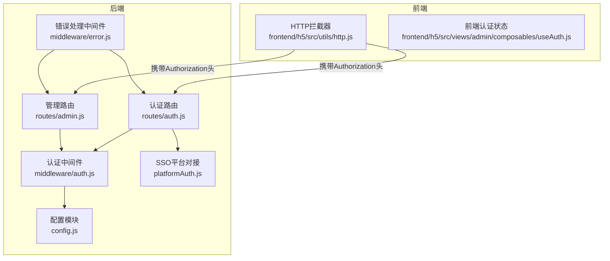
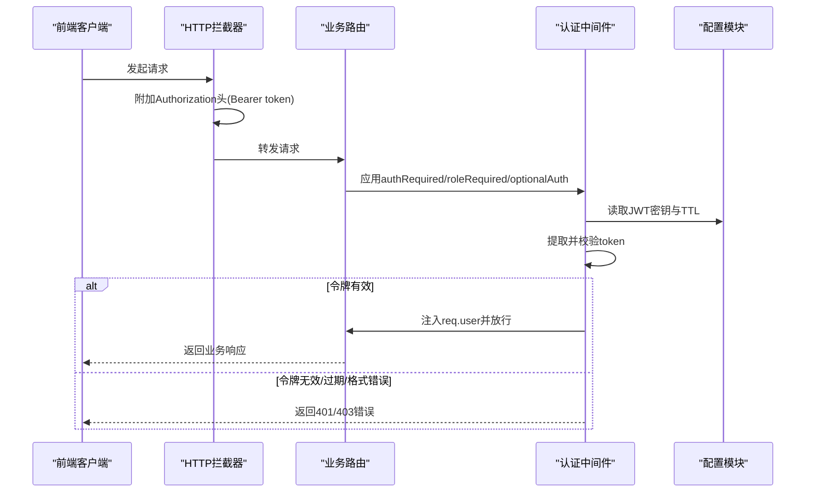
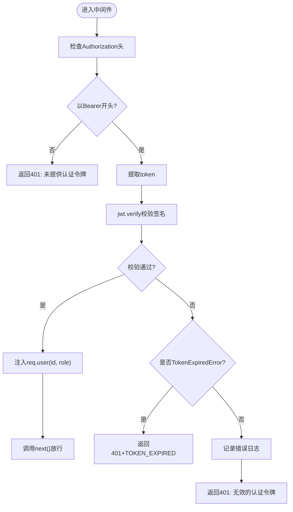
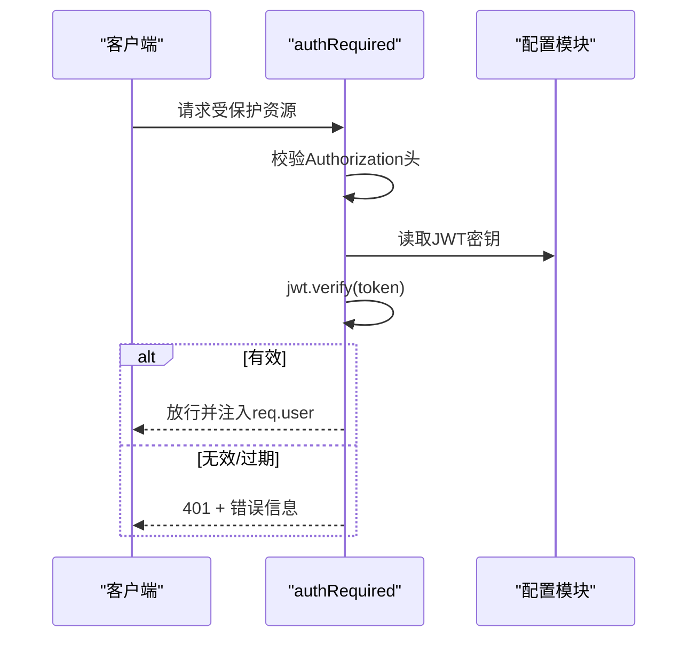
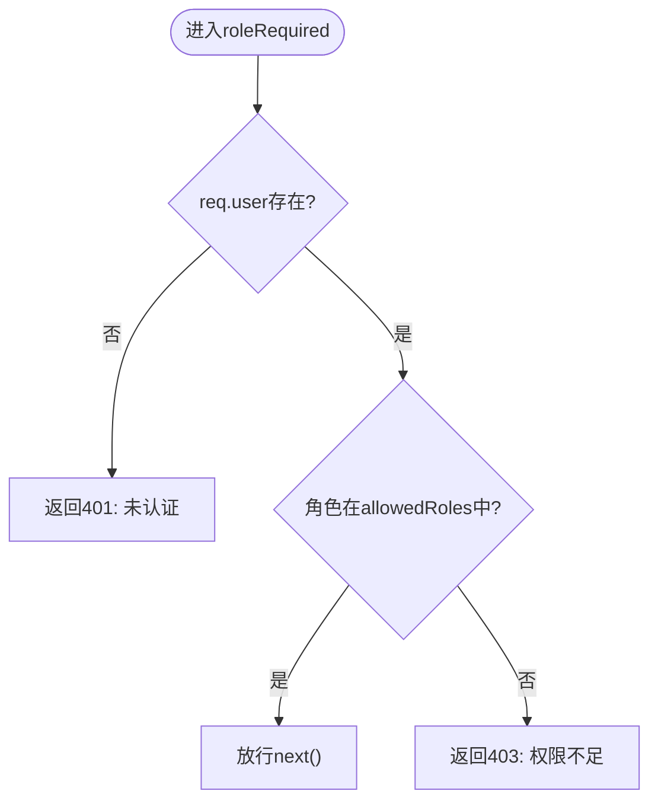
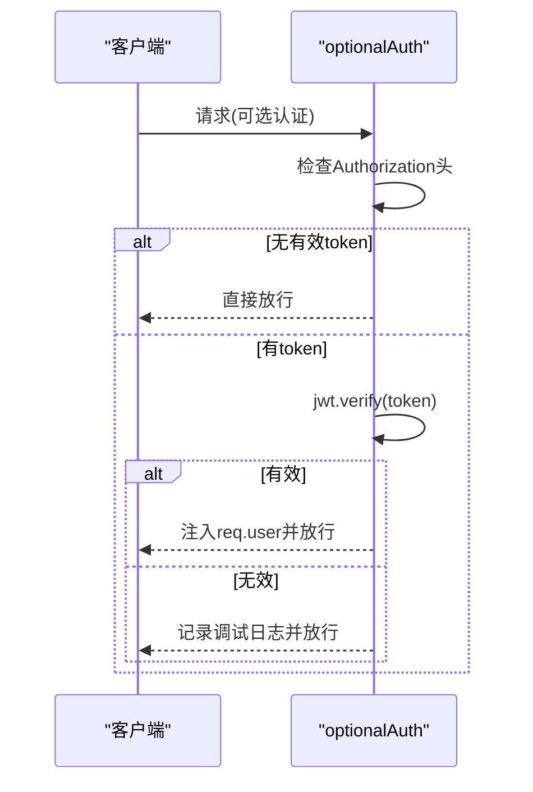
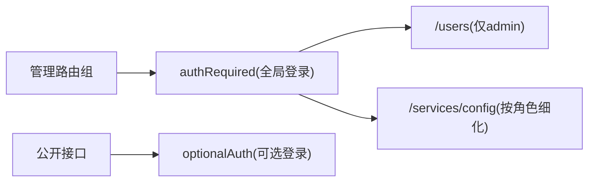
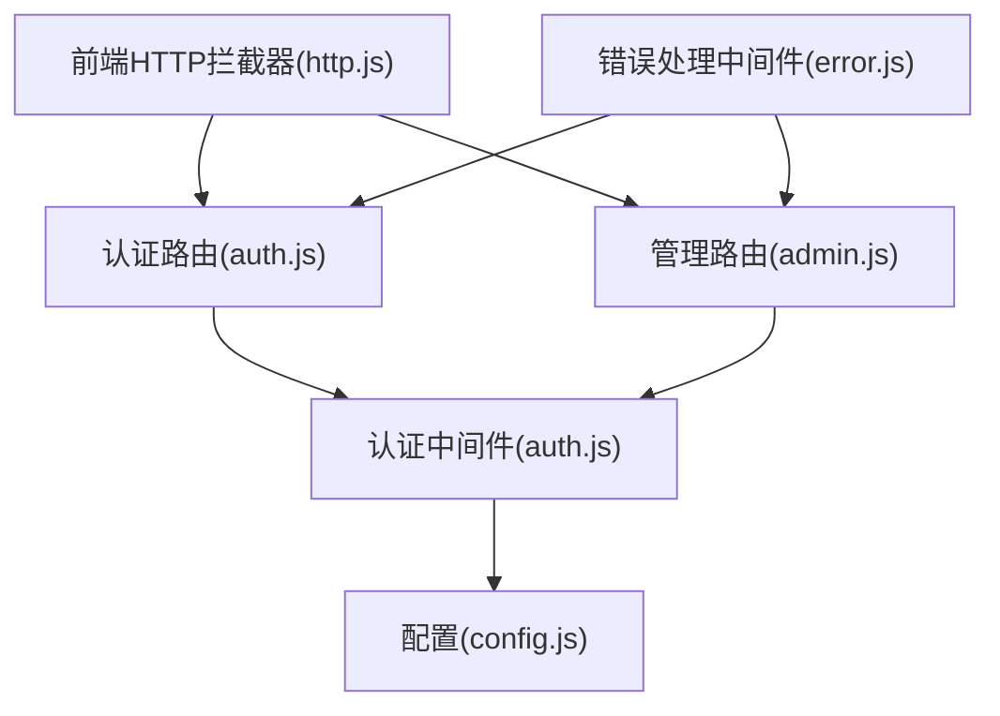

# 认证中间件

<cite>
**本文引用的文件**
- [backend/middleware/auth.js](file://backend/middleware/auth.js)
- [backend/config.js](file://backend/config.js)
- [backend/routes/admin.js](file://backend/routes/admin.js)
- [backend/routes/auth.js](file://backend/routes/auth.js)
- [backend/platformAuth.js](file://backend/platformAuth.js)
- [backend/middleware/error.js](file://backend/middleware/error.js)
- [backend/middleware/validation.js](file://backend/middleware/validation.js)
- [backend/index.js](file://backend/index.js)
- [frontend/h5/src/utils/http.js](file://frontend/h5/src/utils/http.js)
- [frontend/h5/src/views/admin/composables/useAuth.js](file://frontend/h5/src/views/admin/composables/useAuth.js)
- [backend/package.json](file://backend/package.json)
</cite>

## 目录
1. [简介](#简介)
2. [项目结构](#项目结构)
3. [核心组件](#核心组件)
4. [架构总览](#架构总览)
5. [详细组件分析](#详细组件分析)
6. [依赖关系分析](#依赖关系分析)
7. [性能考虑](#性能考虑)
8. [故障排除指南](#故障排除指南)
9. [结论](#结论)
10. [附录](#附录)

## 简介
本文件系统性地阐述认证中间件的设计与实现，重点覆盖以下方面：
- JWT 令牌提取、解码与验证机制
- authRequired 中间件的强制认证逻辑、token 格式检查与错误处理
- roleRequired 中间件的角色权限验证、allowedRoles 配置与权限拒绝处理
- optionalAuth 中间件的可选认证实现与无 token 的处理策略
- 在路由中的使用示例与组合使用场景
- 认证失败的错误码与统一响应格式

## 项目结构
认证相关能力主要分布在后端中间件、路由与配置模块，并由前端发起请求时自动携带 Bearer 令牌。

**图表来源**
- [backend/middleware/auth.js:1-168](file://backend/middleware/auth.js#L1-L168)
- [backend/config.js:1-123](file://backend/config.js#L1-L123)
- [backend/routes/auth.js:1-591](file://backend/routes/auth.js#L1-L591)
- [backend/routes/admin.js:1-514](file://backend/routes/admin.js#L1-L514)
- [backend/platformAuth.js:1-177](file://backend/platformAuth.js#L1-L177)
- [backend/middleware/error.js:1-90](file://backend/middleware/error.js#L1-L90)
- [frontend/h5/src/utils/http.js:1-99](file://frontend/h5/src/utils/http.js#L1-L99)
- [frontend/h5/src/views/admin/composables/useAuth.js:1-45](file://frontend/h5/src/views/admin/composables/useAuth.js#L1-L45)

**章节来源**
- [backend/middleware/auth.js:1-168](file://backend/middleware/auth.js#L1-L168)
- [backend/config.js:1-123](file://backend/config.js#L1-L123)
- [backend/routes/auth.js:1-591](file://backend/routes/auth.js#L1-L591)
- [backend/routes/admin.js:1-514](file://backend/routes/admin.js#L1-L514)
- [backend/platformAuth.js:1-177](file://backend/platformAuth.js#L1-L177)
- [backend/middleware/error.js:1-90](file://backend/middleware/error.js#L1-L90)
- [frontend/h5/src/utils/http.js:1-99](file://frontend/h5/src/utils/http.js#L1-L99)
- [frontend/h5/src/views/admin/composables/useAuth.js:1-45](file://frontend/h5/src/views/admin/composables/useAuth.js#L1-L45)

## 核心组件
- authRequired：强制认证中间件，校验 Authorization 头与 JWT 有效性，注入 req.user
- roleRequired：基于角色的权限控制中间件，支持 allowedRoles 白名单
- optionalAuth：可选认证中间件，仅在存在有效 token 时注入用户信息
- rateLimit：简单速率限制中间件（非认证核心，但与登录等接口配合）

上述组件均位于认证中间件模块中，依赖配置模块提供的 JWT 密钥与过期时间。

**章节来源**
- [backend/middleware/auth.js:11-101](file://backend/middleware/auth.js#L11-L101)
- [backend/config.js:9-14](file://backend/config.js#L9-L14)

## 架构总览
认证流程自前端发起请求开始，经由中间件进行令牌校验与角色权限判断，最终进入业务路由处理。

**图表来源**
- [backend/middleware/auth.js:11-101](file://backend/middleware/auth.js#L11-L101)
- [backend/config.js:9-14](file://backend/config.js#L9-L14)
- [frontend/h5/src/utils/http.js:19-26](file://frontend/h5/src/utils/http.js#L19-L26)

## 详细组件分析

### JWT 令牌验证机制
- 令牌提取：从 Authorization 头中提取 Bearer token，若缺失或格式不正确则返回 401
- 令牌解码与验证：使用配置模块中的 JWT 密钥对 token 进行签名验证
- 过期处理：捕获过期错误并返回带 TOKEN_EXPIRED 错误码的 401 响应
- 无效令牌：记录日志并返回 401

**图表来源**
- [backend/middleware/auth.js:11-45](file://backend/middleware/auth.js#L11-L45)
- [backend/config.js:9-14](file://backend/config.js#L9-L14)

**章节来源**
- [backend/middleware/auth.js:11-45](file://backend/middleware/auth.js#L11-L45)
- [backend/config.js:9-14](file://backend/config.js#L9-L14)

### authRequired 强制认证中间件
- 功能：确保每个受保护路由都必须具备有效 JWT
- 令牌格式检查：要求 Authorization 头必须为 Bearer <token> 形式
- 错误处理：
  - 缺失头：401 未提供认证令牌
  - 格式错误：401 未提供认证令牌
  - 校验失败：401 无效的认证令牌
  - 过期：401 并带 TOKEN_EXPIRED 错误码
- 成功后在 req.user 中注入用户标识与角色

**图表来源**
- [backend/middleware/auth.js:11-45](file://backend/middleware/auth.js#L11-L45)
- [backend/config.js:9-14](file://backend/config.js#L9-L14)

**章节来源**
- [backend/middleware/auth.js:11-45](file://backend/middleware/auth.js#L11-L45)

### roleRequired 角色权限验证
- 功能：基于 allowedRoles 白名单进行角色校验
- 依赖：依赖前置 authRequired 已注入 req.user
- 行为：
  - 未认证：401 未认证
  - 角色不在白名单：403 权限不足
  - 通过：放行
- 典型用法：在路由级别传入允许的角色数组

**图表来源**
- [backend/middleware/auth.js:50-75](file://backend/middleware/auth.js#L50-L75)

**章节来源**
- [backend/middleware/auth.js:50-75](file://backend/middleware/auth.js#L50-L75)

### optionalAuth 可选认证
- 功能：仅在存在有效 token 时才注入用户信息；无 token 或 token 无效时不阻断请求
- 场景：某些公开接口需要“尽可能识别用户”，但不强制要求登录
- 行为：
  - 无 Authorization 或非 Bearer：直接 next()
  - 有 token 且有效：注入 req.user
  - 有 token 但无效：记录调试日志并继续 next()

**图表来源**
- [backend/middleware/auth.js:80-101](file://backend/middleware/auth.js#L80-L101)

**章节来源**
- [backend/middleware/auth.js:80-101](file://backend/middleware/auth.js#L80-L101)

### 在路由中的使用示例
- 全站强制认证：在管理路由前挂载 authRequired，使所有子路由默认需要登录
- 局部角色控制：在特定路由上叠加 roleRequired(['admin']) 实现管理员专属接口
- 组合使用：先强制认证，再按需进行角色校验
- 可选认证：在部分公开接口使用 optionalAuth，以便在登录状态下提供个性化内容

**图表来源**
- [backend/routes/admin.js:23-24](file://backend/routes/admin.js#L23-L24)
- [backend/routes/admin.js:212-212](file://backend/routes/admin.js#L212-L212)
- [backend/middleware/auth.js:80-101](file://backend/middleware/auth.js#L80-L101)

**章节来源**
- [backend/routes/admin.js:23-24](file://backend/routes/admin.js#L23-L24)
- [backend/routes/admin.js:212-212](file://backend/routes/admin.js#L212-L212)
- [backend/middleware/auth.js:80-101](file://backend/middleware/auth.js#L80-L101)

## 依赖关系分析
- 认证中间件依赖配置模块提供 JWT 密钥与过期时间
- 路由层通过 require 引入中间件并组合使用
- 前端通过 HTTP 拦截器统一附加 Authorization 头
- 错误处理中间件统一捕获并格式化错误响应

**图表来源**
- [backend/middleware/auth.js:1-168](file://backend/middleware/auth.js#L1-L168)
- [backend/config.js:1-123](file://backend/config.js#L1-L123)
- [backend/routes/auth.js:1-591](file://backend/routes/auth.js#L1-L591)
- [backend/routes/admin.js:1-514](file://backend/routes/admin.js#L1-L514)
- [backend/middleware/error.js:1-90](file://backend/middleware/error.js#L1-L90)
- [frontend/h5/src/utils/http.js:1-99](file://frontend/h5/src/utils/http.js#L1-L99)

**章节来源**
- [backend/middleware/auth.js:1-168](file://backend/middleware/auth.js#L1-L168)
- [backend/config.js:1-123](file://backend/config.js#L1-L123)
- [backend/routes/auth.js:1-591](file://backend/routes/auth.js#L1-L591)
- [backend/routes/admin.js:1-514](file://backend/routes/admin.js#L1-L514)
- [backend/middleware/error.js:1-90](file://backend/middleware/error.js#L1-L90)
- [frontend/h5/src/utils/http.js:1-99](file://frontend/h5/src/utils/http.js#L1-L99)

## 性能考虑
- 令牌验证为 O(1)，开销极低
- 建议在网关或反向代理层做基础限流，避免针对登录接口的暴力尝试
- 对于高频接口，可结合 optionalAuth 降低不必要的鉴权成本
- 前端统一拦截器复用 token，减少重复请求与网络往返

## 故障排除指南
- 401 未提供认证令牌
  - 检查前端是否正确设置 Authorization 头
  - 确认请求头格式为 Bearer <token>
- 401 令牌已过期
  - 使用刷新令牌接口刷新 access token
  - 检查服务端 JWT 过期时间配置
- 401 无效的认证令牌
  - 核对 JWT 密钥一致性
  - 检查 token 是否被篡改或来自不同签发方
- 403 权限不足
  - 确认用户角色是否在 allowedRoles 白名单中
  - 检查路由是否正确叠加了 roleRequired 中间件
- 速率限制 429
  - 登录/注册接口设置了速率限制，避免频繁尝试
  - 前端应避免短时间内的重复提交

**章节来源**
- [backend/middleware/auth.js:14-44](file://backend/middleware/auth.js#L14-L44)
- [backend/middleware/auth.js:53-71](file://backend/middleware/auth.js#L53-L71)
- [backend/middleware/auth.js:127-131](file://backend/middleware/auth.js#L127-L131)
- [backend/middleware/error.js:31-45](file://backend/middleware/error.js#L31-L45)

## 结论
本认证中间件体系以 JWT 为核心，结合强制认证、角色权限与可选认证三种策略，满足从公开到受限的多层级安全需求。通过统一的中间件与路由组合，既保证了安全性，又提供了良好的扩展性与可维护性。建议在生产环境中严格管理 JWT 密钥与过期策略，并结合前端拦截器与错误处理机制，提供一致的用户体验。

## 附录

### 认证失败错误码与响应格式
- 401 未提供认证令牌
  - message: 未提供认证令牌
- 401 令牌已过期
  - message: 令牌已过期
  - code: TOKEN_EXPIRED
- 401 无效的认证令牌
  - message: 无效的认证令牌
- 403 权限不足
  - message: 权限不足
- 429 请求过于频繁,请稍后重试
  - message: 请求过于频繁,请稍后重试

**章节来源**
- [backend/middleware/auth.js:15-44](file://backend/middleware/auth.js#L15-L44)
- [backend/middleware/auth.js:67-71](file://backend/middleware/auth.js#L67-L71)
- [backend/middleware/auth.js:127-131](file://backend/middleware/auth.js#L127-L131)
- [backend/middleware/error.js:39-44](file://backend/middleware/error.js#L39-L44)

### 前端集成要点
- 统一在 HTTP 拦截器中附加 Authorization: Bearer <token>
- 401 时触发刷新令牌流程，刷新成功后重试原请求
- 本地持久化 access/refresh token，避免每次请求重复登录

**章节来源**
- [frontend/h5/src/utils/http.js:19-78](file://frontend/h5/src/utils/http.js#L19-L78)