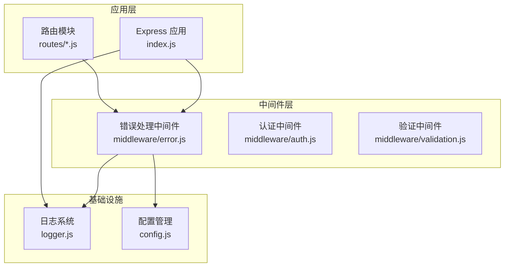
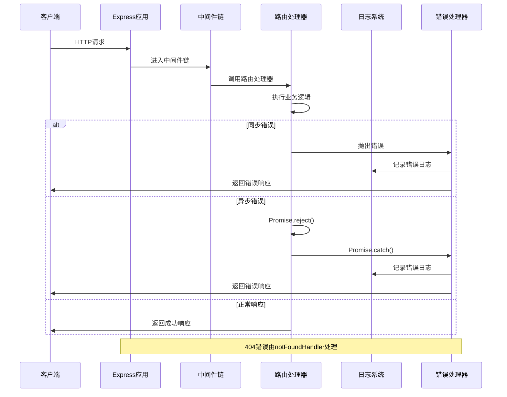
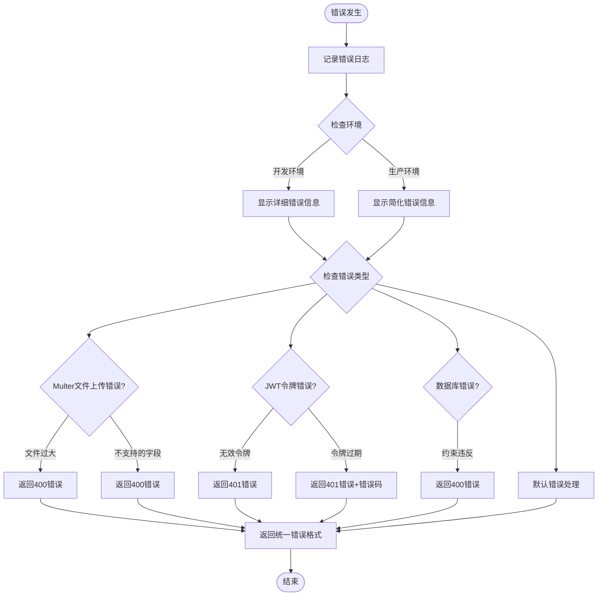
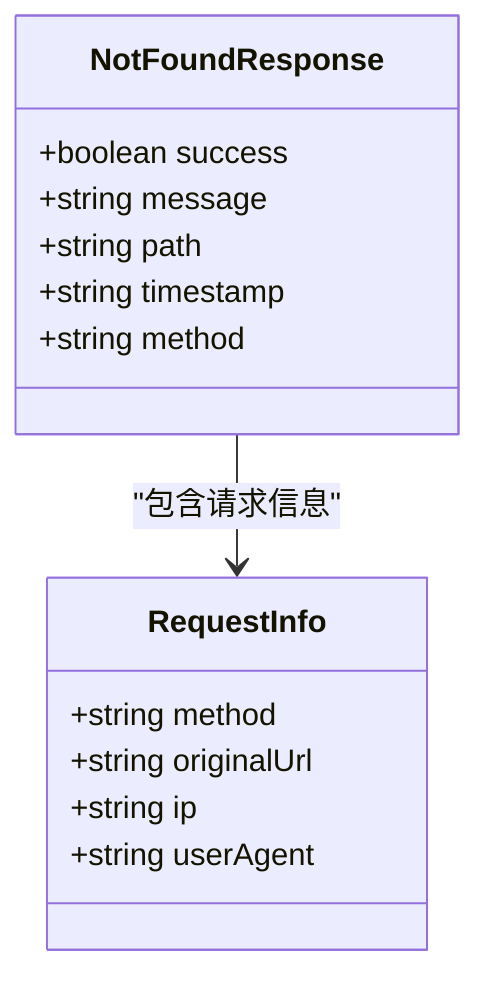
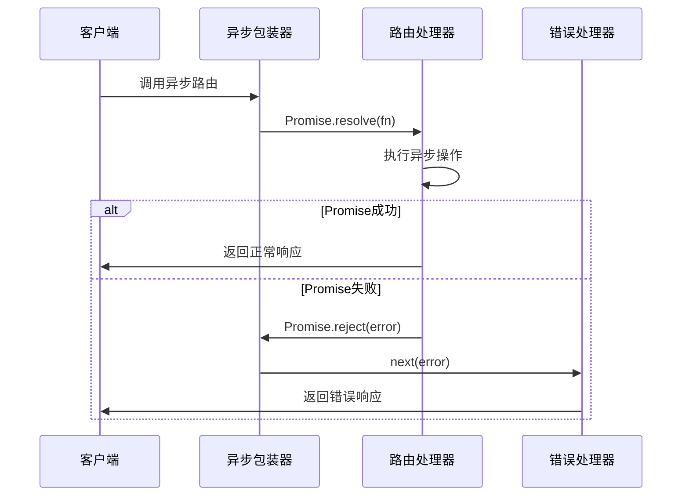
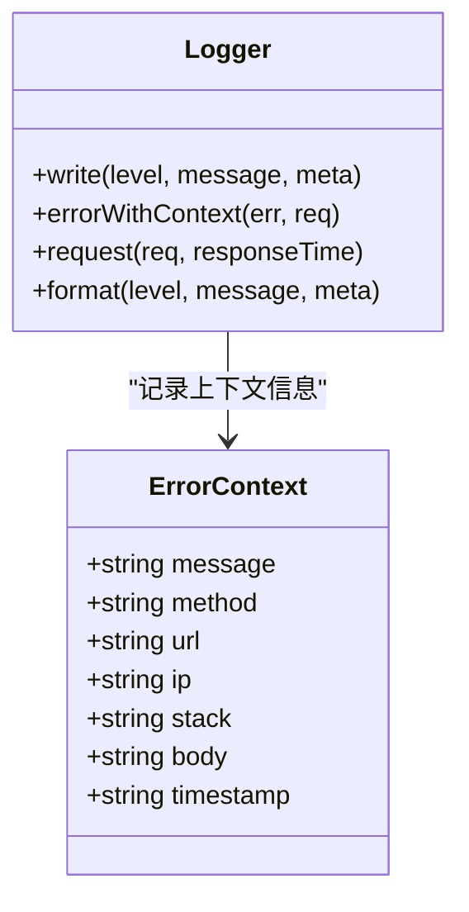
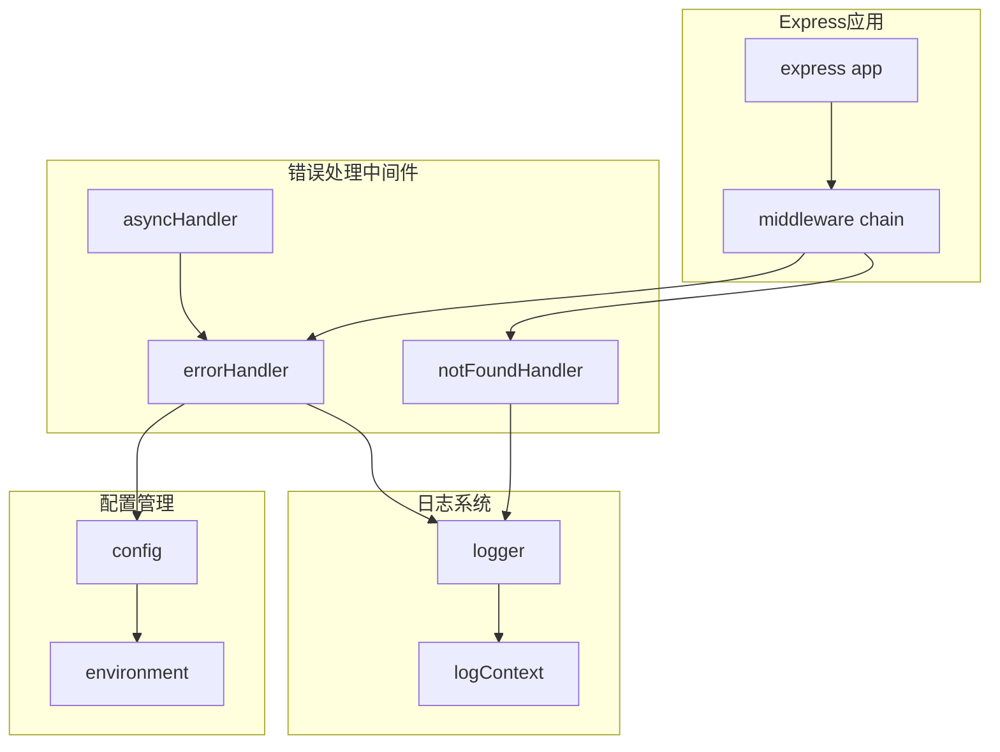

# 错误处理中间件

<cite>
**本文档引用的文件**
- [error.js](file://backend/middleware/error.js)
- [logger.js](file://backend/logger.js)
- [index.js](file://backend/index.js)
- [admin.js](file://backend/routes/admin.js)
- [config.js](file://backend/config.js)
- [package.json](file://backend/package.json)
</cite>

## 目录
1. [简介](#简介)
2. [项目结构](#项目结构)
3. [核心组件](#核心组件)
4. [架构概览](#架构概览)
5. [详细组件分析](#详细组件分析)
6. [依赖关系分析](#依赖关系分析)
7. [性能考虑](#性能考虑)
8. [故障排除指南](#故障排除指南)
9. [结论](#结论)

## 简介

本项目实现了完整的错误处理中间件系统，提供了统一的错误捕获、格式化和响应机制。该系统采用Express中间件模式，能够处理同步和异步错误，确保应用程序在各种异常情况下都能提供一致的用户体验和可靠的错误信息。

错误处理中间件的核心目标是：
- 统一错误格式化标准
- 区分HTTP状态码和业务错误
- 提供详细的错误日志记录
- 实现优雅的错误降级机制
- 支持开发和生产环境的不同处理策略

## 项目结构

错误处理相关的文件组织结构如下：



**图表来源**
- [error.js:1-90](file://backend/middleware/error.js#L1-L90)
- [logger.js:1-104](file://backend/logger.js#L1-L104)
- [index.js:18-20](file://backend/index.js#L18-L20)

**章节来源**
- [error.js:1-90](file://backend/middleware/error.js#L1-L90)
- [logger.js:1-104](file://backend/logger.js#L1-L104)
- [index.js:1-1401](file://backend/index.js#L1-L1401)

## 核心组件

### 错误处理中间件 (error.js)

错误处理中间件包含三个核心函数：

1. **全局错误处理器** (`errorHandler`)
2. **404处理器** (`notFoundHandler`)
3. **异步错误包装器** (`asyncHandler`)

每个组件都经过精心设计，确保能够处理各种类型的错误场景。

**章节来源**
- [error.js:8-62](file://backend/middleware/error.js#L8-L62)
- [error.js:67-73](file://backend/middleware/error.js#L67-L73)
- [error.js:79-83](file://backend/middleware/error.js#L79-L83)

### 日志系统 (logger.js)

日志系统提供了结构化的日志记录功能，支持多种日志级别和上下文信息收集。

**章节来源**
- [logger.js:85-94](file://backend/logger.js#L85-L94)

## 架构概览

错误处理系统的整体架构采用中间件链模式，确保错误能够在应用程序的各个层面得到统一处理。



**图表来源**
- [index.js:1374-1378](file://backend/index.js#L1374-L1378)
- [error.js:8-62](file://backend/middleware/error.js#L8-L62)

## 详细组件分析

### 全局错误处理器 (errorHandler)

全局错误处理器是整个错误处理系统的核心，负责捕获和处理所有未处理的错误。

#### 错误分类处理

系统实现了多层次的错误分类处理机制：



**图表来源**
- [error.js:16-61](file://backend/middleware/error.js#L16-L61)

#### 错误格式化标准

系统采用统一的错误响应格式：

| 字段名 | 类型 | 必填 | 描述 |
|--------|------|------|------|
| success | boolean | 是 | 错误标志，始终为false |
| message | string | 是 | 错误消息描述 |
| code | string | 否 | 错误码标识符 |
| stack | string | 开发环境 | 错误堆栈跟踪 |
| detail | string | 开发环境 | 详细错误信息 |

**章节来源**
- [error.js:17-61](file://backend/middleware/error.js#L17-L61)

### 404处理器 (notFoundHandler)

404处理器专门处理未匹配的路由请求，提供一致的资源不存在响应格式。

#### 404响应格式



**图表来源**
- [error.js:67-73](file://backend/middleware/error.js#L67-L73)

**章节来源**
- [error.js:67-73](file://backend/middleware/error.js#L67-L73)

### 异步错误包装器 (asyncHandler)

异步错误包装器解决了Promise错误处理的常见问题，避免了繁琐的try-catch嵌套。

#### 异步错误处理流程



**图表来源**
- [error.js:79-83](file://backend/middleware/error.js#L79-L83)

**章节来源**
- [error.js:79-83](file://backend/middleware/error.js#L79-L83)

### 日志记录机制

日志系统提供了全面的错误日志记录功能，确保所有错误都有迹可循。

#### 错误日志上下文



**图表来源**
- [logger.js:85-94](file://backend/logger.js#L85-L94)

**章节来源**
- [logger.js:85-94](file://backend/logger.js#L85-L94)

## 依赖关系分析

错误处理中间件与系统其他组件的依赖关系如下：



**图表来源**
- [error.js:4-14](file://backend/middleware/error.js#L4-L14)
- [index.js:18-20](file://backend/index.js#L18-L20)

**章节来源**
- [error.js:4-14](file://backend/middleware/error.js#L4-L14)
- [index.js:18-20](file://backend/index.js#L18-L20)

## 性能考虑

### 错误处理性能优化

1. **条件日志记录**：仅在开发环境显示详细错误信息，减少生产环境的性能开销
2. **异步错误处理**：使用Promise包装器避免同步try-catch的性能影响
3. **错误缓存**：对于重复的404错误，可以考虑添加简单的缓存机制

### 内存管理

- 错误日志中的请求体只记录前500个字符，避免内存溢出
- 开发环境的详细信息仅在需要时才包含在响应中

## 故障排除指南

### 常见错误类型及处理

#### 文件上传错误

| 错误代码 | 错误描述 | HTTP状态码 | 处理方式 |
|----------|----------|------------|----------|
| LIMIT_FILE_SIZE | 文件过大 | 400 | 提示用户选择更小的文件 |
| LIMIT_UNEXPECTED_FILE | 不支持的文件字段 | 400 | 检查表单字段配置 |

#### JWT令牌错误

| 错误类型 | 错误描述 | HTTP状态码 | 处理方式 |
|----------|----------|------------|----------|
| JsonWebTokenError | 无效的认证令牌 | 401 | 要求用户重新登录 |
| TokenExpiredError | 令牌已过期 | 401 | 提示用户刷新令牌 |

#### 数据库错误

| 错误码前缀 | 错误描述 | HTTP状态码 | 处理方式 |
|------------|----------|------------|----------|
| 23xxx | PostgreSQL约束违反 | 400 | 检查输入数据格式 |
| 其他 | 其他数据库错误 | 500 | 记录详细日志并通知管理员 |

**章节来源**
- [error.js:16-54](file://backend/middleware/error.js#L16-L54)

### 自定义错误处理器

要实现自定义错误处理器，可以按照以下步骤进行：

1. **扩展错误类型识别**：在全局错误处理器中添加新的错误类型判断
2. **自定义响应格式**：根据业务需求调整错误响应的字段结构
3. **集成监控系统**：将错误信息发送到外部监控服务

### 错误中间件执行顺序

错误中间件的执行顺序至关重要，必须确保正确的中间件注册顺序：

```javascript
// 1. 静态文件服务
app.use(express.static(path.join(__dirname, 'public')));

// 2. 路由处理
app.use('/api', apiRoutes);

// 3. 404处理器（API路由）
app.use(notFoundHandler);

// 4. 全局错误处理器
app.use(errorHandler);
```

**章节来源**
- [index.js:1374-1378](file://backend/index.js#L1374-L1378)

## 结论

本项目的错误处理中间件系统具有以下特点：

### 设计优势

1. **统一性**：所有错误都遵循相同的格式化标准
2. **可扩展性**：支持自定义错误类型和处理逻辑
3. **安全性**：生产环境自动过滤敏感信息
4. **可观测性**：完整的错误日志记录和上下文信息

### 最佳实践建议

1. **错误分类**：根据错误性质合理分配HTTP状态码
2. **日志管理**：定期清理日志文件，避免磁盘空间不足
3. **监控集成**：将错误信息集成到监控系统中
4. **性能监控**：关注错误处理对系统性能的影响

### 未来改进方向

1. **错误统计**：添加错误频率统计和告警机制
2. **错误恢复**：实现部分错误的自动恢复机制
3. **国际化**：支持多语言错误消息
4. **审计日志**：记录重要的业务错误事件

通过这套完善的错误处理机制，系统能够在各种异常情况下保持稳定运行，为用户提供一致的错误处理体验。