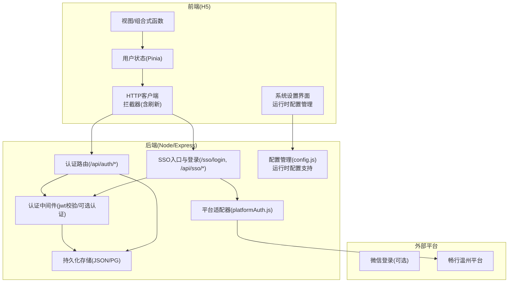
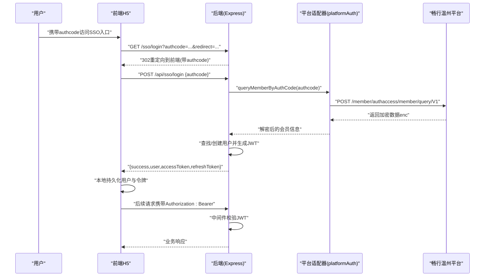
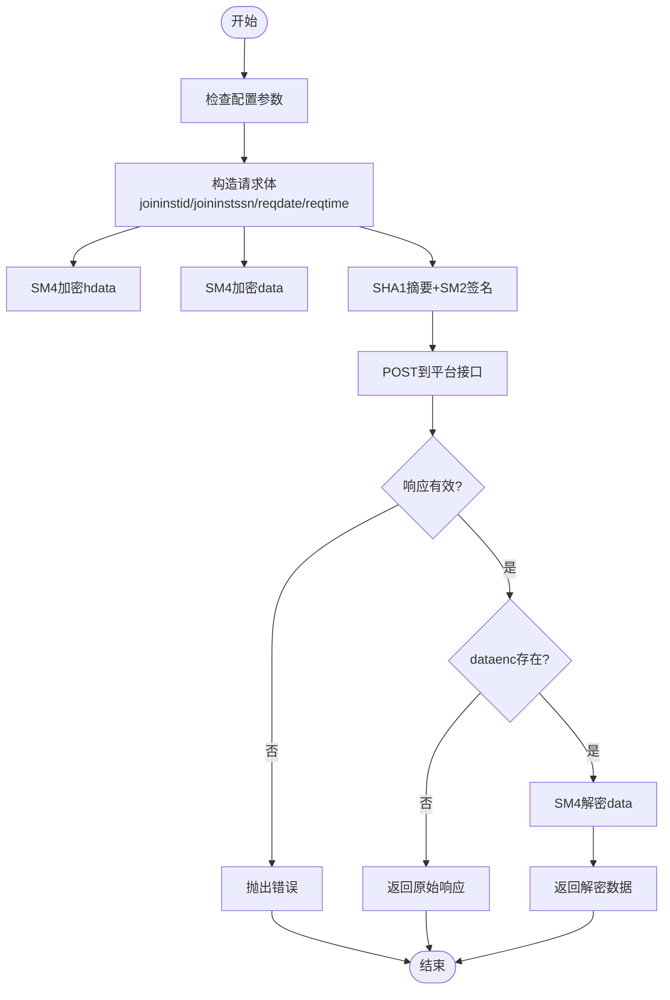
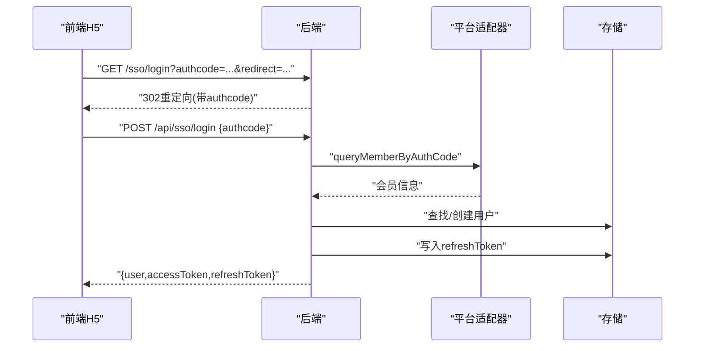
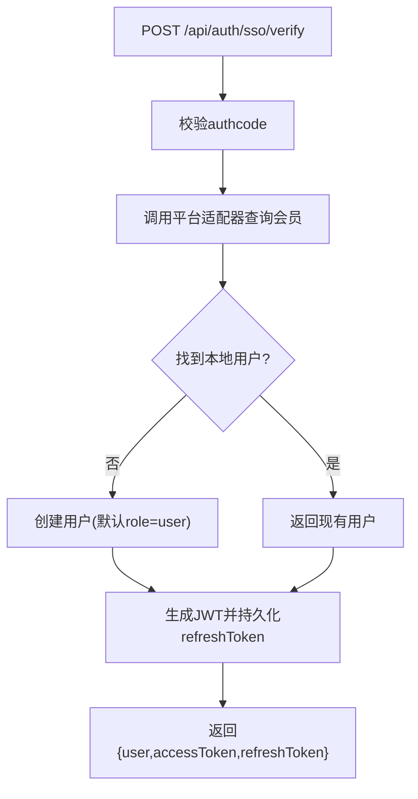
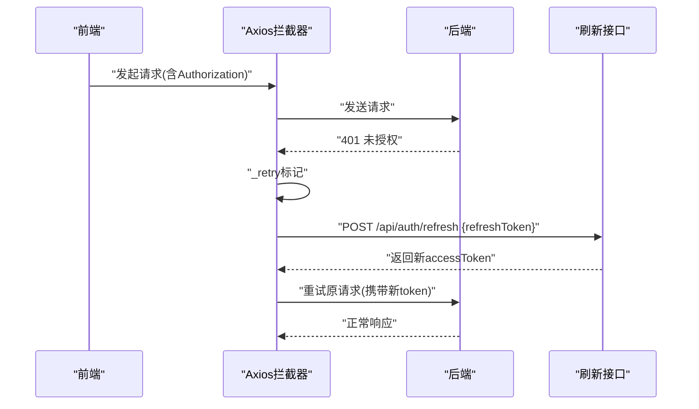
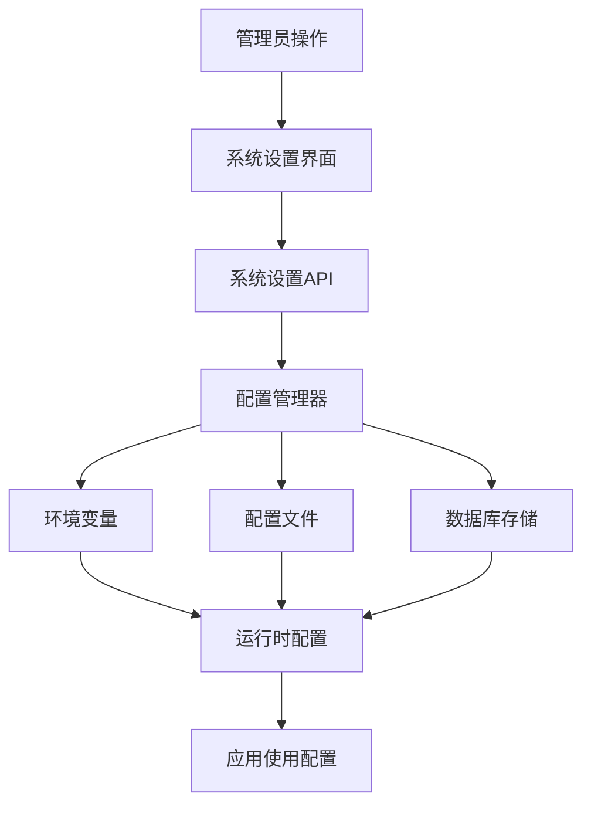
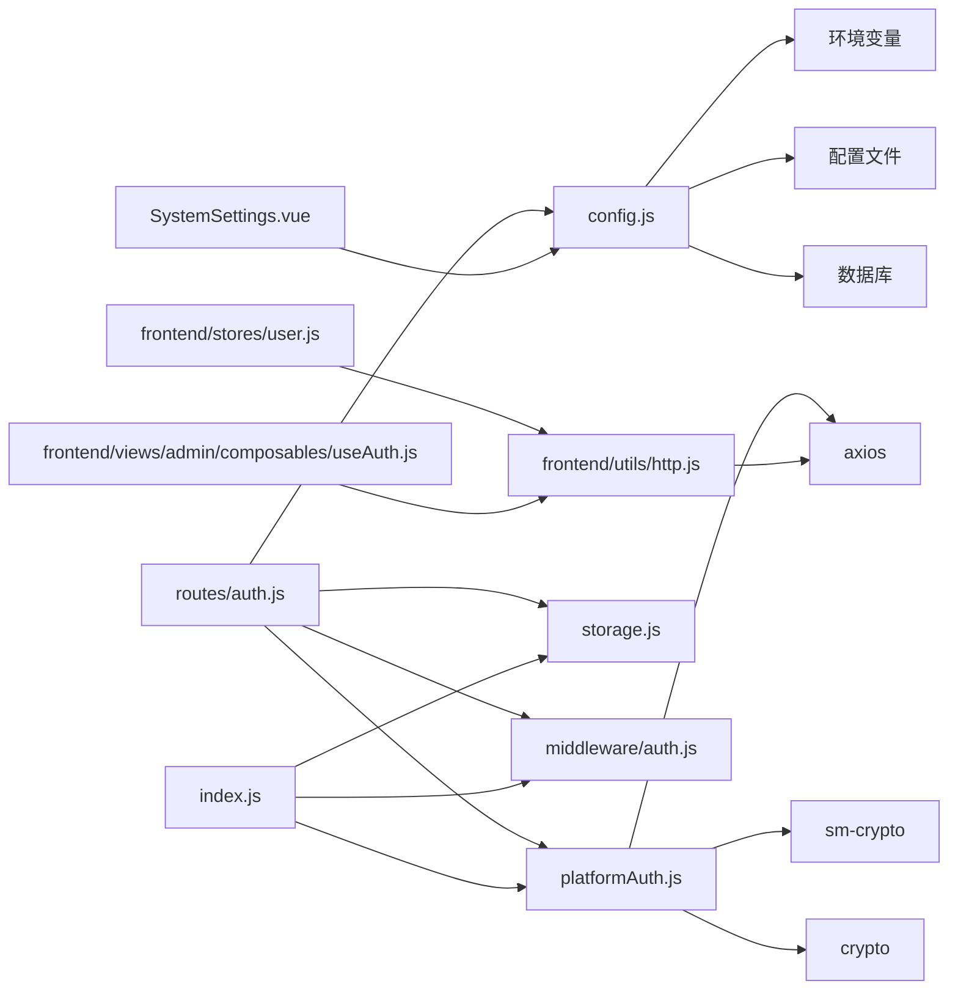

# 单点登录(SSO)集成

<cite>
**本文引用的文件列表**
- [backend/index.js](file://backend/index.js)
- [backend/platformAuth.js](file://backend/platformAuth.js)
- [backend/routes/auth.js](file://backend/routes/auth.js)
- [backend/middleware/auth.js](file://backend/middleware/auth.js)
- [backend/config.js](file://backend/config.js)
- [backend/storage.js](file://backend/storage.js)
- [frontend/h5/src/stores/user.js](file://frontend/h5/src/stores/user.js)
- [frontend/h5/src/utils/http.js](file://frontend/h5/src/utils/http.js)
- [frontend/h5/src/views/admin/composables/useAuth.js](file://frontend/h5/src/views/admin/composables/useAuth.js)
- [frontend/h5/src/views/admin/config/SystemSettings.vue](file://frontend/h5/src/views/admin/config/SystemSettings.vue)
- [docs/接入文档/接入参数.txt](file://docs/接入文档/接入参数.txt)
- [docs/implementation/SSO-Debug-Info.md](file://docs/implementation/SSO-Debug-Info.md)
</cite>

## 更新摘要
**变更内容**   
- 新增运行时系统设置配置功能，支持动态调整SSO可见性
- 增强认证选项的灵活配置能力，支持按部署环境定制
- 完善前端系统设置界面，提供可视化的配置管理
- 优化后端配置读取机制，支持运行时配置覆盖

## 目录
1. [简介](#简介)
2. [项目结构](#项目结构)
3. [核心组件](#核心组件)
4. [架构总览](#架构总览)
5. [详细组件分析](#详细组件分析)
6. [依赖关系分析](#依赖关系分析)
7. [性能考量](#性能考量)
8. [故障排除指南](#故障排除指南)
9. [结论](#结论)
10. [附录](#附录)

## 简介
本文件面向"畅行温州SSO平台"的集成与运维，系统性阐述单点登录(SSO)集成方案、用户信息同步机制、权限映射策略，以及认证流程、回调处理、用户状态管理。文档同时覆盖配置参数、安全证书与密钥管理、错误处理机制，并提供最佳实践、性能优化建议与故障排除指南，帮助在多系统场景下实现统一身份认证与权限协调。

**更新** 新增运行时配置功能，支持通过系统设置动态调整SSO可见性和认证选项，满足不同部署环境的灵活需求。

## 项目结构
后端采用Node.js + Express，前端采用Vue3 + Pinia，SSO对接通过后端平台适配器与畅行温州平台交互，前端通过Axios拦截器自动处理令牌刷新与鉴权。

图表来源
- [backend/index.js:477-569](file://backend/index.js#L477-L569)
- [backend/routes/auth.js:96-392](file://backend/routes/auth.js#L96-L392)
- [backend/platformAuth.js:135-172](file://backend/platformAuth.js#L135-L172)
- [frontend/h5/src/utils/http.js:19-78](file://frontend/h5/src/utils/http.js#L19-L78)
- [frontend/h5/src/views/admin/config/SystemSettings.vue:1-200](file://frontend/h5/src/views/admin/config/SystemSettings.vue#L1-L200)

章节来源
- [backend/index.js:1-1401](file://backend/index.js#L1-L1401)
- [backend/routes/auth.js:1-591](file://backend/routes/auth.js#L1-L591)
- [backend/platformAuth.js:1-177](file://backend/platformAuth.js#L1-L177)
- [frontend/h5/src/utils/http.js:1-99](file://frontend/h5/src/utils/http.js#L1-L99)
- [frontend/h5/src/views/admin/config/SystemSettings.vue:1-200](file://frontend/h5/src/views/admin/config/SystemSettings.vue#L1-L200)

## 核心组件
- 平台适配器：负责与畅行温州平台进行SM2/SM4加解密、签名与请求封装，调用会员查询接口。
- 认证路由：提供登录、注册、刷新、登出、SSO验证等REST接口。
- SSO入口与登录：接收来自畅行温州的授权码，调用平台适配器查询会员信息，完成用户创建与令牌发放。
- 认证中间件：统一处理JWT校验、可选认证与速率限制。
- 前端HTTP拦截器：自动注入Authorization头、处理401并触发刷新流程。
- 用户状态管理：Pinia Store持久化用户信息与令牌，提供角色判断与权限控制。
- 存储层：支持JSON文件与PostgreSQL两种后端，提供用户、案例、配置等数据的读写与缓存。
- **新增** 运行时配置管理：支持通过系统设置动态调整SSO可见性和认证选项。

章节来源
- [backend/platformAuth.js:1-177](file://backend/platformAuth.js#L1-L177)
- [backend/routes/auth.js:96-392](file://backend/routes/auth.js#L96-L392)
- [backend/index.js:477-569](file://backend/index.js#L477-L569)
- [backend/middleware/auth.js:1-168](file://backend/middleware/auth.js#L1-L168)
- [frontend/h5/src/utils/http.js:1-99](file://frontend/h5/src/utils/http.js#L1-L99)
- [frontend/h5/src/stores/user.js:1-177](file://frontend/h5/src/stores/user.js#L1-L177)
- [backend/storage.js:1-197](file://backend/storage.js#L1-L197)
- [frontend/h5/src/views/admin/config/SystemSettings.vue:1-200](file://frontend/h5/src/views/admin/config/SystemSettings.vue#L1-L200)

## 架构总览
SSO认证流程概览如下：

图表来源
- [backend/index.js:477-569](file://backend/index.js#L477-L569)
- [backend/platformAuth.js:135-172](file://backend/platformAuth.js#L135-L172)
- [frontend/h5/src/utils/http.js:19-78](file://frontend/h5/src/utils/http.js#L19-L78)

## 详细组件分析

### 组件A：SSO平台适配器(platformAuth)
- 功能职责
  - 读取环境变量中的平台地址、机构ID、渠道ID、SM2私钥、SM4密钥等参数。
  - 构造请求体：时间戳、流水号、hdata结构体、data结构体分别SM4加密，整体按字段ASCII排序拼接后SHA1摘要，再用SM2私钥签名。
  - 发送HTTPS请求到畅行温州平台，解析响应，若存在dataenc则SM4解密返回。
- 安全要点
  - SM2签名使用userId为joininstid的十六进制字节串，hash=false（已做SHA1）。
  - SM4密钥支持32位hex或16位UTF-8转hex两种形式。
- 错误处理
  - 响应为空、result非0000、解密失败均抛出错误；日志记录请求/响应便于调试。

图表来源
- [backend/platformAuth.js:135-172](file://backend/platformAuth.js#L135-L172)

章节来源
- [backend/platformAuth.js:1-177](file://backend/platformAuth.js#L1-L177)
- [docs/接入文档/接入参数.txt:1-28](file://docs/接入文档/接入参数.txt#L1-L28)
- [docs/implementation/SSO-Debug-Info.md:1-126](file://docs/implementation/SSO-Debug-Info.md#L1-L126)

### 组件B：SSO入口与登录(index.js)
- SSO入口
  - GET /sso/login：从查询参数提取authcode与redirect，进行URL编码后302重定向到前端目标路径，附带authcode参数。
- SSO登录
  - POST /api/sso/login：接收authcode，调用平台适配器查询会员信息；根据平台会员号或手机号查找/创建本地用户；生成JWT并持久化refreshToken；返回用户与令牌。
- SSO验证
  - POST /api/sso/verify：仅验证authcode并返回平台会员信息，不创建用户。

图表来源
- [backend/index.js:477-569](file://backend/index.js#L477-L569)
- [backend/platformAuth.js:165-172](file://backend/platformAuth.js#L165-L172)

章节来源
- [backend/index.js:477-569](file://backend/index.js#L477-L569)

### 组件C：认证路由(routes/auth.js)
- 提供标准认证接口：登录、注册、获取当前用户、刷新令牌、登出。
- SSO验证接口：POST /api/auth/sso/verify，内部复用平台适配器，自动创建用户并发放令牌。
- 微信公众号授权：提供授权URL与回调，回调完成后重定向前端并携带用户与令牌。
- 速率限制：对登录/注册接口设置简单IP窗口限流。

图表来源
- [backend/routes/auth.js:322-392](file://backend/routes/auth.js#L322-L392)

章节来源
- [backend/routes/auth.js:96-392](file://backend/routes/auth.js#L96-L392)

### 组件D：认证中间件(middleware/auth.js)
- authRequired：从Authorization头提取Bearer token，使用JWT密钥验证，注入req.user。
- roleRequired：基于用户角色进行权限控制。
- optionalAuth：可选认证，无token时放行。
- rateLimit：基于内存Map的简单滑动窗口限流，定期清理过期记录。

章节来源
- [backend/middleware/auth.js:1-168](file://backend/middleware/auth.js#L1-L168)

### 组件E：前端HTTP拦截器(utils/http.js)
- 请求拦截：从localStorage读取accessToken并注入Authorization头。
- 响应拦截：当401且存在refreshToken时，串行排队等待刷新；刷新成功后重试原请求；刷新失败则清空本地令牌并拒绝请求。
- 提供authStorage工具：统一管理accessToken/refreshToken的读取与清除。

图表来源
- [frontend/h5/src/utils/http.js:19-78](file://frontend/h5/src/utils/http.js#L19-L78)

章节来源
- [frontend/h5/src/utils/http.js:1-99](file://frontend/h5/src/utils/http.js#L1-L99)

### 组件F：用户状态管理(stores/user.js)
- 状态：user、accessToken、refreshToken。
- 方法：登录/注册、登出、拉取当前用户、设置/清除用户信息、更新资料。
- 本地持久化：localStorage存储用户与令牌，确保刷新后仍可恢复状态。
- 角色判断：提供isAdmin/isDslAdmin/isStudyAdmin/isSuperAdmin等派生状态。

章节来源
- [frontend/h5/src/stores/user.js:1-177](file://frontend/h5/src/stores/user.js#L1-L177)

### 组件G：权限映射与角色控制
- 平台侧：SSO登录成功后，系统将平台会员号与手机号关联到本地用户，初始角色为user。
- 系统侧：管理员角色包括admin、dsl_admin、study_admin；超级管理员固定手机号。
- 前端：通过组合式函数useAuth.js维护角色状态，提供canManage等权限判断。

章节来源
- [backend/index.js:514-533](file://backend/index.js#L514-L533)
- [frontend/h5/src/views/admin/composables/useAuth.js:1-45](file://frontend/h5/src/views/admin/composables/useAuth.js#L1-L45)

### 组件H：运行时系统设置配置（新增）
- 功能职责
  - 提供系统设置API接口，支持动态读取和更新SSO相关配置。
  - 支持按部署环境配置不同的认证选项和可见性设置。
  - 提供前端可视化界面，管理员可通过界面调整SSO配置。
- 配置项支持
  - SSO开关：控制是否启用SSO登录功能。
  - 可见性控制：根据环境动态显示/隐藏SSO登录选项。
  - 认证策略：支持多种认证方式的灵活配置。
- 配置持久化
  - 支持配置文件和环境变量的优先级覆盖。
  - 运行时修改的配置可持久化存储，重启后保持生效。

图表来源
- [frontend/h5/src/views/admin/config/SystemSettings.vue:1-200](file://frontend/h5/src/views/admin/config/SystemSettings.vue#L1-L200)
- [backend/config.js:1-100](file://backend/config.js#L1-L100)

章节来源
- [frontend/h5/src/views/admin/config/SystemSettings.vue:1-200](file://frontend/h5/src/views/admin/config/SystemSettings.vue#L1-L200)
- [backend/config.js:1-100](file://backend/config.js#L1-L100)

## 依赖关系分析
- 平台适配器依赖：axios、sm-crypto(sm2/sm4)、crypto。
- 认证路由依赖：config、storage、middleware/auth、platformAuth。
- 中间件依赖：config、jwt。
- 前端拦截器依赖：axios、authStorage。
- 存储层依赖：fs/path、pg(可选)、cache。
- **新增** 运行时配置依赖：文件系统、环境变量、数据库存储。

图表来源
- [backend/platformAuth.js:1-177](file://backend/platformAuth.js#L1-L177)
- [backend/routes/auth.js:1-591](file://backend/routes/auth.js#L1-L591)
- [backend/index.js:1-1401](file://backend/index.js#L1-L1401)
- [frontend/h5/src/utils/http.js:1-99](file://frontend/h5/src/utils/http.js#L1-L99)
- [frontend/h5/src/stores/user.js:1-177](file://frontend/h5/src/stores/user.js#L1-L177)
- [frontend/h5/src/views/admin/composables/useAuth.js:1-45](file://frontend/h5/src/views/admin/composables/useAuth.js#L1-L45)
- [frontend/h5/src/views/admin/config/SystemSettings.vue:1-200](file://frontend/h5/src/views/admin/config/SystemSettings.vue#L1-L200)

章节来源
- [backend/platformAuth.js:1-177](file://backend/platformAuth.js#L1-L177)
- [backend/routes/auth.js:1-591](file://backend/routes/auth.js#L1-L591)
- [backend/index.js:1-1401](file://backend/index.js#L1-L1401)
- [frontend/h5/src/utils/http.js:1-99](file://frontend/h5/src/utils/http.js#L1-L99)
- [frontend/h5/src/stores/user.js:1-177](file://frontend/h5/src/stores/user.js#L1-L177)
- [frontend/h5/src/views/admin/composables/useAuth.js:1-45](file://frontend/h5/src/views/admin/composables/useAuth.js#L1-L45)
- [frontend/h5/src/views/admin/config/SystemSettings.vue:1-200](file://frontend/h5/src/views/admin/config/SystemSettings.vue#L1-L200)

## 性能考量
- 令牌刷新串行化：前端拦截器通过队列串行处理并发401刷新，避免重复刷新风暴。
- 存储缓存：storage层对用户/案例/配置等数据设置不同TTL缓存，减少数据库压力。
- 速率限制：登录/注册接口内置滑动窗口限流，防止暴力破解与滥用。
- 图片压缩：后端提供图片压缩接口，降低带宽与渲染开销。
- **新增** 配置缓存：运行时配置支持内存缓存，减少频繁的文件系统和数据库访问。
- 建议
  - 在高并发场景下，建议将存储切换至PostgreSQL并启用连接池。
  - 对频繁调用的SSO接口增加Redis缓存，避免重复调用平台接口。
  - 前端可引入轻量令牌预刷新策略，提前5分钟刷新以降低401概率。
  - 合理设置配置缓存TTL，平衡实时性与性能。

## 故障排除指南
- SSO签名/验签失败
  - 确认SM2私钥与公钥配对，userId使用joininstid的十六进制字节串，hash=false。
  - 对比签名内容构建顺序与示例，确保字段ASCII排序一致。
  - 参考调试文档中的签名步骤与示例请求体。
- 平台返回result非0000
  - 检查SM4密钥长度与格式，必要时转换为32位hex。
  - 确认hdata结构体字段与平台要求一致。
- 401未授权
  - 前端拦截器会自动尝试刷新，若失败需清空本地令牌并引导重新登录。
  - 检查refreshToken是否过期或被撤销。
- 配置缺失
  - JWT_SECRET、微信小程序/公众号配置、SSO平台参数未设置会导致功能不可用。
  - 使用config.validateConfig()输出警告，生产环境需强制强密钥。
- **新增** 运行时配置问题
  - 检查配置文件语法是否正确，环境变量是否设置正确。
  - 确认系统设置API权限配置，管理员是否有修改配置的权限。
  - 查看配置加载日志，确认配置优先级和覆盖规则。

章节来源
- [docs/implementation/SSO-Debug-Info.md:1-126](file://docs/implementation/SSO-Debug-Info.md#L1-L126)
- [backend/platformAuth.js:30-38](file://backend/platformAuth.js#L30-L38)
- [frontend/h5/src/utils/http.js:28-78](file://frontend/h5/src/utils/http.js#L28-L78)
- [backend/config.js:1-100](file://backend/config.js#L1-L100)

## 结论
本SSO集成方案通过平台适配器与畅行温州平台完成安全加解密与签名，结合后端JWT与前端拦截器实现了完整的认证与会话管理。系统具备良好的扩展性与安全性，新增的运行时配置功能进一步提升了系统的灵活性和可维护性。建议在生产环境中强化密钥管理、引入缓存与数据库连接池，并完善监控与告警机制，以支撑多系统统一身份认证与权限协同。

**更新** 运行时配置功能的加入使得系统能够更好地适应不同部署环境的需求，管理员可以通过可视化界面灵活调整SSO相关配置，无需修改代码即可实现配置的动态调整。

## 附录

### SSO配置参数清单
- 平台基础参数
  - 平台请求地址：PLATFORM_BASE_URL
  - 机构ID(joininstid)：PLATFORM_JOININST_ID
  - hdata.instid：PLATFORM_INST_ID
  - 商户ID(mchntid)：PLATFORM_MCHNT_ID
  - 渠道ID(chnlid)：PLATFORM_CHNL_ID
  - 认证机构ID(authinstid)：PLATFORM_AUTH_INST_ID
- 加密参数
  - SM2私钥：PLATFORM_SM2_PRIVATE_KEY
  - SM4密钥：PLATFORM_SM4_KEY（支持32位hex或16位UTF-8转hex）
- **新增** 运行时配置参数
  - SSO开关：ENABLE_SSO（布尔值，控制SSO功能启用）
  - 可见性控制：SSO_VISIBILITY（字符串，控制SSO登录选项的显示）
  - 认证策略：AUTH_STRATEGY（字符串，指定认证策略类型）

章节来源
- [backend/platformAuth.js:5-23](file://backend/platformAuth.js#L5-L23)
- [docs/接入文档/接入参数.txt:1-28](file://docs/接入文档/接入参数.txt#L1-L28)
- [backend/config.js:1-100](file://backend/config.js#L1-L100)

### 安全证书与密钥管理
- JWT密钥
  - 生产环境必须使用至少32字符的强随机密钥，避免使用默认值。
- SM2/SM4密钥
  - 确保密钥对一致，SM4密钥长度符合规范。
- HTTPS与CORS
  - 生产环境启用HTTPS，合理配置CORS白名单与凭证允许。
- **新增** 运行时配置安全
  - 敏感配置项应支持加密存储。
  - 配置修改操作需要审计日志记录。
  - 提供配置备份和恢复功能。

章节来源
- [backend/config.js:78-104](file://backend/config.js#L78-L104)
- [backend/index.js:71-75](file://backend/index.js#L71-L75)
- [frontend/h5/src/views/admin/config/SystemSettings.vue:1-200](file://frontend/h5/src/views/admin/config/SystemSettings.vue#L1-L200)

### 最佳实践
- 令牌生命周期
  - accessToken短周期(如30分钟)，refreshToken较长周期(如7天)，到期后主动刷新。
- 用户信息同步
  - SSO登录成功后，优先使用平台会员号建立映射，手机号缺失时回退到手机号匹配。
- 多系统权限协调
  - 以平台会员号为唯一标识，系统内角色与权限通过本地策略映射，避免跨系统冲突。
- 日志与监控
  - 记录SSO请求/响应、签名与加解密过程，便于审计与问题定位。
- **新增** 运行时配置最佳实践
  - 使用环境变量管理敏感配置，配置文件仅用于非敏感设置。
  - 实施配置版本控制，便于追踪配置变更历史。
  - 提供配置验证机制，确保配置项的完整性和有效性。
  - 建立配置变更审批流程，重要配置修改需要审核确认。

[本节为通用最佳实践，无需特定文件引用]

### 运行时配置管理指南
- 配置优先级
  - 环境变量 > 数据库存储 > 配置文件 > 默认值
- 配置热更新
  - 支持运行时修改配置，无需重启服务。
  - 配置变更立即生效，影响所有新请求。
- 配置验证
  - 提供配置项验证规则，确保配置格式正确。
  - 支持配置项依赖关系检查。
- 配置审计
  - 记录所有配置修改操作，包含操作人、时间、变更前后的值。
  - 支持配置变更历史查询和回滚。

章节来源
- [frontend/h5/src/views/admin/config/SystemSettings.vue:1-200](file://frontend/h5/src/views/admin/config/SystemSettings.vue#L1-L200)
- [backend/config.js:1-100](file://backend/config.js#L1-L100)