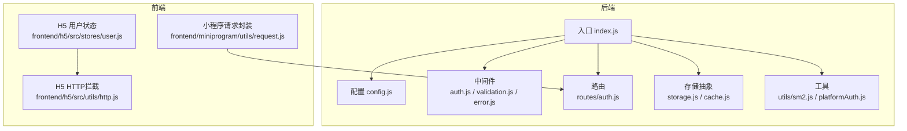
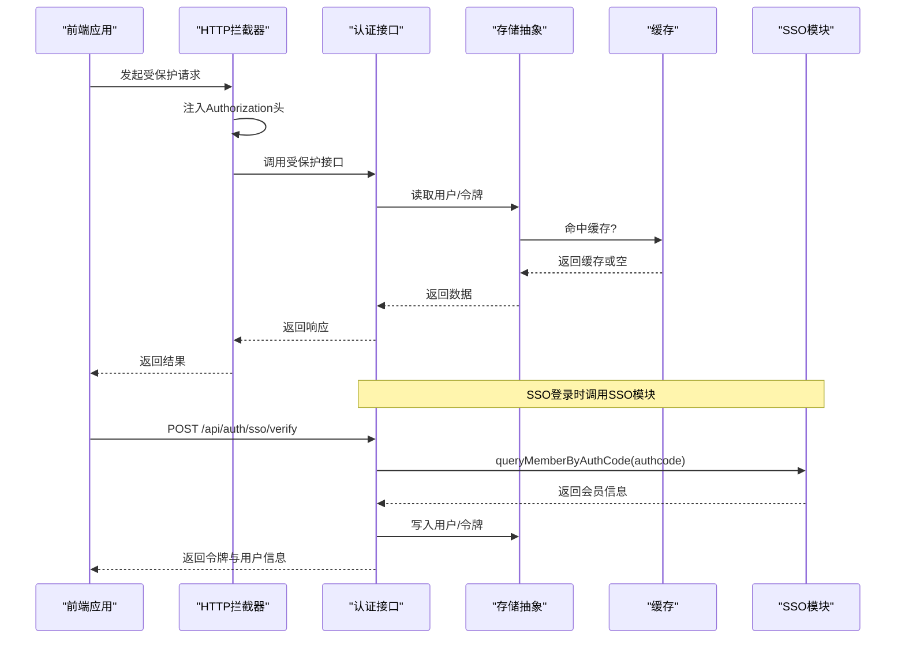
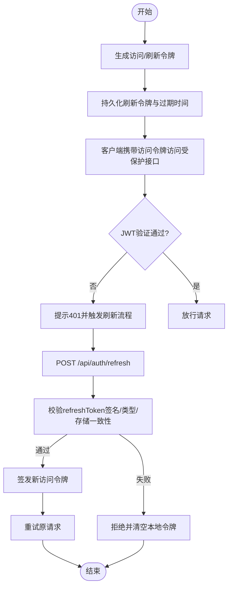
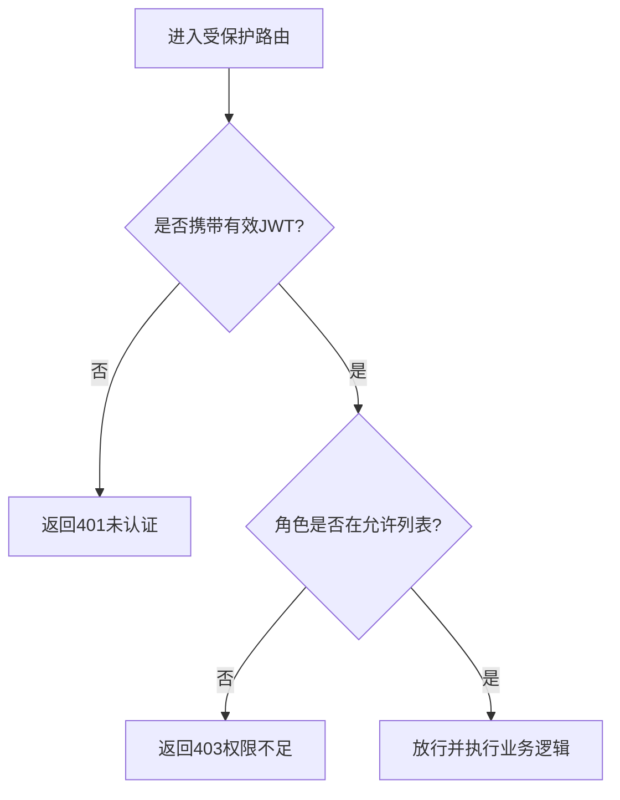
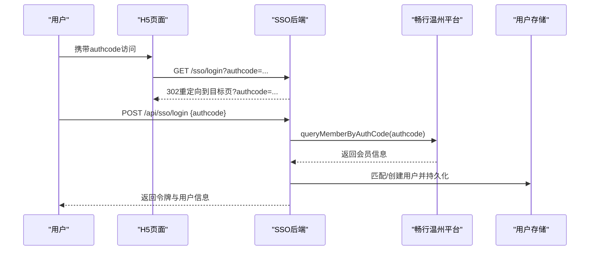
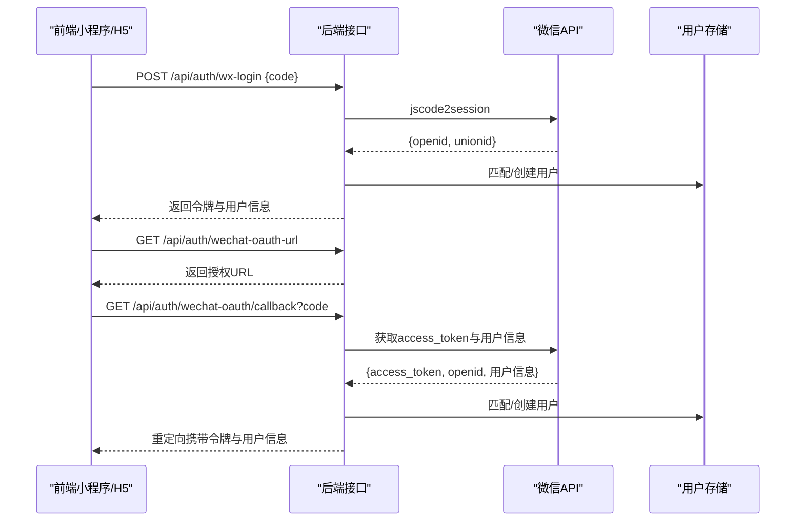
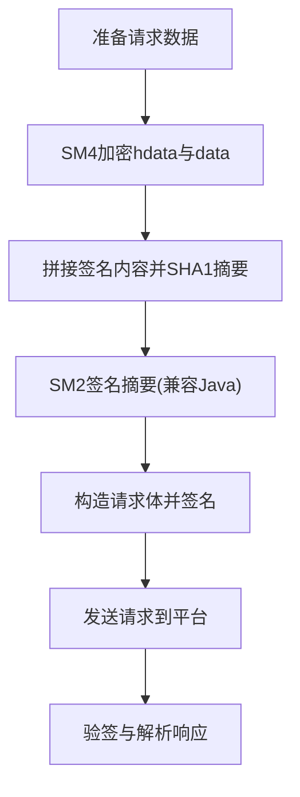
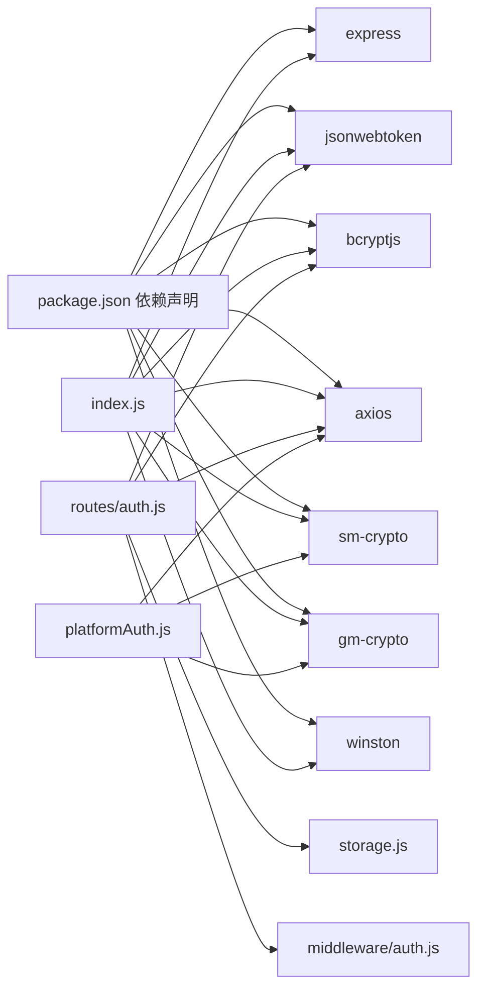

# 认证与授权系统

<cite>
**本文引用的文件**
- [backend/index.js](file://backend/index.js)
- [backend/platformAuth.js](file://backend/platformAuth.js)
- [backend/middleware/auth.js](file://backend/middleware/auth.js)
- [backend/routes/auth.js](file://backend/routes/auth.js)
- [backend/utils/sm2.js](file://backend/utils/sm2.js)
- [backend/config.js](file://backend/config.js)
- [backend/storage.js](file://backend/storage.js)
- [backend/cache.js](file://backend/cache.js)
- [backend/middleware/validation.js](file://backend/middleware/validation.js)
- [backend/middleware/error.js](file://backend/middleware/error.js)
- [backend/package.json](file://backend/package.json)
- [frontend/h5/src/stores/user.js](file://frontend/h5/src/stores/user.js)
- [frontend/h5/src/utils/http.js](file://frontend/h5/src/utils/http.js)
- [frontend/miniprogram/utils/request.js](file://frontend/miniprogram/utils/request.js)
- [docs/implementation/SSO-Debug-Info.md](file://docs/implementation/SSO-Debug-Info.md)
- [docs/接入文档/Apigox使用说明.md](file://docs/接入文档/Apigox使用说明.md)
</cite>

## 目录
1. [简介](#简介)
2. [项目结构](#项目结构)
3. [核心组件](#核心组件)
4. [架构总览](#架构总览)
5. [详细组件分析](#详细组件分析)
6. [依赖关系分析](#依赖关系分析)
7. [性能考虑](#性能考虑)
8. [故障排查指南](#故障排查指南)
9. [结论](#结论)
10. [附录](#附录)

## 简介
本文件面向低空飞行服务平台的认证与授权系统，系统采用JWT作为主要认证载体，结合多种登录方式（用户名密码、微信小程序、微信公众号、SSO单点登录），并内置基于SM2/SM4的国密算法对接能力。系统提供完整的令牌生成与刷新、用户权限分级、密码哈希、输入消毒与错误处理、以及可扩展的会话管理机制。本文将从架构、流程、接口、安全与扩展性等维度进行全面阐述。

## 项目结构
后端采用Express框架，按职责分层组织：
- 配置与启动：入口文件负责加载环境变量、初始化配置、挂载中间件、注册路由与静态资源。
- 中间件：认证、鉴权、输入消毒、错误处理、速率限制。
- 路由：认证相关接口集中在独立路由模块。
- 存储：统一抽象用户、案例、申请、配置、评价等数据的读写，支持JSON文件与PostgreSQL两种后端。
- 工具：SM2签名工具、SSO对接工具。
- 前端：H5与小程序分别维护各自的HTTP拦截与用户状态管理。

图表来源
- [backend/index.js:1-120](file://backend/index.js#L1-L120)
- [backend/config.js:1-123](file://backend/config.js#L1-L123)
- [backend/middleware/auth.js:1-168](file://backend/middleware/auth.js#L1-L168)
- [backend/routes/auth.js:1-591](file://backend/routes/auth.js#L1-L591)
- [backend/storage.js:1-197](file://backend/storage.js#L1-L197)
- [backend/cache.js:1-119](file://backend/cache.js#L1-L119)
- [backend/utils/sm2.js:1-190](file://backend/utils/sm2.js#L1-L190)
- [backend/platformAuth.js:1-177](file://backend/platformAuth.js#L1-L177)
- [frontend/h5/src/stores/user.js:1-177](file://frontend/h5/src/stores/user.js#L1-L177)
- [frontend/h5/src/utils/http.js:1-99](file://frontend/h5/src/utils/http.js#L1-L99)
- [frontend/miniprogram/utils/request.js:1-144](file://frontend/miniprogram/utils/request.js#L1-L144)

章节来源
- [backend/index.js:1-120](file://backend/index.js#L1-L120)
- [backend/config.js:1-123](file://backend/config.js#L1-L123)

## 核心组件
- JWT认证与令牌管理
  - 生成访问令牌与刷新令牌，区分访问有效期与刷新有效期。
  - 支持刷新令牌校验与过期处理。
- 用户认证与权限
  - 基于Bearer Token的认证中间件，支持可选认证与强制认证。
  - 角色权限控制中间件，支持白名单角色校验。
- 登录与注册
  - 用户名密码登录、注册（手机号+密码+姓名）。
  - 微信小程序登录（code→openid/unionid→用户→令牌）。
  - 微信公众号OAuth登录（授权回调→用户信息→令牌）。
  - SSO单点登录（authcode→平台会员信息→自动创建/匹配用户→令牌）。
- 国密算法与SSO对接
  - SM4对称加密、SM2签名/验签，与第三方平台协议保持一致。
- 输入安全与错误处理
  - 请求体消毒、字段校验、速率限制、统一错误处理。
- 存储与缓存
  - 统一的JSON/PG存储抽象，带缓存层，降低IO压力。
- 前端会话管理
  - 本地持久化令牌，HTTP拦截器自动注入Authorization头，401时触发刷新队列。

章节来源
- [backend/index.js:159-176](file://backend/index.js#L159-L176)
- [backend/index.js:183-231](file://backend/index.js#L183-L231)
- [backend/routes/auth.js:49-73](file://backend/routes/auth.js#L49-L73)
- [backend/middleware/auth.js:11-101](file://backend/middleware/auth.js#L11-L101)
- [backend/middleware/validation.js:52-98](file://backend/middleware/validation.js#L52-L98)
- [backend/middleware/error.js:9-62](file://backend/middleware/error.js#L9-L62)
- [backend/storage.js:134-142](file://backend/storage.js#L134-L142)
- [backend/cache.js:5-99](file://backend/cache.js#L5-L99)
- [frontend/h5/src/stores/user.js:25-35](file://frontend/h5/src/stores/user.js#L25-L35)
- [frontend/h5/src/utils/http.js:19-78](file://frontend/h5/src/utils/http.js#L19-L78)
- [frontend/miniprogram/utils/request.js:59-134](file://frontend/miniprogram/utils/request.js#L59-L134)

## 架构总览
系统采用前后端分离架构，后端提供REST风格认证接口，前端通过拦截器统一注入令牌并处理刷新逻辑。SSO对接通过专用模块与第三方平台交互，使用SM2/SM4保证数据机密性与完整性。

图表来源
- [backend/routes/auth.js:322-392](file://backend/routes/auth.js#L322-L392)
- [backend/platformAuth.js:165-172](file://backend/platformAuth.js#L165-L172)
- [backend/storage.js:134-142](file://backend/storage.js#L134-L142)
- [backend/cache.js:57-67](file://backend/cache.js#L57-L67)
- [frontend/h5/src/utils/http.js:19-78](file://frontend/h5/src/utils/http.js#L19-L78)

## 详细组件分析

### JWT认证机制与令牌生命周期
- 令牌生成
  - 访问令牌：包含sub与role，按配置有效期签发。
  - 刷新令牌：包含sub与type=refresh，按配置有效期签发，并记录过期时间戳。
- 令牌验证
  - 强制认证中间件：校验Authorization头与JWT签名，解析用户角色。
  - 可选认证中间件：若存在无效令牌则忽略，不影响请求继续。
- 令牌刷新
  - 校验refreshToken签名与类型，比对存储中的刷新令牌与过期时间，签发新的访问令牌。
- 令牌注销
  - 清空用户存储中的刷新令牌与过期时间，使旧令牌失效。

图表来源
- [backend/index.js:159-176](file://backend/index.js#L159-L176)
- [backend/index.js:653-680](file://backend/index.js#L653-L680)
- [backend/middleware/auth.js:11-45](file://backend/middleware/auth.js#L11-L45)
- [frontend/h5/src/utils/http.js:36-78](file://frontend/h5/src/utils/http.js#L36-L78)

章节来源
- [backend/index.js:159-176](file://backend/index.js#L159-L176)
- [backend/index.js:653-680](file://backend/index.js#L653-L680)
- [backend/middleware/auth.js:11-45](file://backend/middleware/auth.js#L11-L45)
- [frontend/h5/src/utils/http.js:36-78](file://frontend/h5/src/utils/http.js#L36-L78)

### 用户权限管理策略
- 角色定义
  - 系统内置用户、管理员、DSL管理员、研学管理员等角色。
- 权限控制
  - 强制认证中间件确保用户已登录。
  - 角色中间件支持白名单角色校验，未满足角色将返回403。
- 前端权限
  - Pinia Store提供角色判断与显示名称等派生状态，便于UI层渲染。

图表来源
- [backend/middleware/auth.js:50-75](file://backend/middleware/auth.js#L50-L75)
- [frontend/h5/src/stores/user.js:18-35](file://frontend/h5/src/stores/user.js#L18-L35)

章节来源
- [backend/middleware/auth.js:50-75](file://backend/middleware/auth.js#L50-L75)
- [frontend/h5/src/stores/user.js:18-35](file://frontend/h5/src/stores/user.js#L18-L35)

### SSO单点登录集成
- 授权入口
  - H5重定向携带authcode参数，后端将其回传给前端目标页。
- 验证流程
  - POST /api/sso/login：接收authcode，调用SSO模块查询会员信息，匹配或创建用户，签发令牌。
  - POST /api/sso/verify：仅验证authcode，返回平台会员信息。
- 第三方平台对接
  - 使用SM4对请求体与hdata进行加密，使用SM2对签名内容进行签名，遵循平台协议规范。

图表来源
- [backend/index.js:477-490](file://backend/index.js#L477-L490)
- [backend/index.js:492-569](file://backend/index.js#L492-L569)
- [backend/platformAuth.js:165-172](file://backend/platformAuth.js#L165-L172)

章节来源
- [backend/index.js:477-490](file://backend/index.js#L477-L490)
- [backend/index.js:492-569](file://backend/index.js#L492-L569)
- [backend/platformAuth.js:165-172](file://backend/platformAuth.js#L165-L172)
- [docs/implementation/SSO-Debug-Info.md:1-126](file://docs/implementation/SSO-Debug-Info.md#L1-L126)

### 微信登录流程
- 小程序登录
  - 前端提交code，后端调用微信jscode2session换取openid/unionid，匹配或创建用户，签发令牌。
- 公众号OAuth登录
  - 提供授权URL与回调接口，回调中获取access_token与用户信息，匹配或创建用户，签发令牌并重定向携带令牌与用户信息。

图表来源
- [backend/index.js:695-762](file://backend/index.js#L695-L762)
- [backend/routes/auth.js:513-588](file://backend/routes/auth.js#L513-L588)
- [backend/routes/auth.js:398-508](file://backend/routes/auth.js#L398-L508)

章节来源
- [backend/index.js:695-762](file://backend/index.js#L695-L762)
- [backend/routes/auth.js:513-588](file://backend/routes/auth.js#L513-L588)
- [backend/routes/auth.js:398-508](file://backend/routes/auth.js#L398-L508)

### 密码哈希与安全策略
- 密码处理
  - 注册与登录均使用bcrypt进行哈希处理，向后兼容明文密码自动升级。
- 输入安全
  - 请求体消毒，移除潜在XSS与事件属性，严格字段校验与查询参数校验。
- 速率限制
  - 基于IP的滑动窗口限流，防止暴力破解与滥用。
- 错误处理
  - 统一错误响应，生产环境不暴露堆栈，支持JWT过期、数据库约束等分类处理。

章节来源
- [backend/index.js:233-239](file://backend/index.js#L233-L239)
- [backend/routes/auth.js:25-44](file://backend/routes/auth.js#L25-L44)
- [backend/middleware/validation.js:52-98](file://backend/middleware/validation.js#L52-L98)
- [backend/middleware/auth.js:108-160](file://backend/middleware/auth.js#L108-L160)
- [backend/middleware/error.js:9-62](file://backend/middleware/error.js#L9-L62)

### SM2/SM4加密与SSO对接
- SM2签名
  - 与Java SDK兼容的签名/验签，支持DER与r||s格式切换。
- SM4加密
  - ECB模式加密，密钥支持16/32字符格式，输出Base64。
- SSO请求构建
  - 按平台协议组装请求体，计算签名内容、SHA1摘要、SM2签名与SM4加密，最终发起请求。

图表来源
- [backend/platformAuth.js:92-133](file://backend/platformAuth.js#L92-L133)
- [backend/utils/sm2.js:138-156](file://backend/utils/sm2.js#L138-L156)
- [docs/implementation/SSO-Debug-Info.md:45-66](file://docs/implementation/SSO-Debug-Info.md#L45-L66)

章节来源
- [backend/platformAuth.js:92-133](file://backend/platformAuth.js#L92-L133)
- [backend/utils/sm2.js:138-156](file://backend/utils/sm2.js#L138-L156)
- [docs/implementation/SSO-Debug-Info.md:45-66](file://docs/implementation/SSO-Debug-Info.md#L45-L66)

### 会话管理与前端集成
- 前端状态
  - Pinia Store持久化用户信息与令牌，提供角色判断与显示名称。
- HTTP拦截
  - 自动注入Authorization头，401时排队等待刷新，刷新成功后重试原请求。
- 小程序适配
  - 与H5类似，但使用uni.request与本地存储封装。

章节来源
- [frontend/h5/src/stores/user.js:25-35](file://frontend/h5/src/stores/user.js#L25-L35)
- [frontend/h5/src/utils/http.js:19-78](file://frontend/h5/src/utils/http.js#L19-L78)
- [frontend/miniprogram/utils/request.js:59-134](file://frontend/miniprogram/utils/request.js#L59-L134)

## 依赖关系分析
- 核心依赖
  - Express：Web框架。
  - jsonwebtoken：JWT签发与验证。
  - bcryptjs：密码哈希。
  - axios：HTTP客户端，用于微信与SSO调用。
  - sm-crypto/gm-crypto：SM2/SM4加密库。
  - winston：日志。
- 模块耦合
  - 路由依赖中间件与存储；存储依赖缓存；SSO模块独立封装第三方协议。
  - 前端通过HTTP拦截器与后端接口解耦。

图表来源
- [backend/package.json:12-29](file://backend/package.json#L12-L29)
- [backend/index.js:4-19](file://backend/index.js#L4-L19)
- [backend/routes/auth.js:4-14](file://backend/routes/auth.js#L4-L14)
- [backend/platformAuth.js:1-6](file://backend/platformAuth.js#L1-L6)

章节来源
- [backend/package.json:12-29](file://backend/package.json#L12-L29)
- [backend/index.js:4-19](file://backend/index.js#L4-L19)

## 性能考虑
- 缓存策略
  - 用户、案例、申请、配置、评价等数据分别设置不同TTL，减少磁盘IO与JSON解析开销。
- 存储抽象
  - 支持PostgreSQL与JSON文件双后端，可根据规模切换。
- 速率限制
  - 登录/注册接口设置独立阈值，缓解暴力破解与滥用。
- 图片压缩
  - 提供图片压缩接口，支持质量与尺寸参数，带缓存头。

章节来源
- [backend/cache.js:5-99](file://backend/cache.js#L5-L99)
- [backend/storage.js:134-181](file://backend/storage.js#L134-L181)
- [backend/middleware/auth.js:108-160](file://backend/middleware/auth.js#L108-L160)
- [backend/index.js:86-114](file://backend/index.js#L86-L114)

## 故障排查指南
- 常见问题
  - 401未认证/令牌过期：检查Authorization头是否正确，确认刷新令牌可用且未过期。
  - 403权限不足：确认用户角色是否在允许列表。
  - SSO失败：核对SM2/SM4参数与平台协议，关注签名内容、SHA1摘要、密钥格式。
  - 微信登录失败：确认AppID/Secret配置、回调地址、code有效性。
- 日志与监控
  - 统一日志上下文，生产环境避免泄露堆栈。
- 错误处理
  - 400参数错误、401令牌错误、403权限错误、500服务器错误均有明确响应。

章节来源
- [backend/middleware/error.js:9-62](file://backend/middleware/error.js#L9-L62)
- [backend/middleware/auth.js:31-44](file://backend/middleware/auth.js#L31-L44)
- [docs/implementation/SSO-Debug-Info.md:80-97](file://docs/implementation/SSO-Debug-Info.md#L80-L97)

## 结论
本认证与授权系统以JWT为核心，结合多渠道登录与SSO对接，具备完善的令牌生命周期管理、角色权限控制、输入安全与错误处理机制。通过SM2/SM4实现与第三方平台的合规对接，配合缓存与速率限制提升性能与安全性。前端拦截器与状态管理进一步增强了用户体验与会话稳定性。建议在生产环境强化密钥轮换、审计日志与安全扫描，持续迭代登录与权限策略。

## 附录

### 认证API接口清单
- 登录
  - POST /api/auth/login：用户名密码登录
  - POST /api/auth/wx-login：微信小程序登录
  - GET /api/auth/wechat-oauth-url：获取微信公众号授权URL
  - GET /api/auth/wechat-oauth/callback：微信公众号授权回调
  - POST /api/sso/login：SSO登录（authcode→令牌）
  - POST /api/sso/verify：SSO验证（仅返回会员信息）
- 用户与会话
  - GET /api/auth/me：获取当前用户信息
  - POST /api/auth/refresh：刷新访问令牌
  - POST /api/auth/logout：登出
- 注册
  - POST /api/auth/register：手机号+密码+姓名注册

章节来源
- [backend/routes/auth.js:96-205](file://backend/routes/auth.js#L96-L205)
- [backend/routes/auth.js:210-317](file://backend/routes/auth.js#L210-L317)
- [backend/routes/auth.js:322-392](file://backend/routes/auth.js#L322-L392)
- [backend/routes/auth.js:398-508](file://backend/routes/auth.js#L398-L508)
- [backend/routes/auth.js:513-588](file://backend/routes/auth.js#L513-L588)
- [backend/index.js:477-569](file://backend/index.js#L477-L569)

### 安全最佳实践
- 强制HTTPS传输，严格CORS配置。
- 定期轮换JWT密钥与SM2密钥对。
- 限制令牌有效期，最小权限原则。
- 审计登录与敏感操作日志。
- 对外部接口调用增加超时与重试策略。

### 扩展指南
- 新增登录方式
  - 在路由模块新增接口，调用对应平台API获取用户标识，匹配/创建用户并签发令牌。
- 细粒度权限控制
  - 在中间件中扩展权限矩阵，结合业务实体与动作进行授权。
- SSO对接
  - 参照SSO模块实现，确保SM2/SM4参数与平台协议一致，提供调试文档与示例脚本。

章节来源
- [backend/routes/auth.js:398-508](file://backend/routes/auth.js#L398-L508)
- [backend/platformAuth.js:135-163](file://backend/platformAuth.js#L135-L163)
- [docs/接入文档/Apigox使用说明.md:1-69](file://docs/接入文档/Apigox使用说明.md#L1-L69)