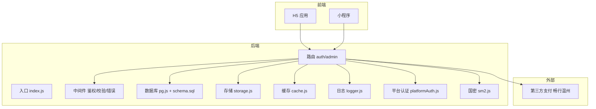
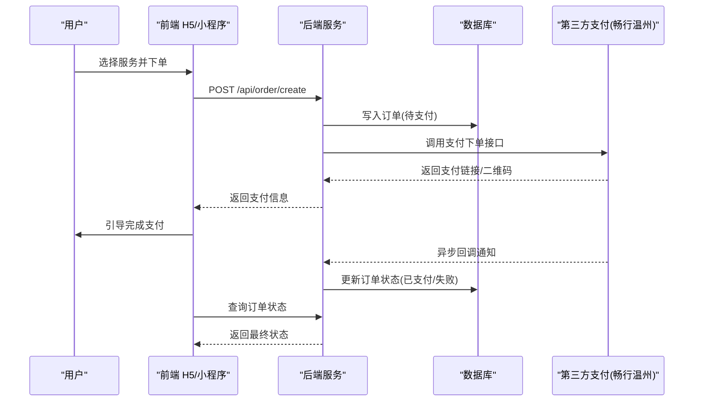
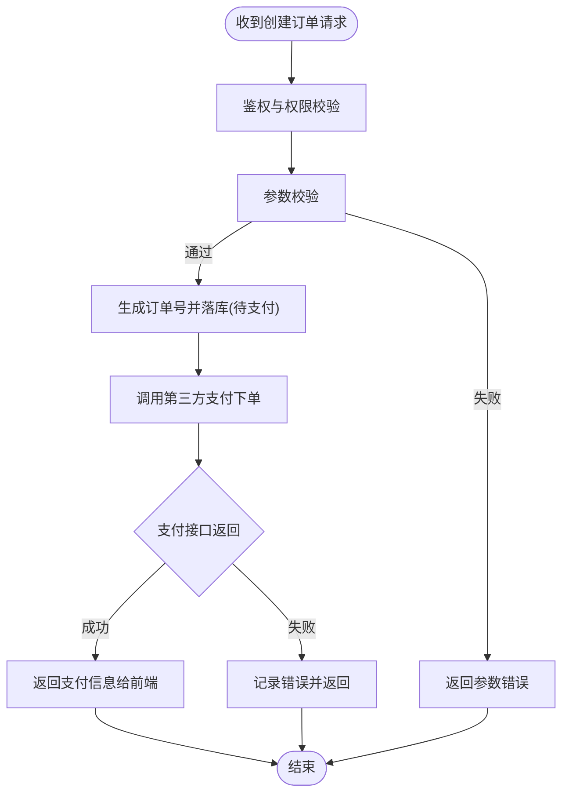
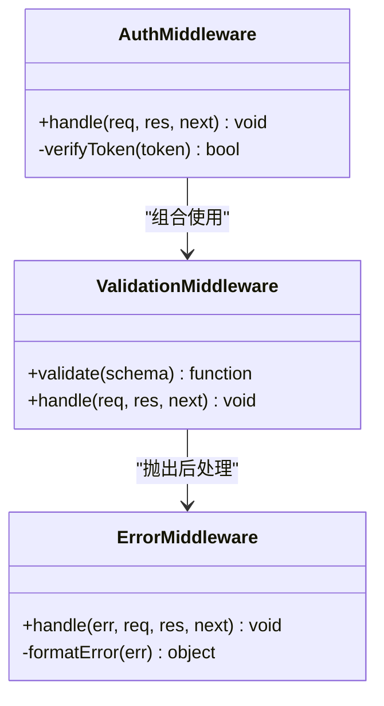
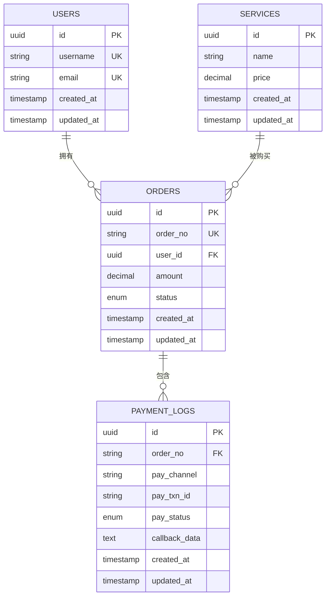
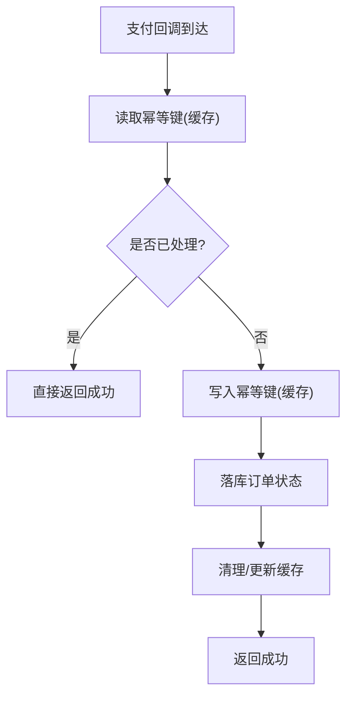
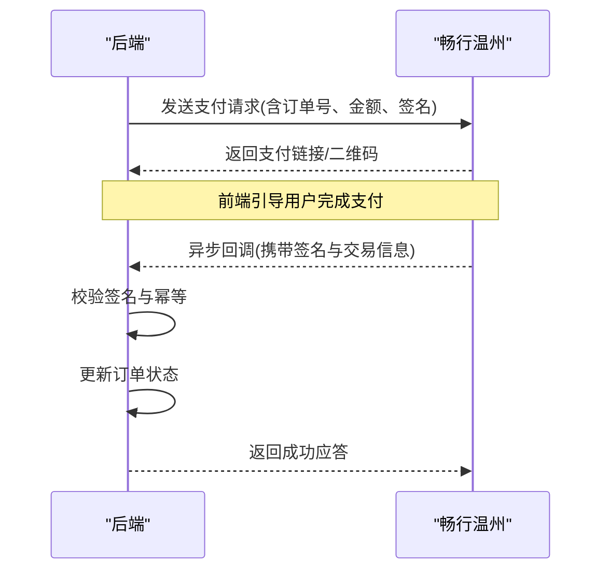
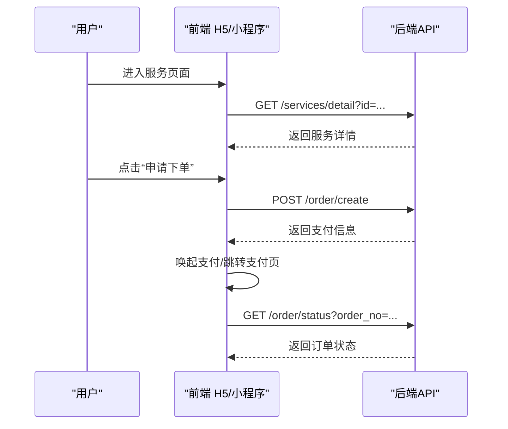
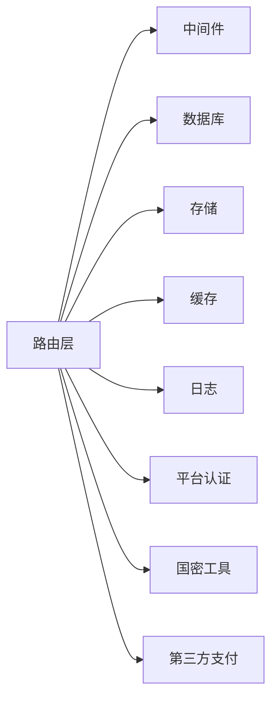

# 支付系统集成

<cite>
**本文引用的文件**
- [backend/index.js](file://backend/index.js)
- [backend/config.js](file://backend/config.js)
- [backend/routes/auth.js](file://backend/routes/auth.js)
- [backend/routes/admin.js](file://backend/routes/admin.js)
- [backend/middleware/auth.js](file://backend/middleware/auth.js)
- [backend/middleware/validation.js](file://backend/middleware/validation.js)
- [backend/middleware/error.js](file://backend/middleware/error.js)
- [backend/db/pg.js](file://backend/db/pg.js)
- [backend/db/schema.sql](file://backend/db/schema.sql)
- [backend/storage.js](file://backend/storage.js)
- [backend/cache.js](file://backend/cache.js)
- [backend/logger.js](file://backend/logger.js)
- [backend/platformAuth.js](file://backend/platformAuth.js)
- [backend/utils/sm2.js](file://backend/utils/sm2.js)
- [docs/接入文档/CxwzPay.php](file://docs/接入文档/CxwzPay.php)
- [docs/接入文档/接入参数.txt](file://docs/接入文档/接入参数.txt)
- [frontend/h5/src/stores/service.js](file://frontend/h5/src/stores/service.js)
- [frontend/h5/src/views/services/Index.vue](file://frontend/h5/src/views/services/Index.vue)
- [frontend/h5/src/views/services/Detail.vue](file://frontend/h5/src/views/services/Detail.vue)
- [frontend/h5/src/views/services/Apply.vue](file://frontend/h5/src/views/services/Apply.vue)
</cite>

## 目录
1. [简介](#简介)
2. [项目结构](#项目结构)
3. [核心组件](#核心组件)
4. [架构总览](#架构总览)
5. [详细组件分析](#详细组件分析)
6. [依赖关系分析](#依赖关系分析)
7. [性能考虑](#性能考虑)
8. [故障排查指南](#故障排查指南)
9. [结论](#结论)
10. [附录](#附录)

## 简介
本仓库为低空经济服务平台的支付系统集成方案，围绕“服务订单”场景实现从前端下单、后端创建订单与调用第三方支付（以“畅行温州”为例）到回调处理与状态同步的完整链路。系统采用前后端分离架构：前端提供下单与结果展示界面；后端提供鉴权、校验、订单持久化、第三方支付网关对接、回调处理与日志记录等能力；数据库使用 PostgreSQL，并通过迁移脚本管理表结构。

## 项目结构
本项目按功能域分层组织：
- 后端（Node.js/Express）：入口路由、中间件、数据库、存储、缓存、日志、平台认证工具等
- 前端（H5/小程序）：服务列表、详情、申请下单、支付流程与结果页
- 文档：第三方接入示例与参数说明
- 数据库：PostgreSQL 初始化与迁移脚本

图表来源
- [backend/index.js:1-200](file://backend/index.js#L1-L200)
- [backend/routes/auth.js:1-200](file://backend/routes/auth.js#L1-L200)
- [backend/routes/admin.js:1-200](file://backend/routes/admin.js#L1-L200)
- [backend/db/pg.js:1-200](file://backend/db/pg.js#L1-L200)
- [backend/db/schema.sql:1-200](file://backend/db/schema.sql#L1-L200)

章节来源
- [backend/index.js:1-200](file://backend/index.js#L1-L200)
- [backend/config.js:1-200](file://backend/config.js#L1-L200)
- [backend/db/schema.sql:1-200](file://backend/db/schema.sql#L1-L200)

## 核心组件
- 路由层：负责对外暴露 API，如创建订单、查询订单、支付回调等
- 中间件层：统一鉴权、请求体校验、错误处理
- 数据层：PostgreSQL 连接与表结构定义，订单与支付相关字段
- 存储与缓存：本地文件/对象存储与内存缓存，用于临时票据或幂等键
- 日志与监控：结构化日志输出，便于问题定位
- 平台认证与安全：平台级鉴权、国密算法支持
- 第三方支付集成：封装“畅行温州”支付接口与回调处理

章节来源
- [backend/routes/auth.js:1-200](file://backend/routes/auth.js#L1-L200)
- [backend/routes/admin.js:1-200](file://backend/routes/admin.js#L1-L200)
- [backend/middleware/auth.js:1-200](file://backend/middleware/auth.js#L1-L200)
- [backend/middleware/validation.js:1-200](file://backend/middleware/validation.js#L1-L200)
- [backend/middleware/error.js:1-200](file://backend/middleware/error.js#L1-L200)
- [backend/db/pg.js:1-200](file://backend/db/pg.js#L1-L200)
- [backend/db/schema.sql:1-200](file://backend/db/schema.sql#L1-L200)
- [backend/storage.js:1-200](file://backend/storage.js#L1-L200)
- [backend/cache.js:1-200](file://backend/cache.js#L1-L200)
- [backend/logger.js:1-200](file://backend/logger.js#L1-L200)
- [backend/platformAuth.js:1-200](file://backend/platformAuth.js#L1-L200)
- [backend/utils/sm2.js:1-200](file://backend/utils/sm2.js#L1-L200)

## 架构总览
支付系统整体遵循“前端发起 -> 后端创建订单 -> 调用第三方支付 -> 异步回调 -> 更新订单状态 -> 前端轮询/推送结果”的标准模式。关键交互如下：

图表来源
- [backend/routes/auth.js:1-200](file://backend/routes/auth.js#L1-L200)
- [backend/routes/admin.js:1-200](file://backend/routes/admin.js#L1-L200)
- [backend/db/pg.js:1-200](file://backend/db/pg.js#L1-L200)
- [backend/db/schema.sql:1-200](file://backend/db/schema.sql#L1-L200)

## 详细组件分析

### 路由与控制器（订单与支付）
- 职责
  - 接收前端下单请求，进行鉴权与参数校验
  - 生成唯一订单号，落库并调用第三方支付
  - 处理支付回调，校验签名与幂等性，更新订单状态
  - 提供订单查询接口供前端轮询
- 关键点
  - 幂等控制：基于订单号或支付流水号去重
  - 安全校验：对回调数据进行签名验证，防止伪造
  - 事务一致性：确保订单状态与支付流水一致

图表来源
- [backend/routes/auth.js:1-200](file://backend/routes/auth.js#L1-L200)
- [backend/routes/admin.js:1-200](file://backend/routes/admin.js#L1-L200)
- [backend/middleware/validation.js:1-200](file://backend/middleware/validation.js#L1-L200)

章节来源
- [backend/routes/auth.js:1-200](file://backend/routes/auth.js#L1-L200)
- [backend/routes/admin.js:1-200](file://backend/routes/admin.js#L1-L200)
- [backend/middleware/validation.js:1-200](file://backend/middleware/validation.js#L1-L200)

### 中间件（鉴权、校验、错误处理）
- 鉴权中间件：解析令牌/会话，校验用户身份与角色
- 校验中间件：统一校验请求体字段、类型与范围
- 错误中间件：捕获异常、格式化错误响应、记录日志

图表来源
- [backend/middleware/auth.js:1-200](file://backend/middleware/auth.js#L1-L200)
- [backend/middleware/validation.js:1-200](file://backend/middleware/validation.js#L1-L200)
- [backend/middleware/error.js:1-200](file://backend/middleware/error.js#L1-L200)

章节来源
- [backend/middleware/auth.js:1-200](file://backend/middleware/auth.js#L1-L200)
- [backend/middleware/validation.js:1-200](file://backend/middleware/validation.js#L1-L200)
- [backend/middleware/error.js:1-200](file://backend/middleware/error.js#L1-L200)

### 数据层（数据库与表结构）
- 连接管理：PostgreSQL 连接池配置与复用
- 表结构：订单表、支付流水表、用户与服务关联等
- 迁移：版本化迁移脚本保证结构演进一致性

图表来源
- [backend/db/schema.sql:1-200](file://backend/db/schema.sql#L1-L200)
- [backend/db/pg.js:1-200](file://backend/db/pg.js#L1-L200)

章节来源
- [backend/db/pg.js:1-200](file://backend/db/pg.js#L1-L200)
- [backend/db/schema.sql:1-200](file://backend/db/schema.sql#L1-L200)

### 存储与缓存
- 存储：用于存放支付凭证、临时文件或回调原始报文
- 缓存：用于幂等键、短期令牌或热点数据

图表来源
- [backend/cache.js:1-200](file://backend/cache.js#L1-L200)
- [backend/storage.js:1-200](file://backend/storage.js#L1-L200)

章节来源
- [backend/cache.js:1-200](file://backend/cache.js#L1-L200)
- [backend/storage.js:1-200](file://backend/storage.js#L1-L200)

### 日志与监控
- 结构化日志：记录请求上下文、订单号、支付渠道、耗时与错误堆栈
- 分级输出：调试、信息、警告、错误级别便于生产排障

章节来源
- [backend/logger.js:1-200](file://backend/logger.js#L1-L200)

### 平台认证与安全
- 平台认证：统一鉴权入口，校验平台令牌与权限
- 国密算法：SM2 签名/验签，保障回调数据完整性

章节来源
- [backend/platformAuth.js:1-200](file://backend/platformAuth.js#L1-L200)
- [backend/utils/sm2.js:1-200](file://backend/utils/sm2.js#L1-L200)

### 第三方支付集成（畅行温州）
- 入参规范：参考接入文档中的参数说明
- 调用方式：HTTP 请求封装，重试与超时控制
- 回调处理：签名校验、幂等处理、状态同步

图表来源
- [docs/接入文档/CxwzPay.php:1-200](file://docs/接入文档/CxwzPay.php#L1-L200)
- [docs/接入文档/接入参数.txt:1-200](file://docs/接入文档/接入参数.txt#L1-200)
- [backend/routes/auth.js:1-200](file://backend/routes/auth.js#L1-L200)

章节来源
- [docs/接入文档/CxwzPay.php:1-200](file://docs/接入文档/CxwzPay.php#L1-200)
- [docs/接入文档/接入参数.txt:1-200](file://docs/接入文档/接入参数.txt#L1-200)
- [backend/routes/auth.js:1-200](file://backend/routes/auth.js#L1-L200)

### 前端集成（H5/小程序）
- 服务列表与详情：展示可购买服务与价格
- 申请下单：提交订单并获取支付信息
- 支付结果：轮询或监听回调，展示最终状态

图表来源
- [frontend/h5/src/views/services/Index.vue:1-200](file://frontend/h5/src/views/services/Index.vue#L1-L200)
- [frontend/h5/src/views/services/Detail.vue:1-200](file://frontend/h5/src/views/services/Detail.vue#L1-L200)
- [frontend/h5/src/views/services/Apply.vue:1-200](file://frontend/h5/src/views/services/Apply.vue#L1-L200)
- [frontend/h5/src/stores/service.js:1-200](file://frontend/h5/src/stores/service.js#L1-L200)

章节来源
- [frontend/h5/src/views/services/Index.vue:1-200](file://frontend/h5/src/views/services/Index.vue#L1-L200)
- [frontend/h5/src/views/services/Detail.vue:1-200](file://frontend/h5/src/views/services/Detail.vue#L1-L200)
- [frontend/h5/src/views/services/Apply.vue:1-200](file://frontend/h5/src/views/services/Apply.vue#L1-L200)
- [frontend/h5/src/stores/service.js:1-200](file://frontend/h5/src/stores/service.js#L1-L200)

## 依赖关系分析
- 模块耦合
  - 路由层依赖中间件进行鉴权与校验
  - 路由层依赖数据层进行订单读写
  - 路由层依赖存储与缓存进行幂等控制
  - 路由层依赖日志进行审计与排障
  - 路由层依赖平台认证与国密工具进行安全校验
- 外部依赖
  - 第三方支付（畅行温州）通过 HTTP 接口交互
  - 数据库 PostgreSQL 提供持久化能力

图表来源
- [backend/index.js:1-200](file://backend/index.js#L1-L200)
- [backend/routes/auth.js:1-200](file://backend/routes/auth.js#L1-L200)
- [backend/routes/admin.js:1-200](file://backend/routes/admin.js#L1-L200)

章节来源
- [backend/index.js:1-200](file://backend/index.js#L1-L200)
- [backend/routes/auth.js:1-200](file://backend/routes/auth.js#L1-L200)
- [backend/routes/admin.js:1-200](file://backend/routes/admin.js#L1-L200)

## 性能考虑
- 数据库连接池：合理设置最大连接数与空闲回收策略，避免连接泄漏
- 幂等与缓存：使用缓存减少重复处理与数据库压力
- 异步回调：将回调处理拆分为任务队列，避免阻塞主线程
- 超时与重试：对第三方接口设置合理超时与重试上限，防止雪崩
- 日志采样：生产环境降低高频日志量，保留关键路径日志

[本节为通用指导，不直接分析具体文件]

## 故障排查指南
- 常见问题
  - 回调未触发：检查回调地址可达性与防火墙策略
  - 签名校验失败：核对密钥与签名算法，确认时间戳与随机串
  - 订单状态不一致：查看幂等键与数据库事务日志
  - 支付超时：调整超时阈值与重试策略，关注第三方限流
- 排查步骤
  - 根据订单号检索日志，定位请求与回调
  - 检查数据库订单与支付流水表的一致性
  - 复现最小用例，逐步缩小问题范围
  - 启用更细粒度日志，观察关键节点耗时

章节来源
- [backend/logger.js:1-200](file://backend/logger.js#L1-L200)
- [backend/middleware/error.js:1-200](file://backend/middleware/error.js#L1-L200)
- [backend/db/pg.js:1-200](file://backend/db/pg.js#L1-L200)

## 结论
本支付系统集成以清晰的层次划分与严格的中间件机制保障了安全性与稳定性。通过幂等控制、签名校验与结构化日志，有效降低了回调处理的风险与排障成本。建议在生产环境中完善监控告警、灰度发布与回滚预案，持续提升系统的可靠性与可维护性。

## 附录
- 接入参数与示例：参见接入文档中的 PHP 示例与参数说明
- 数据库迁移：使用迁移脚本管理表结构变更，确保多环境一致性
- 配置项：在配置文件中管理第三方密钥、回调地址与超时等参数

章节来源
- [docs/接入文档/CxwzPay.php:1-200](file://docs/接入文档/CxwzPay.php#L1-200)
- [docs/接入文档/接入参数.txt:1-200](file://docs/接入文档/接入参数.txt#L1-200)
- [backend/config.js:1-200](file://backend/config.js#L1-200)
- [backend/db/schema.sql:1-200](file://backend/db/schema.sql#L1-200)